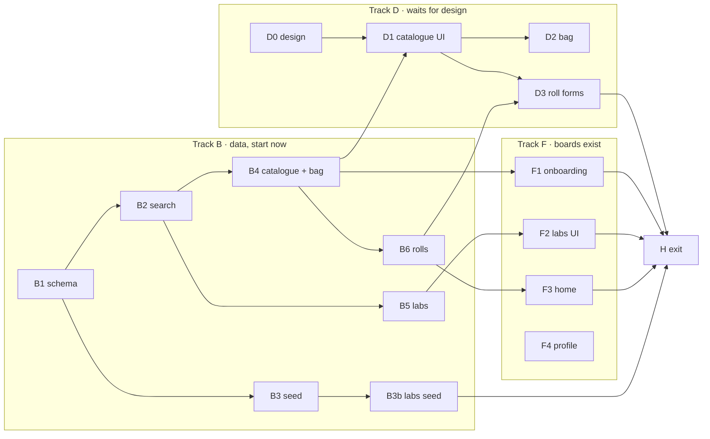

# Plan: Phase 1 · Log a roll

A user fills their túi (bag) from a seeded catalogue that can be searched without accents, or adds their own stock or camera. They log a new or past roll by picking film and camera from the bag, and can pick or add a lab. It ends on the roadmap's Phase 1 exit: **a roll is logged from the bag in under 60 s on a phone.**

- **Roadmap:** Phase 1, 12 Oct – 1 Nov 2026 (W3–5), 27 h booked. This plan estimates **~30 h** including ~2.5 h of design (see [Budget](#budget)). Roadmap artifact re-read 25.09.2026: rev 24, same as the mirror.
- **Design system:** artifact re-read 25.09.2026: `1790324661-b252`, same as the mirror.
- **Design canvas:** D0 drawn 27.09.2026: canvas `1790513747-0dce`, 82 boards (quick-add film inside the roll form, and per-stock roll counts in the bag, which is BAG-2 and needs a `bag_item.qty` column; the Phase 1 screens in [missing-screens.md](../../docs/design/missing-screens.md#phase-1--log-a-roll), phone + desktop, Paper + Darkroom), waiting for Trúc's approval. The older Phase 1 boards (`OnboardBag`, `OnboardFirst`, `Home`, `Profile`, `LabPicker`, `LabAdd`) are unchanged; what they add is in [Design findings](#design-findings-27092026).
- **Requirements:** [CAT-1, CAT-2](../../docs/product/requirements/catalogue.md), [BAG-1](../../docs/product/requirements/bag.md), [ROLL-1, ROLL-2](../../docs/product/requirements/rolls.md), [LAB-1, LAB-2](../../docs/product/requirements/labs.md). Carried over from the Phase 0 plan: onboarding after sign-up (D17) and changing the display name on Profile (D18).
- **Phase 0:** closed 27.09.2026 (roadmap rev 30: exit ticked, all merged to `main`). Phase 1 can start now, ahead of its 12 Oct slot.
- **Status:** draft, updated 27.09.2026: columns decided; replanned into three tracks so data work starts before the design. Waiting for Trúc's approval and answers to [Blockers](#blockers-answer-before-approval).
- **Waitlist removed** (Trúc, 25.09.2026): sign-up stays open through the landing page's "Đăng ký" button. The Phase 1 waitlist item is gone from the roadmap artifact (rev 26) and `docs/roadmap.md`.

## Blockers: answer before approval

One is left. Its default is in [Decisions](#decisions-this-plan-assumes).

1. ~~**Known conflict #6: data model depth** (due "before Phase 1 schema", [docs/README.md](../../docs/README.md#known-conflicts-between-sources)). The ADR tables drop fields that the P0 requirements use: lenses (BAG-1), box and shot ISO, exposures, format and locations on the roll (ROLL-1), and address, link and services on a lab (LAB-2). Default D1–D5: **add the columns now** as nullable. They cost nothing today, and they spare a migration and a PRD edit later.~~ **Decided 27.09.2026 (Trúc): add the columns.** D1–D5 stand as written.
2. **Design for the Phase 1 screens: drawn, waiting for your approval.** D0 was done on 27.09.2026: `NewRoll`, `PastRoll`, `CatalogueSearch`, `CatalogueEmpty`, `CustomEntry`, `Bag` and `RollSaved`, 4 boards each (canvas `1790513151-737b`, 78 boards; see [missing-screens.md](../../docs/design/missing-screens.md#phase-1--log-a-roll)). Approving them unblocks Track D (D1–D3).

## Design findings (27.09.2026)

From the Phase 1 boards on canvas `e51e`:

1. **Bag screen can reuse existing boards.** `Profile` already has "Túi của tôi" (cameras with roll counts, films) with a "Sửa túi" link, and `OnboardBag` is the chip picker. `/bag` = Profile's bag list + `OnboardBag`'s picker in edit mode. D0 then only needs to design lenses on it (neither board shows lenses) and the two roll forms.
2. **`LabAdd` has a "Gửi lên danh bạ lab chung" toggle.** That is a submission to the shared directory, CAT-3 (P1, v1.1b). **Left out of Phase 1**: custom labs stay private (LAB-2).
3. **The lab is picked from a roll, before scans.** `LabPicker` is titled "Cuộn #14 · Gold 200 · Tráng ở lab nào?", and `Home` shows "Cuộn #15 đang ở LLAB · gửi 20.10.25". That is a drop-off step: a scan set with lab, branch and drop-off date, before any frames. D13 keeps the picker on `/dev/labs` in Phase 1. **Option:** mount it now as "Gửi lab" on a roll, which pulls the `scan_set` table (LAB-3) forward from Phase 2 (+~2 h).
4. **Seeded labs show services** (`LabPicker`: "C-41 · B&W · SLIDE"), while roadmap decision 4 suggests none for seeds. The D5 columns allow either; the content track decides by 01.11.
5. **`Profile` shows stat tiles, recent keepers, share links and delete account.** F4 stays scoped to name, email, theme and sign out, as planned.

## Sub-tasks, in three tracks

Replanned 27.09.2026 (Trúc): data and server work goes first, while the missing screens are designed. The server layer here is TypeScript inside the Next.js app (Drizzle, Server Actions), so every code task goes to `fe-plan-executor`, test first, as in Phase 0. `be-executor` is for Kotlin and doesn't apply.

- **Track B · Data and server:** needs no design. Starts now, from `main`. Each task is tested server code with no UI.
- **Track F · Screens that have boards:** `OnboardBag`, `OnboardFirst`, `Home`, `Profile`, `LabPicker`, `LabAdd`. Each one starts when its Track B piece lands.
- **Track D · Screens waiting for design:** the roll forms, catalogue results, custom entry form, lenses in the bag ([missing-screens.md](../../docs/design/missing-screens.md#phase-1--log-a-roll)).

| ID | Task | Requirements | Est. | Needs | Branch |
|---|---|---|---|---|---|
| **B1** | Schema: all Phase 1 tables, migration `0002`, ADR + conflict #6 docs | D1–D5, D9, D20 | 2.5 h | — | `feature/phase-1-data` |
| **B2** | `toSearchText()` + trigram indexes | CAT-1, LAB-1 (D8) | 1 h | B1 | `feature/phase-1-data` |
| **B3** | Seed: stocks and cameras JSON, seed script, `vercel-build` | CAT-1 (D10, D11) | 1.5 h | B1, [seed list](../content/seed-catalogue.md) | `feature/phase-1-data` |
| **B3b** | Seed: labs JSON | LAB-1 | 0.5 h | B3, lab research checked by you | `feature/phase-1-seed-labs` |
| **B4** | Catalogue + bag data layer: search, custom entry, bag add/remove | CAT-1, CAT-2, BAG-1 | 2.5 h | B2 | `feature/phase-1-catalogue-bag-data` |
| **B5** | Labs data layer: search by city, add private lab | LAB-1, LAB-2 | 1 h | B2 | `feature/phase-1-labs-data` |
| **B6** | Rolls data layer: `createRoll`, list, get, push/pull, time-to-log events | ROLL-1, ROLL-2 (D14–D17) | 2.5 h | B4 | `feature/phase-1-rolls-data` |
| **F1** | Onboarding: `/onboarding/bag`, `/onboarding/first-roll` | BAG-1, Phase 0 D17 | 2.5 h | B4 | `feature/phase-1-onboarding` |
| **F2** | Lab picker + add lab on `/dev/labs` | LAB-1, LAB-2 (D13) | 2.5 h | B5 | `feature/phase-1-labs-ui` |
| **F3** | Home `RollCard` list + bottom tabs | D15 | 1.5 h | B6 | `feature/phase-1-home` |
| **F4** | Profile: name, email, theme, sign out | AUTH-1 (Phase 0 D18) | 1.5 h | — | `feature/phase-1-profile` |
| **D0** | ~~Design: new roll, past roll, catalogue results, custom entry form, bag, roll page~~ drawn 27.09.2026 | ROLL-1, ROLL-2, CAT-1, CAT-2, BAG-1 | 2.5 h | your approval | (canvas only) |
| **D1** | Catalogue picker + custom entry form | CAT-1, CAT-2 | 2 h | D0, B4 | `feature/phase-1-catalogue-ui` |
| **D2** | `/bag` with lenses | BAG-1 | 1.5 h | D0, D1 | `feature/phase-1-bag-ui` |
| **D3** | `/rolls/new`, past mode, `/rolls/[id]` | ROLL-1, ROLL-2 | 2.5 h | D0, D1, B6 | `feature/phase-1-rolls-ui` |
| **H** | Exit check + roadmap ticks | Phase 1 exit | 0.5 h | all | — |

B1–B3 ship as one PR, since the seed can't run without the tables. Every other task is its own PR.



**Suggested order:** B1 → B2 → B3 (one PR) → B4 → B5 → B6, with F4 alongside at any point. F1, F2 and F3 follow as their data lands. Track D starts the moment D0 is approved. If design is still not ready once Track B and F are done, D1–D3 are about 6 h of work, which fits the last week (26 Oct – 1 Nov).

## Round 2: design parity, BAG-2 and BAG-3 (27.09.2026)

Decided by Trúc after the owner review of PR #20 and the [design audit](../reviews/phase-1-design-audit.md) against canvas `1790516511-f125`:

| # | Decision |
|---|---|
| R2-1 | **All 45 class-A audit items** go into PR #20 (~25 h). The buffer absorbs it; Phase 1 slips a few days |
| R2-2 | **BAG-2 and BAG-3 move into Phase 1 as P0** (PRD artifact version 6, roadmap rev 33). BAG-3 shows rolls shot per camera; its mistake count waits for NOTE-2 (Phase 2). Per-film and per-lens roll counts from the Bag board come along, since they need no new data |
| R2-3 | **Bag canister strip** (Bag board, "N cuộn chờ nạp") ships with BAG-2. Home keeps the roll-card list; CAN-1 and CAN-2 stay in Phase 3. The frame grid "Lưới" stays in Phase 3 |
| R2-4 | **Past-roll dates are month + year** as on `PastRoll`, with "Không nhớ" leaving them empty; stored as the month's first and last day. The day picker stays for a new roll's optional dates |
| R2-5 | **Roll numbers are stored** (`roll.number`, next per user at save, never reused) |
| R2-6 | **Desktop "Lab" nav item hidden** until the scan-set flow (Phase 2) |

Work order: **W1** data (migration `0003`: `bag_item.qty`, `bag_item.expiry_year`, `roll.number`; nullable past-mode dates; decrement on load; counts per camera, film and lens), then **W2** roll form, past roll, roll page; **W3** bag, catalogue, custom entry, onboarding, profile; **W4** shell, home, labs, in parallel, each owning its files and working from the audit's item IDs.

## Decisions this plan assumes

Change any of these before approving.

| # | Decision | Default | Why |
|---|---|---|---|
| D1 | Roll columns (conflict #6) | Add nullable `box_iso` (copied from the stock, editable), `shot_iso`, `exposures`, `format`, `lens_id`, `locations text[]`, `shot_from`, `shot_to`. Push/pull is **computed**, not stored | ROLL-1 lists them all and computes push/pull from them |
| D2 | Which camera a roll points to | `roll.camera_bag_item_id` (the owner's body), not the catalogue model | PRD uses `camera_item_id`, so two bodies of the same model stay apart. BAG-3 (camera card) needs it later |
| D3 | Lenses (conflict #6, BAG-1) | A `lens` table, **custom entries only** (brand, model, focal length), no seeded lens catalogue in the MVP. `bag_item.kind` = `camera` \| `lens` \| `stock` | BAG-1 is P0 and names lenses. Seeding lenses is content work nobody has planned |
| D4 | Stock format | `stock.formats text[]` (PRD), not a single `format` (ADR) | One stock can come in 35mm and 120 |
| D5 | Lab columns (conflict #6, LAB-2) | Add nullable `address`, `link_url`, `services text[]`, `accepts_mail` to `lab` and `lab_branch`, plus `lab_branch.area_hint`. `district` holds the **new phường**; `area_hint` keeps the old quận ("Q.1") for display, because the 2025 reform removed quận and most sources still use them. Seeded labs fill services only where a source states them, pending roadmap decision 4 | LAB-2 collects these for custom labs. The [lab research](../content/seed-catalogue.md#labs) found addresses and services for most seeded labs |
| D6 | Waitlist | **None.** Sign-up stays open; the landing page CTA is the way in | Trúc, 25.09.2026 |
| D7 | Design for missing screens (blocker 2) | D0 drawn on the canvas 27.09.2026 (7 screens × 4 boards). You approve them before D1–D3 start | The project rule: no screen without a phone + desktop design |
| D8 | Accent-free search | Normalise in the app: `toSearchText()` lowercases, strips diacritics (NFD) and maps đ→d. The result goes in a `search_text` column on write, with a `pg_trgm` GIN index. Queries go through the same function | Postgres `unaccent` isn't immutable, so it can't back an index without a wrapper. One function for write and query can't drift. LAB-1 and NOTE-3 reuse it |
| D9 | House DB rules (ADR) | Every new table: `uuid_generate_v4()` ids (enable `uuid-ossp`), no foreign keys, `deleted_at` soft deletes, partial indexes `WHERE deleted_at IS NULL`, `timestamptz`. **Every query filters by owner**, because there are no FKs and no row-level security | Recorded in ADR-001 on 25.09.2026 |
| D10 | Seeding | `scripts/seed-catalogue.ts` reads `data/catalogue/*.json` and upserts on a natural key (`brand`+`name`, lab `slug`). It runs in `vercel-build` after `migrate`, and is idempotent | The content track keeps adding entries until 01.11. Data lives in the repo, reviewable in PRs, and flows to every Neon branch |
| D11 | Starter seed | Until the content track delivers: ~15 stocks, ~15 cameras, LLAB/Croplab/Cinephile branches as you know them today, and "Tự tráng ở nhà" as a built-in lab | Build and test against real-shaped data. The exit check needs the stock you really shoot to be there |
| D12 | Custom entries (CAT-2) | Custom stock/camera/lens: insert with `owner_id` = user **and** its bag item in one `transaction`. Only the owner sees it | CAT-2: "goes straight into the user's bag and is private to them" |
| D13 | Labs in Phase 1 have no host screen | LAB-3 (scan set) is Phase 2, so the lab picker ships as a finished component on `/dev/labs`. Phase 2 mounts it in the scan-set flow | Builds against the content deadline (01.11) without inventing a lab screen that has no design |
| D14 | ROLL-2 in Phase 1 | Same form in "past" mode (dates in the past, no "loaded now"). After saving, it goes to the roll page, which shows an "upload scans" placeholder until Phase 2 (SCAN-1) | Upload is Phase 2. The flow is complete once upload lands |
| D15 | Where a saved roll shows | Home becomes the `Home` board's `RollCard` list, newest first, plus a minimal `/rolls/[id]` page (title, stock, camera, dates, push/pull). The shelf of canisters (CAN-1) waits for Phase 3 | Gives the exit check somewhere to land without starting Phase 3 |
| D16 | Measuring time to log a roll | PostHog events `roll_form_opened` and `roll_created` with `duration_ms`, `source` (`bag` \| `catalogue`) and `mode` (`new` \| `past`) | Gives numbers for the Phase 1 exit and the launch gate ("median under 60 s") |
| D17 | Push/pull | `stops = log2(shot_iso / box_iso)`, rounded to the nearest ⅓ stop, shown as `+1`, `−⅔`, `0` in `meta` type | ROLL-1: "calculated in stops from box and shot-at ISO" |
| D18 | Routes (English, Phase 0 D15) | `/onboarding/bag`, `/onboarding/first-roll`, `/bag`, `/rolls/new`, `/rolls/new?mode=past`, `/rolls/[id]`, `/profile`, `/dev/labs` | Project naming rule |
| D19 | Writes | Server Actions with zod validation. No REST routes for these screens | One Next.js app. Only share pages and upload signing need route handlers later |
| D20 | Single-use cameras | `camera.fixed_stock_id` (nullable). Picking a single-use camera in the roll form fills its film and locks it. Seeded rows are listed in [the seed list](../content/seed-catalogue.md#single-use) | Trúc, 27.09.2026: seed Kodak FunSaver and similar |
| D21 | Test database for the data layer | PGlite (Postgres in-process, no network) in Vitest, with `pg_trgm` and `uuid-ossp` loaded. If either extension doesn't load, a local Docker Postgres instead. Never the Neon `dev` branch | Tests stay fast, isolated and offline. B1 checks the extensions first |

## Sub-task detail

### Track B · Data and server

**B1 · Schema (~2.5 h)**
1. Update ADR-001's data model with D1–D5, D9 and D20. Close Known conflict #6 in `docs/README.md`, and edit the open issues in `rolls.md`, `bag.md`, `labs.md` and `catalogue.md`.
2. Tests first: schema shape tests like `auth.test.ts`.
3. `src/db/schema/catalogue.ts` (`stock`, `camera` with `fixed_stock_id`, `lens`), `bag.ts` (`bag_item`), `labs.ts` (`lab`, `lab_branch`), `rolls.ts` (`roll`). Migration `0002` enables `uuid-ossp` and `pg_trgm`, and adds partial indexes on owner.
4. Set up the data-layer test database (D21) so B2–B6 can test against real Postgres.

**B2 · Accent-free search (~1 h)**
1. Tests first: `toSearchText()`: "Đà Lạt" → "da lat", "Kodak Gold 200" → "kodak gold 200", "Ilford HP5+" keeps `+`.
2. `src/lib/search-text.ts`, `search_text` columns filled on write, GIN trigram indexes.

**B3 · Seed stocks and cameras (~1.5 h)**
1. `data/catalogue/stocks.json` and `cameras.json` from [seed-catalogue.md](../content/seed-catalogue.md), including the single-use cameras with their fixed film (D20).
2. `scripts/seed-catalogue.ts`: idempotent upsert on `slug`, sets `search_text`. `pnpm db:seed`; `vercel-build` = migrate → seed → build.
3. Tests: a second run changes nothing; a fixed film that doesn't exist fails the seed.
4. Check: the preview build migrates and seeds its Neon branch.

**B3b · Seed labs (~0.5 h)**
`data/catalogue/labs.json` from the lab research, **only rows you've ticked**, plus the built-in "Tự tráng ở nhà" (`home-development`). Can land any time before the exit.

**B4 · Catalogue + bag data layer (~2.5 h)**
1. `src/features/catalogue/queries.ts`: `searchCatalogue({ kind, q, userId })` returns seeded entries plus the user's own private ones, ranked by trigram similarity, 20 max.
2. Server Actions: `addCustomStock` / `addCustomCamera` / `addCustomLens` insert the entry and its bag item in one transaction (D12). `addToBag`, `removeFromBag` (soft delete), `listBag`.
3. Tests: accent-free matching; another user's private entries never show; the transaction rolls back if the bag insert fails; no duplicate bag item for the same entry.

**B5 · Labs data layer (~1 h)**
1. `searchLabs({ q, city, userId })`: seeded labs and branches plus the user's private ones; "Tự tráng ở nhà" always included.
2. `addLab` Server Action: a private lab plus one branch (LAB-2). The design's "Gửi lên danh bạ lab chung" is not built (design finding 2).
3. Tests: "da nang" finds "Đà Nẵng"; the city filter; a custom lab is private.

**B6 · Rolls data layer (~2.5 h)**
1. Tests first: `pushPullStops()` and its formatter (D17): 400→800 = `+1`, 400→320 = `−⅓`, missing ISO = no badge.
2. `createRoll` Server Action: zod; only stock and camera required; owner check on every referenced id (D9); past mode rejects future dates (D14); a single-use camera forces its fixed film (D20).
3. `listRolls` (newest first) and `getRoll`, both owner-scoped.
4. `trackRollCreated` helper for the PostHog events (D16), called from the action with `duration_ms` the form sends.

### Track F · Screens that have boards

**F1 · Onboarding (~2.5 h)**
1. `/onboarding/bag` from `OnboardBag`: search, camera and film chips, skip. Sign-up step 2 "Tiếp tục" now goes here (replaces Phase 0 D17's placeholder).
2. "+ Máy khác" / "+ Film khác" open the custom entry form once D1 lands; until then they're hidden.
3. `/onboarding/first-roll` from `OnboardFirst`: its two choices link to `/rolls/new?mode=past` and `/rolls/new`; until D3 lands, "Bắt đầu" goes home.
4. Tests: chips add to the bag; skip lands on `/onboarding/first-roll`.

**F2 · Labs UI (~2.5 h)**
`LabPicker` from `LabPicker` / `LabPickerWeb` (city chips, search, "+ Thêm lab mới") and `LabAddForm` from `LabAdd` / `LabAddWeb`, mounted on `/dev/labs` (D13). Tests: pick, filter, add.

**F3 · Home (~1.5 h)**
The `Home` board's `RollCard` list, newest first, and the bottom tabs (Kệ, Túi, Cuộn mới, Tấm ưng, Tôi; active tab `cobalt`). Tabs without a screen yet stay disabled. The empty state points to `/onboarding/first-roll`.

**F4 · Profile (~1.5 h)**
`/profile` from the `Profile` board, **scoped to** the avatar, email, changing the display name, theme and sign out. Stat tiles, recent keepers, "Túi của tôi" and share links wait for their tasks and phases. Delete account is AUTH-2 (v1.1a).

### Track D · Screens waiting for design

**D0 · Design (~2.5 h, no code)**
Boards at 390 and 1440 px, in Paper and Darkroom, on the canvas page "Kệ & hồ sơ": `NewRoll`, `PastRoll`, catalogue results (with the no-match state) and the custom entry form, plus a lens row on the bag list (design finding 1). The roll form puts the bag first ("Trong túi") with the catalogue one tap away, and folds the optional fields behind "Thêm chi tiết", so the two picks and Save fit on one phone screen. After approval, tick them in [missing-screens.md](../../docs/design/missing-screens.md) and add them to `wireframes.md`.

**D1 · Catalogue picker + custom entry form (~2 h)**
`CataloguePicker` (search, results with the `stock-*` swatch and ISO in `meta`, no-match state) in a bottom sheet on phone and a dialog on desktop. `CustomEntryForm` for stock, camera and lens. Wire "+ Máy khác" / "+ Film khác" in F1.

**D2 · Bag (~1.5 h)**
`/bag`: `Profile`'s "Túi của tôi" list with lenses, and `OnboardBag`'s picker in edit mode. Add from the catalogue, remove.

**D3 · Roll forms (~2.5 h)**
`/rolls/new` and `?mode=past` from D0's boards: bag first, catalogue a tap away (picking from it also adds to the bag), box ISO filled from the stock, push/pull badge. A minimal `/rolls/[id]` (D15). Point `OnboardFirst`'s "Bắt đầu" at the chosen mode. Tests: required fields, error copy in `pin`, events fire once.

### H · Exit (~0.5 h)

1. **You:** on a phone, on a preview URL, time three rolls from the bag: tap "Cuộn mới" → saved. Each under 60 s. Check the PostHog `duration_ms` agrees.
2. **Claude:** tick the Phase 1 boxes in the roadmap artifact and `docs/roadmap.md` in the same session, and bump "Last synced". The exit box is ticked only after step 1 holds, and "Labs checked" only when B3b lands with your ticks.

## Files to create or modify

```
docs/architecture/adr-001-tech-stack.md      modify  data model (D1–D5, D9)
docs/README.md                               modify  close Known conflict #6
docs/product/requirements/{rolls,bag,labs,catalogue}.md  modify  open issues resolved
docs/design/wireframes.md                    modify  new boards from D0
docs/roadmap.md + roadmap artifact           modify  ticks at exit
src/db/schema/{catalogue,bag,labs,rolls}.ts  new     + tests
src/db/schema/index.ts                       modify  exports
drizzle/0002_*.sql                           new     generated
src/lib/search-text.ts                       new     + test (D8)
data/catalogue/{stocks,cameras,labs}.json    new     starter seed (D11)
scripts/seed-catalogue.ts                    new     + test
package.json                                 modify  db:seed, vercel-build
src/features/catalogue/*                     new     queries, actions, CataloguePicker, custom forms
src/features/bag/*                           new     queries, actions, BagList
src/features/labs/*                          new     queries, actions, LabPicker, LabAddForm
src/features/rolls/*                         new     push-pull, actions, RollForm
src/components/nav/BottomTabs.tsx            new     tabs from the Home board
src/app/(app)/onboarding/{bag,first-roll}/page.tsx  new
src/app/(app)/bag/page.tsx                   new
src/app/(app)/rolls/new/page.tsx             new
src/app/(app)/rolls/[id]/page.tsx            new
src/app/(app)/profile/page.tsx               new
src/app/dev/labs/page.tsx                    new
src/app/page.tsx                             modify  home → RollCard list
src/app/(auth)/sign-up/profile/*             modify  "Tiếp tục" → /onboarding/bag
messages/vi.json                             modify  every new string
```

`src/features/<area>/` is a new folder convention: one folder per requirement area, holding its queries, Server Actions and area-only components. Say if you'd rather keep everything under `src/components/` and `src/lib/`.

## Test strategy

- **Unit (Vitest), written first:** `toSearchText`, `pushPullStops` and its formatter, zod schemas, seed idempotency, schema shape.
- **Data layer against a real Postgres (D21):** catalogue search ranking and privacy, bag transactions, the `createRoll` owner checks, seed idempotency. Written with Track B, before any screen uses them.
- **Components (Testing Library):** pickers (search, empty state, select), forms (required fields, error copy in `pin`), onboarding skip.
- **Visual:** 390 and 1440 px in Paper and Darkroom, next to the canvas boards.
- **Every PR:** `pnpm check` (lint, typecheck, test, build), then the Vercel preview migrates and seeds its branch.
- **By you, on a phone:** the exit timing (H).

## Budget

| Track | Hours |
|---|---|
| B · Data and server | 11.5 |
| F · Screens with boards | 8 |
| D · Design + waiting screens | 8.5 |
| Exit | 0.5 |
| **Total** (27 h booked) | **~28.5** |

~1.5 h over, taken from the 21 h buffer. If time runs short, cut **F4** (profile) first: it isn't a roadmap item, only a carry-over. Then cut the add-lab half of **F2**: custom labs are only needed once scan sets exist (Phase 2).

## Risks

| Risk | Mitigation |
|---|---|
| Lab data needs your check (content track, due 01.11) | Stocks and cameras seed now (B3). Labs land separately in B3b, only the rows you've ticked |
| No foreign keys, so one missing owner filter leaks another user's private entries | Every query takes `userId`; a test per query checks isolation (D9) |
| The seed runs on every production build | Idempotent upsert on natural keys, and a test that a second run changes nothing |
| `pg_trgm` / `uuid-ossp` not enabled on Neon | Created in migration `0002`. Both are in Neon's supported extensions |
| Phase 1's first non-auth migration runs in the production build | Additive only (new tables); nothing drops or rewrites |
| The 60 s exit fails because the form is too long on a phone | Optional fields folded (D0), bag first, one screen. Measure with D16 during the build, not only at exit |
| Design (D0) arrives late | Tracks B and F (20 h) don't wait for it. D1–D3 are 6 h and fit the last week. If D0 isn't approved by 25 Oct, the exit moves into the buffer |

## Progress

- **30.09.2026:** roadmap rev 34 ticks CAT-1, CAT-2, BAG-1, BAG-2, BAG-3, ROLL-1 and ROLL-2. Evidence: PR #20 merged 30.09.2026 (`a0d6d00`), Vercel production deploy succeeded, `pnpm check` 824 tests. Confirmed by Trúc.
- **Open:** LAB-1 waits for the labs seed (B3b, lab rows to be checked by Trúc; content deadline 01.11.2026).
- **Open:** LAB-2 is built on `/dev/labs` only (D13). Not ticked, pending Trúc's call on whether that counts.
- **Open:** Phase 1 exit: time three rolls logged from the bag on a phone in production, each under 60 s.
