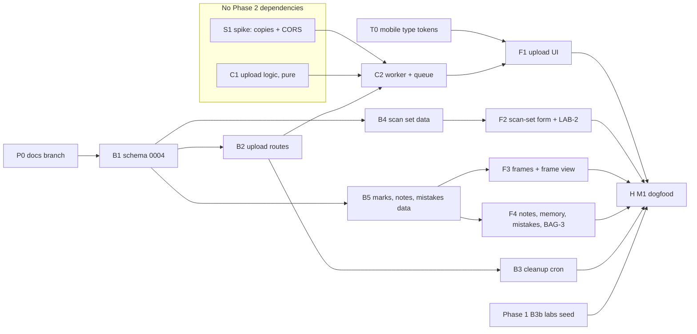

# Plan: Phase 2 · Scans & notes

> **For agentic workers:** REQUIRED SUB-SKILL: superpowers:executing-plans. **Trúc chose inline execution (30.09.2026):** every task runs in the main session, test first, on one branch, `feature/phase-2-scans-and-notes` (from `main`), with one commit per task. Steps use checkboxes (`- [ ]`).

**Goal:** a user drops a lab's folder of scans on a roll. Every file under 10 MB lands in R2 byte for byte, with two browser-made WebP copies. They record the lab (and branch) for the scan set, mark tấm ưng and blank frames, tag mistakes, and write notes and the roll's memory. It ends on **M1 dogfood: 5 of your real rolls uploaded, 0 failed files.**

**Architecture:** the browser validates, hashes, reads EXIF and makes the 480 px and 2048 px copies in a Web Worker. It asks a **route handler** for presigned PUT URLs (frames inserted as `pending`), PUTs the three objects straight to R2, then confirms. The server checks each object with `HEAD` before it marks the frame `ready`. A nightly Vercel Cron deletes frames still pending after 24 h, along with their objects. Marks, notes, memory and mistakes are Server Actions over four new tables.

**Tech stack:** Next.js 16 App Router, Drizzle + Neon (PGlite in tests), Cloudflare R2 via `@aws-sdk/client-s3`, Vitest + Testing Library, `exifr` (new, EXIF only), Web Workers + `OffscreenCanvas`.

**Spec:** [SCAN-1–4](../../docs/product/requirements/scans.md), [LAB-3](../../docs/product/requirements/labs.md), [NOTE-1, NOTE-2](../../docs/product/requirements/notes.md), BAG-3's mistake count ([bag.md](../../docs/product/requirements/bag.md) open issue), [ADR-001 upload flow](../../docs/architecture/adr-001-tech-stack.md#upload-flow), the [roadmap](../../docs/roadmap.md) Phase 2 row, and the 36 Phase 2 boards on the canvas page "Scan & ghi chú".

## Global constraints

- Everything in code is named in English (tables, columns, routes, i18n keys). Vietnamese only in `messages/vi.json` and docs. UI words come from the [PRD glossary](../../docs/product/prd.md#words-we-use): tấm ưng, oops, kỷ niệm, cuộn.
- House DB rules (Phase 1 D9): `uuid_generate_v4()` ids, **no foreign keys**, `deleted_at` soft deletes, partial indexes `WHERE deleted_at IS NULL`, `timestamptz`. **Every query filters by owner.**
- Phase 1 module shape, kept: `src/features/<area>/core.ts` (`import "server-only"`, every function takes `db: TDb` from `src/features/shared/db.ts` first, tested against `createTestDb()`), `actions.ts` (`"use server"`, reads the session, calls the core), `components/`. PostHog through `captureServerEvent`, which never throws.
- Upload types and cap: `image/jpeg`, `image/png`, `image/webp`, at most 10 MB (10 × 1024 × 1024 bytes), checked in the browser **and** on the server (`src/lib/r2.ts` already enforces both on signing).
- Originals stay in the private bucket and are only served through short-lived presigned GETs to their owner. Copies go in the public bucket under random UUID keys.
- Every screen follows its board at 390 px and 1440 px, in Paper and Darkroom. Under 600 px, type uses the design system's mobile styles (`display-mobile`, `title-mobile`, `body-mobile`, `body-sm-mobile`), available once T0 lands.
- `pnpm check` (lint, typecheck, test, build) passes before every commit. Commits: `type(cuon): what changed`, title only.

---

## Status

- **Roadmap:** Phase 2, 2 – 22 Nov 2026 (W6–8), **26 h booked**. This plan estimates **~28.75 h** (see [Budget](#budget)). Roadmap artifact at rev 37 after decision 2 was ticked on 30.09.2026, mirror updated.
- **Phase 1:** merged 30.09.2026 (PR #20, `a0d6d00`; ticks in PR #21). CAT-1, CAT-2, BAG-1–3, ROLL-1 and ROLL-2 are ticked. **Still open:** LAB-1 (labs seed), LAB-2 (built on `/dev/labs` only) and the 60 s exit timing. How Phase 2 picks these up is in [Carried over from Phase 1](#carried-over-from-phase-1).
- **Start:** Phase 2 can begin now, about a month ahead of its 2 Nov slot.
- **Design system:** `1790767263-4ce8` (30.09.2026), mirror synced. Two changes since Phase 1: Trúc's smaller type on phones (`bd24`: `display-mobile`, `title-mobile`, `body-mobile`, `body-sm-mobile`), and the `UploadDrop` guideline now says `cobalt` on drag-over (`4ce8`, blocker 3). **The app's `design-tokens/tokens.json` is still the `ee2b` copy**, so task T0 brings the mobile type into code before track F.
- **Design canvas:** re-read 30.09.2026: `1790765247-6906`. **All nine Phase 2 screens are drawn** (36 boards, see [Designs](#designs-d0-drawn)), with the blocker defaults below. Approved by Trúc on 30.09.2026.
- **Docs for the boards:** moved onto `docs/phase-2-plan` (from `main`) with this plan (task P0), with the decision edits below.
- **Plan status:** **approved 30.09.2026 (Trúc)**, with the default for all four [blockers](#blockers-answered-30092026).

## Blockers (answered 30.09.2026)

Trúc said yes to the default for all four. What each answer changed:

1. **Roadmap decision 2: file types.** The MVP takes JPEG, PNG and WebP up to 10 MB, with copies made in the browser; TIFF and server-made copies move to v1.1a. Done: SCAN-1, SCAN-3 and open question Q2 edited in the PRD artifact (version 8); `prd.md`, `scans.md` and Known conflict #2 updated; decision 2 ticked and its outcome written in the roadmap artifact (rev 37) and `docs/roadmap.md`.
2. **Known conflict #4: mistakes and marks.** D3–D5 stand: a `mistake` table, `frame.is_keeper` and `frame.is_blank`, and oops = has a mistake. Done: Known conflict #4 and the `notes.md` open issues closed. The ADR's table rows change with migration `0004` (B1).
3. **Known conflict #7: drag-over colour.** `cobalt-soft` with a `cobalt` border. Done: the `UploadDrop` guideline in the design system artifact (`4ce8`, which also drops TIFF from its preview hint), the mirror and Known conflict #7. `bundle.css` already used `cobalt`; the app's `UploadDrop` changes in F1.
4. **The 36 Phase 2 boards** on canvas `6906` are approved. Track F can start once its data lands.

## Carried over from Phase 1

| Item | State on 30.09 | What Phase 2 does | Task |
|---|---|---|---|
| LAB-1 labs seed (Phase 1 B3b) | Only "Tự tráng ở nhà" is seeded; no `labs.json`. Lab rows need your check (content deadline 01.11) | **Needed before H.** Dogfood rolls need their real labs, and the "Lab recorded" metric starts with them. B3b stays a Phase 1 task on its own branch | B3b (Phase 1) |
| LAB-2 custom lab | `LabPicker` and `LabAddForm` live on `/dev/labs` only (Phase 1 D13) | F2 mounts both in the scan-set form, then `/dev/labs` is deleted. LAB-2 can be ticked once F2 merges | F2 |
| BAG-3 mistake count | The camera card shows rolls shot only ([bag.md](../../docs/product/requirements/bag.md) open issue) | B5 adds per-camera mistake counts, and F4 shows "2 lần lọt sáng" on the camera card | B5, F4 |
| Desktop "Lab" nav item (Phase 1 R2-6) | Hidden "until the scan-set flow" | **Stays hidden** (D24): no Phase 2 board has a lab page to link to | — |
| ROLL-2 wording "search the catalogue first" | Edited in the main checkout's `rolls.md` and `prd.md`, never committed, and `main` has newer versions of both files | Out of this plan. Needs a PRD artifact check (the artifact owns requirement wording), then a docs PR | — |
| Phase 1 exit (three rolls in under 60 s on a phone) | Open | Nothing. It doesn't block Phase 2 | — |
| Design system `bd24`: smaller type on phones | In the artifact and the mirror; not in `design-tokens/tokens.json` or `src/styles/tokens.css` | T0 copies it in and applies it to the Phase 1 screens, so Phase 2 builds on it | T0 |

## Designs (D0, drawn)

Drawn 27.09.2026 on the canvas page "Scan & ghi chú". Each screen has four boards: phone and desktop, in Paper and Darkroom (`…Dark`, `…Web`, `…WebDark`). The details are in `wireframes.md` once P0 lands.

| Board | Screen | Req | Built in |
|---|---|---|---|
| `UploadScans` | Upload list: totals and bar, "Lab nào tráng cuộn này?" prompt (desktop: lab and received date beside the list), needs-retry / uploading / waiting / done groups, "Thử lại" per file and for all, "Thu nhỏ" to the tray | SCAN-1, SCAN-2 | F1 |
| `UploadTray` | Background tray: uploading 12/36, done, "2 tấm lỗi". Above the tabs on phone, bottom right on desktop | SCAN non-functional | F1 |
| `UploadErrors` | Over-10 MB files rejected with name and size; connection lost (20/36 safe); finished with failures | SCAN-1, SCAN-2 | F1 |
| `HomeUploading` | Home with the tray; the roll card stamped 12/36, then "36 tấm", or "2 lỗi" | SCAN-2 | F1 |
| `ScanSetForm` | "Lần scan này": lab and branch (opens `LabPicker`), received date (today). "Thêm chi tiết" folds drop-off date, process, push/pull, price in ₫, scanner, scan size and file format | LAB-3 | F2 |
| `RollFrames` | Roll page with scans: stamps (36 tấm, tấm ưng, oops, đẩy +1), scan-set line, numbered grid (3 columns on phone, 6 on desktop), memory and notes previews, "+ Thêm scan" | SCAN-4, NOTE-1 | F3 |
| `FrameView` | One frame, "Tấm 14/36", previous/next, toggles for tấm ưng and tấm trắng, "Oops?", this frame's notes, "Xem bản gốc 100%", "Đổi vị trí" | SCAN-2–4, NOTE-1 | F3 |
| `MistakePicker` | "Tấm này / Cả cuộn", 13 multi-select chips, a note per picked type, preview with oops stamp and red scribble | NOTE-2 | F4 |
| `NotesMemory` | Memory with "Đã lưu 14:02", timestamped notes with edit and delete, frame notes linking to their frame, composer | NOTE-1 | F4 |

The boards settled two questions: files are ordered by file name, and one frame moves with "Đổi vị trí" in `FrameView` (drag-reorder waits for Phase 3's grid). The upload starts on drop, and the scan-set form fills in beside it.

## Decisions this plan assumes

Approved with the plan on 30.09.2026. A change to one of these goes back to Trúc first.

| # | Decision | Default | Why |
|---|---|---|---|
| D1 | File types and cap (blocker 1) | JPEG, PNG, WebP, ≤ 10 MB. `accept="image/jpeg,image/png,image/webp"` on `UploadDrop`. A rejected file shows its name and size and is never sent | Roadmap decision 2. `r2.ts` already enforces this on signing |
| D2 | `frame` columns | `id, user_id, roll_id, scan_set_id, position, file_name, content_type, bytes, sha256, width, height, exif jsonb, original_key, grid_key, view_key, is_keeper, is_blank, alt_text, status (pending \| ready), deleted_at, created_at, updated_at`. `roll_id` is copied on, like `user_id` | The PRD's `bytes`, `sha256` and `alt_text` are cheap now: the hash unlocks SCAN-5 and `alt_text` Phase 5. `roll_id` saves a join on every roll page |
| D3 | Marks (blocker 2) | `is_keeper`, `is_blank` booleans. Setting blank clears tấm ưng and the reverse | PRD shape. One enum can't hold "tấm ưng and oops" |
| D4 | Mistakes (blocker 2) | `mistake`: `id, user_id, roll_id, frame_id?, type, note?, …`. `frame_id` null = the whole roll. Unique (`roll_id`, `frame_id`, `type`) among live rows, `NULLS NOT DISTINCT`. `type` is an English slug: `light_leak, blank_frame, double_exposure, missed_focus, underexposed, overexposed, wrong_iso, camera_shake, opened_back, rewound_early, lab_dust_scratches, lab_colour_cast, other`, with Vietnamese labels in `vi.json` | NOTE-2: "one or more mistakes plus a note". BAG-3, NOTE-4 and CAT-5 need stored types |
| D5 | Oops | A frame is oops when it has at least one live `mistake`. No column | One source of truth |
| D6 | Notes | `note`: `id, user_id, roll_id, frame_id?, body, …`. `updated_at` is the "edited" time. Migration `0004` drops the unused `roll.notes`. `roll.memory` stays | NOTE-1: several timestamped notes on a roll or frame, plus one memory |
| D7 | Scan set | `scan_set`: `id, user_id, roll_id, lab_id?, lab_branch_id?, received_at?, dropped_at?, process?, push_pull_thirds?, scanner?, resolution_px?, file_format?, price_vnd?, …`. **`lab_id` and a nullable `lab_branch_id`** because Phase 1's `LabPicker` returns `{ labId, branchId \| null }` and "Tự tráng ở nhà" has no branch. **One live scan set per roll** (unique partial index), dropped when LAB-4 (rescans) ships. Both lab columns are null until the user picks, because the upload starts first; the roll page then asks "Chưa chọn lab" | LAB-3 and the boards' "upload first" flow. "Lab recorded" counts sets with a lab (and a branch where the lab has branches) |
| D8 | Push/pull on the scan set | `push_pull_thirds smallint` (+3 = +1 stop), prefilled from the roll's computed value (`src/features/rolls/push-pull.ts`) and editable | Same ⅓-stop scale as the roll |
| D9 | Upload endpoints | **Route handlers**, not Server Actions: `POST /api/uploads/slots` and `POST /api/uploads/confirm` | Next.js runs one Server Action at a time per client, which would serialise a 36-file upload. Phase 1 D19 already expected upload signing to be a route handler |
| D10 | Object keys | Original: `originals/<userId>/<frameId>.<ext>` (private). Copies: `grid/<uuid>.webp` and `view/<uuid>.webp` (public, random, not tied to the frame id) | Frame id makes the cleanup cron trivial. Public keys can't be guessed from a frame id |
| D11 | Browser copies | In a Web Worker: `createImageBitmap(file, { imageOrientation: "from-image" })` → `OffscreenCanvas` at 480 px and 2048 px on the long edge (never upscaled) → `convertToBlob({ type: "image/webp", quality: 0.82 })`. If the browser returns a PNG (no WebP encoder), fall back to JPEG at 0.85 with `.jpg` keys. Two files at a time, bitmaps closed after use | ADR. Keeps phones from running out of memory. Spike S1 checks it |
| D12 | EXIF | `exifr` in the browser. **GPS tags are removed before sending**; the rest is stored in `frame.exif`. Copies made by canvas carry no metadata | Privacy (SHARE-1). The original keeps its GPS but stays private |
| D13 | Hash | SHA-256 of the original via `crypto.subtle.digest` in the worker, stored in `frame.sha256`. No duplicate skip yet | SCAN-5 (v1.1a) needs it |
| D14 | Server checks on confirm | `HEAD` all three objects per frame; the original's `ContentLength` must equal `frame.bytes`; then `status = ready`. Missing → stays `pending`, the client retries that file | "Checked again on the server" (SCAN non-functional) |
| D15 | Concurrency and retry | 3 files in flight. Each PUT retries 3 times (1 s, 3 s, 9 s) before "Thử lại". Slots in batches of 12. A retry asks for fresh URLs (they live 10 min) | One failed file never fails the batch (SCAN-2) |
| D16 | Upload across navigation | An `UploadProvider` in `AppShell` (the `(app)` layout's client shell) owns the queue, so moving between app pages doesn't stop it. `beforeunload` warns while files are in flight | "Keeps going while the user moves around the app". Resume after a dropped connection is SCAN-5 (v1.1a) |
| D17 | Cleanup cron | `GET /api/cron/cleanup-uploads`, daily at 03:00 Vietnam time (`0 20 * * *` UTC), `Authorization: Bearer $CRON_SECRET`. Hard-deletes frames `pending` for more than 24 h and their R2 objects, at most 500 per run | ADR. Vercel Hobby allows daily crons. The frame never existed for the user |
| D18 | Serving images | Grid and view copies from `R2_PUBLIC_URL`. The original through `GET /api/frames/[id]/original`: owner check, then a redirect to a 5-minute presigned GET | SCAN-3: "the original loads only at 100% zoom or on download" |
| D19 | `roll.version` | Bumped when marks, mistakes or memory change | Phase 4's share images cache per version |
| D20 | Autosave | Notes and memory save 800 ms after the last keystroke and on blur. "Đang lưu…" / "Đã lưu hh:mm"; a failed save keeps the text and shows "Chưa lưu, thử lại" | NOTE-1, `NotesMemory` board |
| D21 | Routes | `/rolls/[id]` grows the frames grid, scan-set line, memory and notes (replacing `RollPage`'s disabled upload placeholder). `/rolls/[id]/frames/[frameId]` is `FrameView`. Upload, scan set, mistakes and notes open as a sheet on phone and a panel or dialog on desktop, not routes of their own | English routes, fewest new pages |
| D22 | Analytics (PostHog) | `upload_batch_started` (files, bytes), `upload_file_failed` (stage: `copies` \| `slot` \| `put` \| `confirm`, reason), `upload_batch_finished` (ok, failed, duration_ms), `frame_marked`, `mistake_tagged`, `note_saved`, `scan_set_saved` (has_lab, has_branch) | The M1 exit, the "upload failures under 1%" launch gate, and the "Lab recorded" metric |
| D23 | Deleting a frame | Soft delete from `FrameView` with undo. R2 objects stay (bucket versioning covers restore) | Not in the PRD, but dogfooding will upload a wrong file. ~0.5 h. Say if you'd rather leave it out |
| D24 | Desktop "Lab" nav (Phase 1 R2-6) | Stays hidden in Phase 2 | No board has a lab page; the scan-set form lives on the roll. Revisit if a labs screen is drawn |
| D25 | BAG-3 mistake count | Per camera: count of live mistakes on rolls shot with that bag item, grouped by type. The card shows the most frequent one, e.g. "12 cuộn · 2 lần lọt sáng" (BAG-3's own example) | Closes the BAG-3 open issue that Phase 1 left for NOTE-2 |

## Order



| ID | Task | Requirements | Est. | Needs | Branch |
|---|---|---|---|---|---|
| **P0** | Docs branch: this plan + the D0 board docs, from `main` | — | 0.25 h | — | `docs/phase-2-plan` |
| **T0** | Mobile type tokens from design system `bd24` into the app | — | 1 h | — | `chore/design-tokens-mobile-type` |
| **S1** | Spike: browser copies and R2 CORS on real phones | SCAN-3, D11 | 2 h | — | `spike/phase-2-browser-copies` |
| **C1** | Upload logic, pure functions | SCAN-1, SCAN-2 | 1.5 h | — | `feature/phase-2-upload-logic` |
| **B1** | Schema: `scan_set`, `frame`, `note`, `mistake`; drop `roll.notes`; migration `0004`; ADR + conflicts #2, #4 | D2–D7 | 2.5 h | blockers 1–2 | `feature/phase-2-data` |
| **B2** | Upload route handlers: slots, confirm, original redirect | SCAN-1, D9, D10, D14, D18 | 3 h | B1 | `feature/phase-2-upload-routes` |
| **B3** | Nightly cleanup cron | SCAN-3 (cleanup) | 1 h | B2 | `feature/phase-2-cleanup-cron` |
| **B4** | Scan-set data layer | LAB-3 | 1 h | B1 | `feature/phase-2-scan-set-data` |
| **B5** | Marks, notes, memory, mistakes data layer + BAG-3 counts | SCAN-4, NOTE-1, NOTE-2, BAG-3 | 3 h | B1 | `feature/phase-2-notes-data` |
| **C2** | Copies worker + upload queue | SCAN-2, SCAN-3, D11–D16 | 2.5 h | S1, C1, B2 | `feature/phase-2-upload-queue` |
| **F1** | Upload UI: list, tray, errors, home card | SCAN-1, SCAN-2 | 2.5 h | boards, C2 | `feature/phase-2-upload-ui` |
| **F2** | Scan-set form, mounting `LabPicker` and `LabAddForm`; remove `/dev/labs` | LAB-3, LAB-2 | 2 h | boards, B4 | `feature/phase-2-scan-set-ui` |
| **F3** | Roll page frames grid + `FrameView` with marks, move, delete | SCAN-3, SCAN-4 | 3 h | boards, B5 | `feature/phase-2-frames-ui` |
| **F4** | Notes, memory, mistake picker, BAG-3 camera card line | NOTE-1, NOTE-2, BAG-3 | 2.5 h | boards, B5 | `feature/phase-2-notes-ui` |
| **H** | M1 dogfood + roadmap ticks | M1 | 1 h | all, Phase 1 B3b | — |

All tasks land on `feature/phase-2-scans-and-notes`, one commit each (the Branch column is the commit scope, not a branch). B1 lands before anything else reads the new tables. PRs: open one when a track is done, or one for the phase; ask Trúc.

## Tasks

Numbered in execution order (inline, 30.09.2026). S1 needs real phones and a bucket setting, and H needs your rolls, so both run last with Trúc; C2 is built with D11's fallback in place and S1 confirms it.

### Task 1: P0 · Docs branch (~0.25 h)

The main checkout is on `feature/phase-1-data` (behind `main`) with uncommitted docs. This task moves only the Phase 2 pieces onto a fresh branch.

- [x] **Step 1:** `git switch -c feature/phase-2-scans-and-notes origin/main` in the main checkout. Its uncommitted work (older copies of these docs, the ROLL-2 wording edits in `rolls.md` and `prd.md`) is kept in the stash entry tagged `cuon-main-checkout-before-phase-2-1790767447`.
- [x] **Step 2:** Copied in this plan, `wireframes.md` (the "Scan & ghi chú" page plus the `CustomCamera`, `CustomLens` and search-first `PastRoll` rows, which describe boards already on the canvas; `main`'s BAG-2 paragraph kept) and `missing-screens.md`. Both re-checked against canvas `1790765247-6906`. The `rolls.md` / `prd.md` ROLL-2 edits stayed behind ([Carried over](#carried-over-from-phase-1)).
- [x] **Step 2b:** The blocker answers ([above](#blockers-answered-30092026)): PRD, design system and roadmap artifacts, and their mirrors.
- [x] **Step 3: Commit** `docs(cuon): plan phase 2 scans and notes, settle its decisions` on `feature/phase-2-scans-and-notes` (PR when Trúc asks).

### Task 2: T0 · Mobile type tokens (~1 h)

Design system `bd24` (Trúc, 30.09.2026) added four phone type styles. The artifact's README says how the app takes them.

- [x] **Step 1:** Copy the artifact's `project/tokens.json` byte for byte into `design-tokens/tokens.json`, then run `pnpm tokens`. (Done in another session on 30.09.2026; checked byte-identical to `bd24` and carried onto this branch.)
- [ ] **Step 2:** Run `pnpm test`. Expected: the generated-CSS test passes, and the contrast test is unaffected (no colour changed).
- [ ] **Step 3:** Under 600 px, switch the design-system components and Phase 1 screens to the mobile styles, following the artifact's `bundle.css` phone block: `Button`, `Field`, `UploadDrop` and `RollCard` sizes; page titles to `display-mobile`; sheet and dialog titles to `title-mobile`. Add `maximum-scale=1` to the viewport, as the README says.
- [ ] **Step 4:** Check the Phase 1 screens at 390 px next to their boards, then `pnpm check`.
- [ ] **Step 5: Commit** `chore(cuon): take the design system's mobile type sizes`.

### Task 14: S1 · Spike: browser copies and CORS (~2 h)

**Question:** do `createImageBitmap` + `OffscreenCanvas.convertToBlob` make correct sRGB WebP copies on iPhone Safari, Android Chrome and desktop Chrome/Safari, and can those browsers PUT straight to both R2 buckets?

**Files:**
- Create: `src/app/dev/copies/page.tsx` (dev-only, removed at the end, like the Phase 0 spikes)
- Create: `docs/spikes/browser-copies.md`
- Modify: R2 CORS on both buckets: `PUT`, `GET`, `HEAD` from `https://*.vercel.app`, the production domain and `http://localhost:3000`; header `content-type`; `ExposeHeaders: ETag`. **Ask Trúc before changing bucket settings.**

- [ ] **Step 1:** Dev page: pick files → show the 480 and 2048 copies beside the original, the output `blob.type`, time taken.
- [ ] **Step 2:** Test with a lab JPEG in **Adobe RGB**, a portrait phone photo with EXIF rotation, and a 10 MB PNG.
- [ ] **Step 3:** Per device, record: (a) does the Adobe RGB copy match the original or look washed out, (b) is `blob.type` `image/webp`, (c) time for 36 files, (d) did the tab crash?
- [ ] **Step 4:** Set CORS, then PUT one presigned original and one public copy from each phone on a preview URL.
- [ ] **Step 5:** Write `docs/spikes/browser-copies.md` with a result per device and which D11 fallback applies. **If Adobe RGB copies are washed out on a target browser, stop and bring it to Trúc.** The options: accept it for the MVP (the original stays true), or pull server-made copies forward from v1.1a.
- [ ] **Step 6:** Delete the dev page. **Commit** `docs(cuon): spike browser-made scan copies and r2 cors`.

### Task 3: C1 · Upload logic, pure functions (~1.5 h)

**Files:**
- Create: `src/features/uploads/limits.ts` (shared, **not** `server-only`)
- Create: `src/features/uploads/validate.ts`, `order.ts`, `strip-gps.ts`, each with a `.test.ts`
- Modify: `src/lib/r2.ts` (import the limits instead of its own constants)

**Interfaces:**
- Produces: `MAX_UPLOAD_BYTES`, `ALLOWED_UPLOAD_TYPES`, `type TAllowedUploadType` (in `limits.ts`)
- Produces: `validateFiles(files: File[]): { accepted: File[]; rejected: IRejectedFile[] }`, `IRejectedFile = { name: string; bytes: number; reason: "too_big" | "wrong_type" }`
- Produces: `orderByFileName<T extends { name: string }>(files: T[]): T[]`
- Produces: `stripGps(exif: Record<string, unknown>): Record<string, unknown>`

- [ ] **Step 1: Write the failing tests**

```ts
// src/features/uploads/validate.test.ts
import { describe, expect, it } from "vitest";
import { MAX_UPLOAD_BYTES } from "./limits";
import { validateFiles } from "./validate";

const file = (name: string, bytes: number, type = "image/jpeg") =>
  new File([new Uint8Array(bytes)], name, { type });

describe("validateFiles", () => {
  it("accepts JPEG, PNG and WebP at exactly 10 MB", () => {
    const files = [
      file("a.jpg", MAX_UPLOAD_BYTES),
      file("b.png", 10, "image/png"),
      file("c.webp", 10, "image/webp"),
    ];
    expect(validateFiles(files)).toEqual({ accepted: files, rejected: [] });
  });

  it("rejects one byte over 10 MB with its name and size", () => {
    const big = file("01.jpg", MAX_UPLOAD_BYTES + 1);
    expect(validateFiles([big]).rejected).toEqual([
      { name: "01.jpg", bytes: MAX_UPLOAD_BYTES + 1, reason: "too_big" },
    ]);
  });

  it("rejects TIFF and HEIC as wrong_type", () => {
    const { rejected } = validateFiles([file("a.tif", 10, "image/tiff"), file("b.heic", 10, "image/heic")]);
    expect(rejected.map((r) => r.reason)).toEqual(["wrong_type", "wrong_type"]);
  });

  it("ignores hidden files from a dropped folder", () => {
    expect(validateFiles([file(".DS_Store", 10, "")])).toEqual({ accepted: [], rejected: [] });
  });
});
```

```ts
// src/features/uploads/order.test.ts
import { describe, expect, it } from "vitest";
import { orderByFileName } from "./order";

describe("orderByFileName", () => {
  it("sorts numbers naturally", () => {
    const names = ["10.jpg", "2.jpg", "1.jpg"].map((name) => ({ name }));
    expect(orderByFileName(names).map((f) => f.name)).toEqual(["1.jpg", "2.jpg", "10.jpg"]);
  });

  it("keeps lab prefixes together and ignores case", () => {
    const names = ["IMG_0010.JPG", "img_0002.jpg", "IMG_0001.jpg"].map((name) => ({ name }));
    expect(orderByFileName(names).map((f) => f.name)).toEqual(["IMG_0001.jpg", "img_0002.jpg", "IMG_0010.JPG"]);
  });

  it("does not mutate its input", () => {
    const input = [{ name: "2.jpg" }, { name: "1.jpg" }];
    orderByFileName(input);
    expect(input[0].name).toBe("2.jpg");
  });
});
```

```ts
// src/features/uploads/strip-gps.test.ts
import { describe, expect, it } from "vitest";
import { stripGps } from "./strip-gps";

describe("stripGps", () => {
  it("drops every GPS tag and keeps the rest", () => {
    const exif = { Make: "NORITSU", latitude: 10.77, longitude: 106.7, GPSLatitude: [10, 46, 12], GPSAltitude: 5 };
    expect(stripGps(exif)).toEqual({ Make: "NORITSU" });
  });
});
```

- [ ] **Step 2: Run them to see them fail**

Run: `pnpm vitest run src/features/uploads`
Expected: FAIL, "Cannot find module" for `./limits`, `./validate`, `./order` and `./strip-gps`.

- [ ] **Step 3: Write the minimal code**

```ts
// src/features/uploads/limits.ts
/** D1 / roadmap decision 2. Shared by the browser (validate.ts) and the server (src/lib/r2.ts). */
export const MAX_UPLOAD_BYTES = 10 * 1024 * 1024;
export const ALLOWED_UPLOAD_TYPES = ["image/jpeg", "image/png", "image/webp"] as const;
export type TAllowedUploadType = (typeof ALLOWED_UPLOAD_TYPES)[number];
```

```ts
// src/features/uploads/validate.ts
import { ALLOWED_UPLOAD_TYPES, MAX_UPLOAD_BYTES } from "./limits";

export interface IRejectedFile {
  name: string;
  bytes: number;
  reason: "too_big" | "wrong_type";
}

export function validateFiles(files: File[]): { accepted: File[]; rejected: IRejectedFile[] } {
  const accepted: File[] = [];
  const rejected: IRejectedFile[] = [];
  for (const file of files) {
    if (file.name.startsWith(".")) continue;
    if (!(ALLOWED_UPLOAD_TYPES as readonly string[]).includes(file.type)) {
      rejected.push({ name: file.name, bytes: file.size, reason: "wrong_type" });
    } else if (file.size > MAX_UPLOAD_BYTES) {
      rejected.push({ name: file.name, bytes: file.size, reason: "too_big" });
    } else {
      accepted.push(file);
    }
  }
  return { accepted, rejected };
}
```

```ts
// src/features/uploads/order.ts
const collator = new Intl.Collator("en", { numeric: true, sensitivity: "base" });

/** SCAN-2: frames are ordered by file name, naturally (2 before 10). */
export function orderByFileName<T extends { name: string }>(files: T[]): T[] {
  return [...files].sort((a, b) => collator.compare(a.name, b.name));
}
```

```ts
// src/features/uploads/strip-gps.ts
const GPS_KEYS = new Set(["latitude", "longitude"]);

/** D12: no GPS leaves the browser. exifr returns GPS tags as GPS* plus latitude/longitude. */
export function stripGps(exif: Record<string, unknown>): Record<string, unknown> {
  return Object.fromEntries(Object.entries(exif).filter(([key]) => !key.startsWith("GPS") && !GPS_KEYS.has(key)));
}
```

- [ ] **Step 4: Run them to see them pass**

Run: `pnpm vitest run src/features/uploads`
Expected: PASS, 8 tests.

- [ ] **Step 5:** In `src/lib/r2.ts`, replace `ALLOWED_UPLOAD_CONTENT_TYPES`, `TAllowedUploadContentType` and `MAX_UPLOAD_BYTES` with imports from `@/features/uploads/limits` (re-export the old names if `r2.test.ts` or `scripts/r2-smoke.ts` use them). Run `pnpm check`. Expected: all green.
- [ ] **Step 6: Commit** `feat(cuon): validate and order scans before upload`

### Task 4: B1 · Schema (~2.5 h)

**Files:**
- Create: `src/db/schema/scans.ts` (`scanSet`, `frame`, `FRAME_STATUSES`), `src/db/schema/scans.test.ts`
- Create: `src/db/schema/notes.ts` (`note`, `mistake`, `MISTAKE_TYPES`), `src/db/schema/notes.test.ts`
- Modify: `src/db/schema/rolls.ts` (drop `notes`, update the doc comment), `src/db/schema/index.ts` (exports)
- Create: `drizzle/0004_*.sql` (generated)
- Modify: `docs/architecture/adr-001-tech-stack.md` (rows for `scan_set`, `frame`, `note`, `mistake`; drop `frame.mark` / `frame.note` and `roll.notes`; the library index becomes (`user_id`, `is_keeper`, `created_at`)); `docs/README.md` (close conflicts #2 and #4 once blockers 1–2 are answered); `docs/product/requirements/{scans,notes,labs}.md` (open issues)

**Interfaces:**
- Produces: `MISTAKE_TYPES` (the 13 slugs in D4, in NOTE-2's table order), `type TMistakeType`, `FRAME_STATUSES = ["pending", "ready"] as const`, and Drizzle tables `scanSet`, `frame`, `note`, `mistake` with the columns in D2, D4, D6 and D7.

- [ ] **Step 1: Failing tests,** in the style of `rolls.test.ts`, against `createTestDb()`:
  - `frame` inserts with only `user_id, roll_id, scan_set_id, position, file_name, content_type, bytes, original_key, grid_key, view_key`, and gets `status = 'pending'`, `is_keeper = false`, `is_blank = false`.
  - A second live `scan_set` for the same `roll_id` fails; one after soft-deleting the first succeeds.
  - A `scan_set` with `lab_id` set and `lab_branch_id` null inserts (home development).
  - A second live `mistake` with the same (`roll_id`, `frame_id`, `type`) fails, and so does a roll-level duplicate (`frame_id` null).
  - `MISTAKE_TYPES` has 13 entries, and each has a `vi.json` label at `mistakes.types.<slug>`.
  - `roll` has no `notes` column.
- [ ] **Step 2:** Run `pnpm vitest run src/db/schema`. Expected: FAIL.
- [ ] **Step 3:** Write the tables. Indexes, all partial on `deleted_at IS NULL`:
  - `frame (roll_id, position)`
  - `frame (user_id, is_keeper, created_at) WHERE status = 'ready'`, for Phase 3's library view
  - `frame (status, created_at) WHERE status = 'pending'`, for the cron
  - `note (roll_id, created_at)`
  - `mistake (roll_id)`

  Then run `pnpm db:generate` and check `0004` is additive apart from the `roll.notes` drop. Hand-add a guard in the migration: `roll.notes` is dropped only when every live row has it `NULL`.
- [ ] **Step 4:** Run the tests (PASS), then `pnpm check`.
- [ ] **Step 5:** The docs edits listed above.
- [ ] **Step 6: Commit** `feat(cuon): add scan set, frame, note and mistake tables`

### Task 5: B2 · Upload route handlers (~3 h)

**Files:**
- Create: `src/features/uploads/core.ts` (`requestSlotsCore`, `confirmFramesCore`) + `core.test.ts`
- Create: `src/app/api/uploads/slots/route.ts`, `src/app/api/uploads/confirm/route.ts`, `src/app/api/frames/[id]/original/route.ts`, each with a route test
- Modify: `src/lib/r2.ts`:
  - `createPresignedUploadUrl` takes `{ bucket: "originals" | "public", key, contentType, size }`, and the caller builds the key (D10)
  - add `headObject({ bucket, key }): Promise<{ contentLength: number } | null>`
  - add `deleteObjects({ bucket, keys })`

  Keep `r2.test.ts` and `pnpm r2:smoke` passing.

**Interfaces:**
- Consumes: `frame`, `scanSet` (B1); `roll`; the session through `getAuth().api.getSession`; `limits.ts` (C1).
- Produces:

```ts
// POST /api/uploads/slots
interface ISlotsRequest {
  rollId: string;
  files: Array<{
    clientId: string; // the browser's id for the file, echoed back
    fileName: string;
    contentType: "image/jpeg" | "image/png" | "image/webp";
    bytes: number;
    sha256: string;
    width: number;
    height: number;
    exif: Record<string, unknown>; // GPS already stripped
    position: number;
    copyType: "image/webp" | "image/jpeg"; // D11 fallback
    gridBytes: number;
    viewBytes: number;
  }>; // max 12 per call (D15)
}
interface ISlotsResponse {
  scanSetId: string;
  slots: Array<{ clientId: string; frameId: string; originalUrl: string; gridUrl: string; viewUrl: string }>;
}

// POST /api/uploads/confirm
interface IConfirmRequest { frameIds: string[] }
interface IConfirmResponse { ready: string[]; missing: string[] }
```

- [ ] **Step 1: Failing tests** for `requestSlotsCore(db, userId, input, { sign })` and `confirmFramesCore(db, userId, frameIds, { head })`. R2 is injected, so no network.
  - Another user's `rollId` → `{ ok: false, error: "not_found" }`, nothing inserted. (Phase 1 cores return result unions, e.g. `TCreateRollResult`; follow that.)
  - The first call creates the roll's scan set; a second call reuses it.
  - 13 files → `"too_many"`. A file over 10 MB or `image/tiff` → `"invalid_file"` naming the `clientId`.
  - Frames are inserted `pending` with keys `originals/<userId>/<frameId>.jpg`, `grid/<uuid>.webp`, `view/<uuid>.webp`.
  - Confirm: all three objects present with the right size → `ready`. Original size differs → stays `pending`, listed in `missing`. Another user's frame id → ignored, not listed.
  - Confirm doesn't bump `roll.version` (D19: only marks, mistakes and memory do).
- [ ] **Step 2:** Run. Expected: FAIL.
- [ ] **Step 3:** Implement. Route handlers parse with zod and return 401 without a session, 400 for validation errors, 404 for `not_found`.
- [ ] **Step 4:** `GET /api/frames/[id]/original`: owner → `302` to a 5-minute presigned GET; anyone else → 404; a `pending` frame → 404.
- [ ] **Step 5:** Run the tests (PASS), then `pnpm check`.
- [ ] **Step 6: Commit** `feat(cuon): sign and confirm scan uploads`

### Task 6: B3 · Nightly cleanup cron (~1 h)

**Files:**
- Create: `src/features/uploads/cleanup.ts` + test, `src/app/api/cron/cleanup-uploads/route.ts` + test
- Modify: `vercel.json` (`"crons": [{ "path": "/api/cron/cleanup-uploads", "schedule": "0 20 * * *" }]`), `src/env.ts` (`CRON_SECRET`, required in production)

- [ ] **Step 1: Failing tests** for `cleanupPendingFramesCore(db, { now, deleteObjects })`:
  - Pending for 25 h → hard-deleted, and its three keys go to `deleteObjects`.
  - Pending for 23 h, or `ready` at any age → untouched.
  - 600 stale frames → 500 deleted this run.
  - `deleteObjects` throws → no rows deleted. Keys go first, then rows, so no row ever points at a missing object.
  - The route returns 401 without `Authorization: Bearer <CRON_SECRET>`.
- [ ] **Step 2–4:** Run (FAIL) → implement → run (PASS), then `pnpm check`.
- [ ] **Step 5:** Add `CRON_SECRET` to Vercel production and preview. **Ask Trúc first**: it's a shared config change.
- [ ] **Step 6: Commit** `feat(cuon): clean up abandoned uploads nightly`

### Task 7: B4 · Scan-set data layer (~1 h)

**Files:** Create `src/features/scan-sets/core.ts`, `actions.ts`, and `core.test.ts`.

**Interfaces:**
- Consumes: `scanSet` (B1); `lab`, `labBranch`, `ILabPick` (Phase 1 `LabPicker`).
- Produces:
  - `updateScanSetCore(db, userId, input)` with `input = { scanSetId; labId?: string | null; labBranchId?: string | null; receivedAt?: Date | null; droppedAt?: Date | null; process?: "c41" | "e6" | "bw" | "ecn2" | null; pushPullThirds?: number | null; scanner?: string | null; resolutionPx?: number | null; fileFormat?: string | null; priceVnd?: number | null }`, returning `{ ok: true } | { ok: false; error: "not_found" | "invalid_lab" | "invalid_dates" | "invalid_push_pull" }`
  - `getScanSetForRollCore(db, userId, rollId)`, returning the set with lab and branch names, or `null`
  - `updateScanSetAction`, the `"use server"` wrapper

- [ ] **Step 1: Failing tests:**
  - Another user's scan set → `not_found`.
  - A lab from another user's private labs → `invalid_lab`; a seeded lab or the user's own is accepted.
  - A `labBranchId` that doesn't belong to `labId` → `invalid_lab`.
  - Home development with no branch is accepted.
  - `receivedAt` in the future, or `droppedAt` after `receivedAt` → `invalid_dates`.
  - `pushPullThirds` outside −9…+9 → `invalid_push_pull`.
  - The action fires `scan_set_saved` once.
- [ ] **Step 2–4:** FAIL → implement (zod) → PASS, then `pnpm check`.
- [ ] **Step 5: Commit** `feat(cuon): record lab and branch on a scan set`

### Task 8: B5 · Marks, notes, memory, mistakes + BAG-3 counts (~3 h)

**Files:** Create `src/features/frames/core.ts`, `src/features/notes/core.ts`, `src/features/mistakes/core.ts`, each with `actions.ts` and tests. Modify `src/features/bag/queries.ts` (`listBag` camera entries gain `topMistake`) and its test. Modify `src/features/rolls/core.ts` (`IRollEntry` gains `frameCount`, for `HomeUploading`'s card stamp).

**Interfaces:**
- Produces:
  - `setFrameMarksCore(db, userId, { frameId, isKeeper?, isBlank? })`: D3 exclusivity; bumps `roll.version`.
  - `moveFrameCore(db, userId, { frameId, toPosition })`: shifts the others in one transaction.
  - `deleteFrameCore` / `restoreFrameCore(db, userId, { frameId })` (D23).
  - `saveNoteCore(db, userId, { noteId?, rollId, frameId?, body })` → `{ id, updatedAt }`: creates or edits; an empty body soft-deletes.
  - `deleteNoteCore(db, userId, { noteId })`.
  - `saveMemoryCore(db, userId, { rollId, memory })` → `{ updatedAt }`: bumps `roll.version`.
  - `setMistakesCore(db, userId, { rollId, frameId?: string | null, items: Array<{ type: TMistakeType; note?: string }> })`: replaces the set for that frame or roll; bumps `roll.version`.
  - `listRollFramesCore(db, userId, rollId)` → `Array<{ id, position, gridUrl, viewUrl, width, height, isKeeper, isBlank, isOops, noteCount }>`, ready and live only, by position.
  - `listRollNotesCore(db, userId, rollId)` → notes newest first, each with `frameId` and `framePosition`.
  - `listBag` camera entries: `topMistake: { type: TMistakeType; count: number } | null` (D25).

- [ ] **Step 1: Failing tests:**
  - Every core rejects another user's ids.
  - Marking blank clears tấm ưng.
  - `moveFrameCore` 5 → 2: old frames 1, 5, 2, 3, 4 end up at positions 1–5.
  - `setMistakesCore` with `[light_leak]`, then `[light_leak, camera_shake]`, leaves two live rows and keeps the first row's id. With `[]`, `isOops` becomes false.
  - `saveNoteCore` with `""` deletes the note.
  - `roll.version` goes up by one per mark, mistake or memory change, and not for notes.
  - `listRollFramesCore` hides `pending` and deleted frames.
  - `topMistake` counts only live mistakes on live rolls shot with that camera bag item, and is `null` with none.
  - `frameCount` counts ready, live frames.
- [ ] **Step 2–4:** FAIL → implement → PASS, then `pnpm check`.
- [ ] **Step 5: Commit** `feat(cuon): mark frames and save notes, memory and mistakes`

### Task 9: C2 · Copies worker + upload queue (~2.5 h)

**Files:**
- Create: `src/features/uploads/client/copies.worker.ts` (bitmap → 2 copies, SHA-256, EXIF via `exifr`, `stripGps`)
- Create: `src/features/uploads/client/queue.ts` + `queue.test.ts` (a state machine with no DOM)
- Create: `src/features/uploads/client/UploadProvider.tsx` + test, mounted in `src/components/app-shell/AppShell.tsx`
- Modify: `package.json` (`exifr`)

**Interfaces:**
- Consumes: `validateFiles`, `orderByFileName` (C1); `/api/uploads/slots` and `/confirm` (B2).
- Produces:
  - `useUploads()` → `{ batches: IUploadBatch[]; start(rollId: string, files: File[]): void; retry(fileId: string): void; retryAll(batchId: string): void }`
  - `IUploadBatch = { id; rollId; files: IUploadFile[]; startedAt }`
  - `IUploadFile = { id; name; bytes; status: "queued" | "copies" | "uploading" | "confirming" | "done" | "failed" | "rejected"; progress: number; error?: "too_big" | "wrong_type" | "copies" | "slot" | "put" | "confirm" }`

- [ ] **Step 1: Failing queue tests,** with fake `makeCopies`, `requestSlots`, `put` and `confirm`, and fake timers:
  - Never more than 3 files between `copies` and `confirming`.
  - A PUT that fails twice then succeeds ends `done`. One that fails 4 times ends `failed` with `error: "put"`, and the others still finish.
  - `retry(id)` asks for **new** slots and ends `done`.
  - Rejected files never reach `requestSlots`.
  - 36 files → 3 slot calls.
  - `upload_batch_finished` fires once.
- [ ] **Step 2–4:** FAIL → implement → PASS.
- [ ] **Step 5:** The worker has no unit test, because jsdom has no `OffscreenCanvas`. S1's devices and the H dogfood check it instead. Add the `beforeunload` warning (D16).
- [ ] **Step 6:** `pnpm check`. **Commit** `feat(cuon): make scan copies in a worker and queue uploads`

### Task 10: F1 · Upload UI (~2.5 h)

Build `UploadScans`, `UploadTray`, `UploadErrors` and `HomeUploading` from their boards:

- Replace `RollPage`'s disabled upload placeholder with the working `UploadDrop`: `accept="image/jpeg,image/png,image/webp"`, folder drops via `webkitGetAsEntry`, and the board's hint "JPEG · PNG · WEBP · TỐI ĐA 10 MB".
- The roll card on home shows the batch progress, then `frameCount` (B5).
- Set the drag-over colour per blocker 3, in the code, the design-system artifact README and the mirror, all in the same session.

- [ ] **Step 1: Failing component tests:**
  - A rejected file shows "01.tif · 24,3 MB · quá 10 MB" (sizes in Vietnamese format).
  - A failed file shows "Thử lại", which calls `retry`.
  - The tray shows "Đang tải 12/36" and links to the roll.
  - The tray hides 5 s after a clean finish and stays when a file failed.
  - "Thu nhỏ" closes the list and leaves the tray.
- [ ] **Step 2–4:** FAIL → build → PASS. Visual check against the four boards of each screen.
- [ ] **Step 5:** `pnpm check`. **Commit** `feat(cuon): upload a folder of scans with per-file retry`

### Task 11: F2 · Scan-set form + LAB-2 home (~2 h)

`ScanSetForm` from its boards. It mounts `LabPicker`, and `LabAddForm` for `onAddNew`. It opens beside the upload on drop, and from "Chưa chọn lab" on the roll page. Once it merges, delete `src/app/dev/labs/`: the picker and the add form now have a real home, so LAB-2 can be ticked (Phase 1 D13).

- [ ] **Step 1: Failing tests:**
  - The received date defaults to today.
  - Push/pull prefills from the roll.
  - Saving without a lab is allowed, and the roll page then shows "Chưa chọn lab".
  - Picking home development saves `labId` with no branch.
  - Adding a lab through `LabAddForm` returns to the form with the new lab picked.
  - Optional fields fold behind "Thêm chi tiết".
  - Errors show in `pin`.
- [ ] **Step 2–4:** FAIL → build → PASS, visual check.
- [ ] **Step 5: Commit** `feat(cuon): record lab and branch when scans come back`

### Task 12: F3 · Frames on the roll page + FrameView (~3 h)

`RollFrames` and `FrameView` from their boards:

- The grid uses the `grid` copy, `loading="lazy"` after the first row, and `width`/`height` set so the layout doesn't shift.
- `FrameView` shows the `view` copy, and "Xem bản gốc 100%" opens `/api/frames/[id]/original`.

- [ ] **Step 1: Failing tests:**
  - The stamps show tấm ưng, blank and oops.
  - Toggling tấm ưng calls `setFrameMarks` optimistically and rolls back on error.
  - Arrow keys move between frames on desktop.
  - "Đổi vị trí" calls `moveFrame`.
  - "Xoá tấm này" shows undo for 5 s.
- [ ] **Step 2–4:** FAIL → build → PASS, visual check.
- [ ] **Step 5:** On a throttled "Fast 4G" profile, the first row of thumbnails shows in under 2 s (the launch gate).
- [ ] **Step 6: Commit** `feat(cuon): show scans on the roll and mark tấm ưng and blank`

### Task 13: F4 · Notes, memory, mistakes, BAG-3 line (~2.5 h)

`NotesMemory` and `MistakePicker` from their boards, with a `useAutosave(save, { delay: 800 })` hook (D20). On the bag's camera card, add the `topMistake` line: "12 cuộn · 2 lần lọt sáng".

- [ ] **Step 1: Failing tests:**
  - `useAutosave` calls `save` once, 800 ms after the last change or on blur, never both.
  - A failed save shows "Chưa lưu, thử lại" and keeps the text.
  - The picker switches between "Tấm này / Cả cuộn", shows the 13 Vietnamese labels, allows several, and sends one `setMistakes` call.
  - A frame note in the list links to its frame.
  - The camera card shows the mistake line only when `topMistake` isn't null.
- [ ] **Step 2–4:** FAIL → build → PASS, visual check.
- [ ] **Step 5: Commit** `feat(cuon): write notes and memory and tag mistakes`

### Task 15: H · M1 dogfood (~1 h of build time, plus your uploading)

1. **Before:** Phase 1 B3b (labs seed) is merged, so your real labs can be picked.
2. **You:** on a preview URL, upload 5 of your real rolls:
   - at least 2 from a phone on 4G
   - at least 1 lab folder of 36+ files

   Then pick each roll's lab, mark tấm ưng, tag at least one mistake and write one memory.
3. **Claude:** check that the exit holds:
   - PostHog has 0 `upload_file_failed` for these batches. A failed-then-retried file counts: the exit says "0 failed files".
   - No frame from these rolls is still `pending`.
4. **Claude:** tick in the roadmap artifact and `docs/roadmap.md` in the same session, and bump "Last synced":
   - the Phase 2 boxes, plus LAB-2 (Phase 1) once F2 is merged
   - the M1 box only after steps 2–3 hold
   - decision 2 only once the PRD artifact, the Decisions table and Known conflict #2 are updated

## Files to create or modify

```
.planning/plans/phase-2-scans-and-notes.md            new     P0
docs/design/{wireframes,missing-screens}.md           modify  P0: Phase 2 boards, canvas 6906
docs/spikes/browser-copies.md                         new     S1
docs/architecture/adr-001-tech-stack.md               modify  B1
docs/README.md                                        modify  close conflicts #2, #4, #7
docs/product/requirements/{scans,notes,labs,bag}.md   modify  open issues
docs/design/design-system.md + DS artifact            modify  UploadDrop drag-over colour (blocker 3)
docs/roadmap.md + roadmap artifact                    modify  ticks at H
PRD artifact + docs/product/prd.md                    modify  SCAN-1, SCAN-3 wording (blocker 1)
src/db/schema/{scans,notes}.ts                        new     + tests
src/db/schema/{rolls,index}.ts                        modify
drizzle/0004_*.sql                                    new     generated + guard
src/lib/r2.ts                                         modify  bucket + key params, head, delete
src/features/uploads/{limits,validate,order,strip-gps}.ts   new  + tests
src/features/uploads/{core,cleanup}.ts                new     + tests
src/features/uploads/client/{copies.worker,queue}.ts  new     + tests
src/features/uploads/client/UploadProvider.tsx        new     + test
src/features/uploads/components/*                     new     UploadList, UploadTray
src/features/scan-sets/{core,actions}.ts              new     + tests
src/features/scan-sets/components/ScanSetForm.tsx     new
src/features/frames/{core,actions}.ts                 new     + tests
src/features/frames/components/{FrameGrid,FrameView}.tsx  new
src/features/notes/{core,actions}.ts, components/*    new     NotesMemory, useAutosave
src/features/mistakes/{core,actions}.ts, components/* new     MistakePicker
src/features/bag/queries.ts, components/BagList.tsx   modify  topMistake (D25)
src/features/rolls/{core.ts,components/RollPage.tsx}  modify  frameCount, upload + frames sections
src/components/app-shell/AppShell.tsx                 modify  UploadProvider + tray
src/app/api/uploads/{slots,confirm}/route.ts          new
src/app/api/frames/[id]/original/route.ts             new
src/app/api/cron/cleanup-uploads/route.ts             new
src/app/(app)/rolls/[id]/frames/[frameId]/page.tsx    new
src/app/dev/labs/                                     delete  F2
src/env.ts, vercel.json, package.json                 modify  CRON_SECRET, cron, exifr
messages/vi.json                                      modify  every new string, mistake labels
```

## Test strategy

- **Pure units first (Vitest):** validation, natural order, GPS stripping, the queue state machine with fake timers.
- **Cores against PGlite (Phase 1 D21):** owner isolation on every core, the single live scan set, lab/branch ownership, mistake replacement, move, version bumps, the cleanup cutoff, `topMistake`.
- **Route handlers:** the 401 / 400 / 404 paths, with R2 injected.
- **Components (Testing Library):** file list states, retry, tray, scan-set form, autosave, mistake picker.
- **Not unit-testable, checked on devices:** the copies worker (S1, H), CORS PUTs from phones (S1), the 4G first-row speed (F3).
- **Every PR:** `pnpm check`, then the Vercel preview migrates its Neon branch.

## Budget

| Track | Tasks | Hours |
|---|---|---|
| Docs, tokens, spike | P0, T0, S1 | 3.25 |
| Data and server | B1–B5 | 10.5 |
| Client upload | C1, C2 | 4 |
| Screens | F1–F4 | 10 |
| Exit | H | 1 |
| **Total** (26 h booked) | | **~28.75** |

The design pass cost ~3 h and was done in Phase 1's week, so it isn't counted. Carried-over work adds 2 h: BAG-3's mistake line, LAB-2's real home and T0. About 2.75 h over; what to cut if the phase runs late:

1. **Drop D23** (delete a frame): −0.5 h. Wrong uploads get cleaned in the database by hand during dogfood.
2. **Frame notes only through the roll's notes list**, with none in `FrameView`: −1 h.
3. **Roll-level mistakes only.** Frame-level tagging moves to Phase 3's bulk marking (COL-4), which touches the same frames: −1 h. This also keeps BAG-3's count working.
4. **Scan-set optional fields** (scanner, resolution, format, price) left out of the form, columns kept: −0.5 h. Compare needs them, so this goes last.

Never cut: per-file retry, the server-side size check, the cleanup cron. The launch gate "upload failures under 1%" depends on them.

## Risks

| Risk | Likelihood | Mitigation |
|---|---|---|
| Safari makes washed-out copies from Adobe RGB lab JPEGs, or can't encode WebP | Medium | S1 on real devices before C2. JPEG fallback built in (D11). If colour is wrong, you choose between accepting it and server-made copies |
| A phone tab runs out of memory on 36 × 10 MB | Medium | Worker, 2 files at a time, bitmaps closed (D11). S1 measures it |
| R2 CORS blocks PUTs from preview URLs | Medium | Set and tested in S1 with `*.vercel.app` |
| The labs seed (Phase 1 B3b) isn't ready for the dogfood | Medium | The content deadline is 01.11, before H. Custom labs (F2) and home development work without it |
| `0004` drops `roll.notes` with data in it | Low | Phase 1 never writes it; the migration's guard fails the deploy instead of losing text |
| Server Actions serialise uploads | Certain if used | Route handlers for slots and confirm (D9) |
| A stale `pending` frame shows on the roll page | Low | Every read filters `status = 'ready'`; the cron removes the rest |
| Upload stops when the tab closes or the phone sleeps | High on phones | `beforeunload` warning; failed files retry; resume is SCAN-5 (v1.1a). Watch it in dogfood |
| R2 free 10 GB fills during dogfood (5 rolls ≈ 1.5 GB) | Low | Not in Phase 2. Decision 6 (storage cap) is due 04.01 |
| Smaller phone type (T0) shifts Phase 1 layouts | Medium | T0 checks every Phase 1 screen at 390 px against its board before track F starts |
