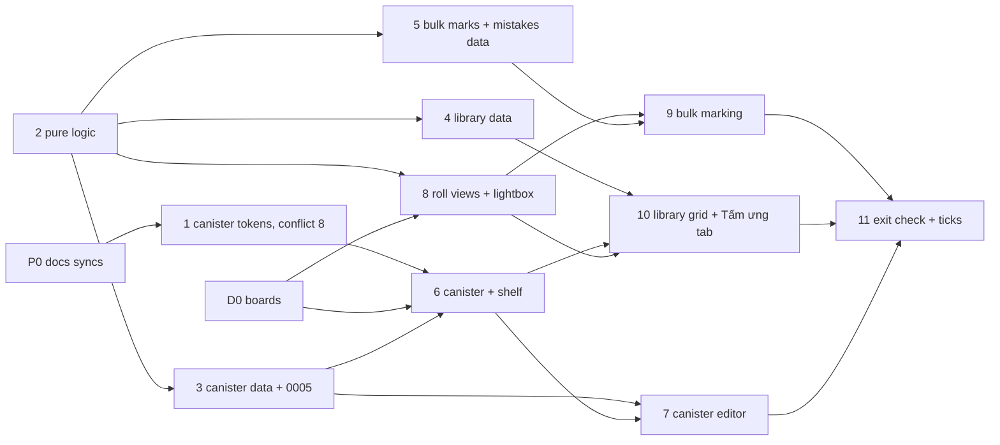

# Plan: Phase 3 · Shelf & collection

> **For agentic workers:** REQUIRED SUB-SKILL: Use superpowers:subagent-driven-development (recommended) or superpowers:executing-plans to implement this plan task by task. Steps use checkbox (`- [ ]`) syntax for tracking. **Trúc chose subagent-driven execution (02.10.2026):** a fresh subagent per task and a reviewer before the next, on `feature/phase-3-shelf-and-collection` (from `main` at `735c8ee`), one commit per task.

**Goal:** the library becomes a shelf of canisters, coloured and labelled by their owner. Each roll and the whole library switch between the beautiful view (Dải phim / Kệ) and a contact-sheet grid with filters and a lightbox, and frames can be marked in bulk. It ends on the exit check: **the shelf shows every roll, and marking 36 frames takes under a minute on desktop.**

**Architecture:** no new tables. One small migration adds `roll.canister_style`, so a roll can follow its stock's colour, use a custom colour, or show the catalogue photo. Pure modules decide the canister's look, the film-type sticker, filters, view preference and selection. Two bulk Server Actions (marks, mistakes) each run in one transaction with one `roll.version` bump. The library grid is one paged query over `roll` and `frame`. View and filter live in the URL. The last view used is a cookie, so the server renders the right view with no flash.

**Tech stack:** Next.js 16 App Router (Server Components + Server Actions), Drizzle + Neon (PGlite in tests), Vitest + Testing Library, CSS Modules on the design-system tokens, `next-intl`. No new dependencies.

**Spec:** [CAN-1, CAN-2](../../docs/product/requirements/canister.md), [COL-1–COL-4](../../docs/product/requirements/collection.md), the [roadmap](../../docs/roadmap.md) Phase 3 row and cut line, the boards `RollGrid`, `RollGridWeb`, `LibraryGrid`, `LibraryGridWeb` on canvas page "Bộ sưu tập", and the boards task D0 draws (below).

## Global constraints

- Everything in code is named in English (tables, columns, routes, query params, i18n keys, cookies). Vietnamese only in `messages/vi.json` and docs. UI words from the [PRD glossary](../../docs/product/prd.md#words-we-use): kệ, cuộn, tấm ưng, oops, tấm trắng, dải phim, lưới.
- House DB rules: `uuid_generate_v4()` ids, **no foreign keys**, `deleted_at` soft deletes, partial indexes `WHERE deleted_at IS NULL`, `timestamptz`. **Every query filters by owner.** Library and grid queries only show frames with `status = 'ready'` and `deleted_at IS NULL`.
- Module shape (Phases 1–2): `src/features/<area>/core.ts` (`import "server-only"`, `db: TDb` first, tested against `createTestDb()`), `actions.ts` (`"use server"`, reads the session with `sessionUserIdForAction`, calls the core), `components/`. Pure modules have no `server-only` import, so client components can use them. PostHog through `captureServerEvent`, which never throws.
- Design system: `stock-*` colours only on canisters; never a manufacturer's logo, box art or trade dress; the stock name goes as text beside the canister. Grids never tilt. Scans show uncropped (`object-fit: contain`) on dark cells. Keeper and oops always carry an icon and an accessible label, never colour alone. Touch targets at least 44 px.
- Images: grid cells use the 480 px copy (`gridUrl`), the lightbox the 2048 px copy (`viewUrl`). The original only through `/api/frames/[id]/original` (Phase 2 D18).
- Every screen follows its board at 390 px and 1440 px, in Paper and Darkroom. Under 600 px, type uses `display-mobile`, `title-mobile`, `body-mobile`, `body-sm-mobile`.
- Marks: blank clears tấm ưng and the reverse (Phase 2 D3). Oops means "has at least one live mistake" (Phase 2 D5). Every mark, mistake or canister change bumps `roll.version` (Phase 2 D19), **once per user action**, not once per frame.
- `pnpm check` (lint, typecheck, test, build) passes before every commit. Commits: `type(cuon): what changed`, title only, under Trúc's git identity.

## Review Focus

The inputs and conditions most likely to bite a real user that the requirements don't spell out. Each has a test in the task named.

1. **Bulk marking while a filter is on.** In "Tấm ưng", un-marking 3 selected frames makes them leave the grid. The selection must drop ids no longer shown, the counts must update, and the next K must not act on hidden frames. Test: Task 9 (`useFrameSelection` prunes hidden ids).
2. **Shift-click range over a filtered grid.** The range follows the order the user sees, not `position`. Frames hidden by the filter between the two clicks are not selected. Test: Task 2 (`selectRange`).
3. **K / O / B while typing.** The shortcuts must not fire when focus is in an input, textarea or contenteditable, or while a dialog (lightbox, mistake picker) is open. Typing "ok" in a note must not mark frames. Test: Task 9.
4. **A canister colour from the client is not trusted.** The value goes into a `style` attribute, so anything except a known preset slug or `#rrggbb` is rejected on the server (`invalid_input`) and ignored when rendering (falls back to the stock's colour). A too-light colour (cream, white) still shows a canister edge on paper. Tests: Task 2 (`resolveCanisterLook`) and Task 3 (`setCanisterCore`).
5. **Rolls without scans, and frames not ready.** The shelf shows every live roll, including ones with no scans yet. The library grid skips rolls with no ready frames, and never shows pending or soft-deleted frames, or another user's frames. Test: Task 4 (`listLibraryCore`).

---

## Status

- **Roadmap:** Phase 3, 23 Nov – 13 Dec 2026 (W9–11), **24 h booked**. This plan estimates **~23 h of build** plus a ~2.5 h design pass (see [Budget](#budget)). Roadmap artifact re-read 02.10.2026: rev 37, same as the mirror.
- **Phase 2:** [PR #22](https://github.com/spartan-trucle/my-rolls/pull/22) **merged 02.10.2026** (`4eb126c`, squash; `src/` identical to `feature/phase-2-scans-and-notes`). Its roadmap boxes (SCAN-1–4, LAB-3, NOTE-1, NOTE-2) wait for a production deploy check and `/progress`. Phase 3 branches from `main` at `4eb126c` or later.
- **Design system:** artifact at `1790936300-7c53`. `project/tokens.json` is byte-identical to the app's `design-tokens/tokens.json` and the README matches the mirror; the mirror's "Last synced" line was bumped to `7c53` in P0 (02.10.2026).
- **Design canvas:** `1790936301-40d9` (147 boards), re-indexed in `wireframes.md` in P0: a new page "Chia sẻ · MVP" with 21 Phase 4 boards. **No Phase 3 boards yet.** `RollGrid`, `RollGridWeb`, `LibraryGrid` and `LibraryGridWeb` exist in Paper only.
- **Missing boards** ([missing-screens.md](../../docs/design/missing-screens.md#phase-3--shelf--collection)): canister shelf, canister editor, owner's roll in film-strip view, filters and lightbox. Plus Darkroom for the four grid boards, and the empty "Tấm ưng" state. Task D0 draws them.
- **Content:** canister photos matched to catalogue entries are due 23.11.2026. No stock has `canister_photo_key` set today, so photo mode is built with a drawn fallback and lights up when the photos land.
- **Plan status:** **blockers answered 02.10.2026 (Trúc)**: defaults for 2, 3, 5 and 6, and the `canister_style` column for 4 (after weighing the no-migration option). Execution: subagent-driven.

## Blockers (answered 02.10.2026)

Trúc's answers: 1 resolved by the merge, 2 default, 3 default, 4 the column (the no-migration alternative was considered and dropped: it needs a magic `"photo"` colour value, and a canister painted in its film's own colour would be repainted by a stock change), 5 default, 6 synced.

1. ~~**Start point.**~~ **Resolved 02.10.2026:** #22 merged; branch `feature/phase-3-shelf-and-collection` from `main`.
2. **Known conflict #8: canister presets.** The PRD's Red, Orange and Cream have no design-system token, and the picker allows "any body colour". *Default:* add `stock-red`, `stock-orange`, `stock-cream` to the design system artifact (light from the PRD: `#c23b22`, `#e07a2e`, `#e6dcc8`; proposed dark: `#ec7a62`, `#f2a565`, `#e6dcc8`), canister-only, like the other `stock-*`. Picker colours (`#rrggbb`) render as-is in both themes. Every drawn canister body gets a 1 px `line-strong` edge, so cream or white reads on paper. This is a design-system change: artifact first, then mirror and the app's `tokens.json` (Task 1).
3. **Bulk "Oops".** Oops is "has a mistake" (Phase 2 D5), and the board's bulk Oops button doesn't say which mistake. *Default:* Oops (button or O) opens `MistakePicker` in "N tấm" mode. The picked types, each with an optional note, are **added** to every selected frame; existing mistakes stay. Removing a mistake stays per frame in `FrameView`. The alternative, tagging `other` with no picker, is faster but empties the mistake stats NOTE-4 and BAG-3 rely on.
4. **Photo or drawn canister.** New rolls copy the stock's colour into `roll.canister_color` today (`createRollCore`, `updateRollCore`), so "no colour means photo" can't work. *Default:* migration `0005` adds `roll.canister_style` (`stock` \| `drawn` \| `photo`, default `stock`). `stock` follows the stock's colour (a stock change keeps it in step), `drawn` uses `roll.canister_color`, `photo` shows the catalogue photo and falls back to the stock's colour while no photo exists.
5. **The four missing screens and the Darkroom grids.** *Default:* Claude draws them on the canvas (task D0) with these defaults, Trúc approves, then the UI tasks start. Data and pure-logic tasks don't wait.
6. ~~**Doc syncs found while planning.**~~ **Done in P0 (02.10.2026):** the design-system mirror's "Last synced" (`4ce8` → `7c53`, no content change); `wireframes.md` re-indexed against canvas `40d9` (new page "Chia sẻ · MVP"); `missing-screens.md`'s Phase 4 rows ticked.

## Designs (D0, to draw)

On a new canvas page "Kệ & bộ sưu tập" (the existing "Bộ sưu tập" boards move there). Four boards per screen: phone and desktop, Paper and Darkroom. Sample data from the existing boards: Đà Lạt tháng 10 (Gold 200), Hội An (Superia 400), HP5 rolls.

| Board | Screen | Req | Built in |
|---|---|---|---|
| `Shelf` | Home in Kệ view: "Kệ của Trúc", count line, Kệ/Lưới switch, canisters standing on wooden-ledge shelves, newest first (phone 3 per shelf, desktop 6). Each canister: drawn or photo, roll name on the label band, film-type sticker (`C-41 · 200`), stock name as text under it, upload stamp from Phase 2 (`12/36`, `2 lỗi`). A roll with no scans says "Chờ scan" | CAN-1 | Task 6 |
| `ShelfEmpty` | No rolls yet: an empty ledge and "Lên kệ cuộn đầu tiên" | CAN-1 | Task 6 |
| `CanisterEditor` | Sheet on phone, dialog on desktop, from the roll page's canister: live preview, "Ảnh vỏ thật" (only when the stock has a photo) / "Tự vẽ", 8 preset swatches with names, "Màu khác" picker, "Theo màu film" to reset, note "Tên trên nhãn là tên cuộn" with a link to rename | CAN-2 | Task 7 |
| `RollStrip` | Owner's roll page in Dải phim view: header as `RollGrid`, Dải phim/Lưới switch, edge-to-edge `FilmStrip` (150 px frames on phone, 200 px on desktop), keeper/oops flags, then the Phase 2 scan-set line, memory and notes | COL-1 | Task 8 |
| `Lightbox` | One frame large on a dark ground: "Tấm 14/36", ← → on desktop, swipe on phone, close, keeper/oops stamps, "Chi tiết" to `FrameView`. Moves through the filtered list only | COL-2 | Task 8 |
| `RollGridDark`, `RollGridWebDark`, `LibraryGridDark`, `LibraryGridWebDark` | Darkroom versions of the existing grid boards. `LibraryGrid` also gets its empty "Tấm ưng" state ("Chưa có tấm ưng nào") | COL-1–4 | Tasks 9, 10 |

What the existing boards already settle: chips "Tất cả / Tấm ưng / Oops / Tấm trắng" with counts (Tấm trắng only on the owner's roll grid; the library has three), the selection bar ("3 tấm đã chọn", Tấm ưng, Oops, Tấm trắng, Bỏ chọn) docked at the bottom on phone and beside the chips on desktop, the hint lines "Nhấn giữ một tấm để chọn nhiều tấm rồi đánh dấu một lần." and "Bấm để chọn, giữ Shift để chọn một dãy. Phím K: tấm ưng · O: oops · B: tấm trắng.", and library groups with a canister header and "Xem cả cuộn ›".

## Decisions this plan assumes

A change to one of these goes back to Trúc first.

| # | Decision | Default | Why |
|---|---|---|---|
| D1 | Canister colour values | `roll.canister_color` is a preset slug (`gold`, `green`, `blue`, `rose`, `red`, `orange`, `mono`, `cream`) or `#rrggbb` (lowercase). Validated on the server; anything else is rejected | CAN-2 "presets or a picker". The value reaches a `style` attribute, so it must be one of two safe shapes |
| D2 | Canister style | `roll.canister_style` text, `stock` \| `drawn` \| `photo`, not null, default `stock` (migration `0005`). Plain text, no pg enum, like `stock.type` | Blocker 4 |
| D3 | Label band | The roll's name, falling back to "Cuộn #N". No `canister_label` column | CAN-2 says "the roll name on the label band". One name to keep in sync. The editor links to rename |
| D4 | Film-type sticker | From `stock.type` and ISO: `color-negative` → `C-41`, `slide` → `E-6`, `bw` → `B&W`, `cine` → `ECN-2`, `instant` → `INSTANT`, others → ISO only. ISO = `roll.box_iso ?? stock.iso`. `C-41 · 200` | CAN-2's examples |
| D5 | Shelf order | Newest first by `roll.created_at` (as `listRolls` does today). Every live roll, scans or not | CAN-1, Phase 1 D15 |
| D6 | Views in the URL | Home: `/?view=shelf\|grid&filter=…`. Roll: `/rolls/[id]?view=strip\|grid&filter=…`. Bad values fall back to the defaults (`shelf`, `strip`, `all`) | Shareable, back button works, server renders the right view |
| D7 | Last view used | Cookies `cuon_library_view` and `cuon_roll_view` (1 year, `SameSite=Lax`), set when the switch is used. Read on the server when the URL has no `view` | COL-1 "remembered". The build note allows local storage; a cookie avoids rendering the wrong view first |
| D8 | Filters | `all`, `keeper`, `oops`, `blank` (blank only on the owner's roll grid). Counts always over the full roll or library, not the filtered list | COL-2, the boards |
| D9 | Library grid paging | Groups of rolls, newest first, 6 rolls per page, cursor `createdAt\|id`, a "Xem thêm cuộn" button. Rolls with no matching ready frame are skipped. Count line "3 CUỘN · 108 TẤM · 16 TẤM ƯNG" from one aggregate | 30 rolls × 36 frames is over 1000 cells. A button is simpler and more accessible than infinite scroll |
| D10 | Lightbox | Client overlay over the strip or grid, given the list currently shown. ← → keys, swipe (horizontal pointer drag over 50 px, vertical scroll untouched), Esc and a close button. No wrap at either end. Opening pushes a history entry, so phone Back closes it. Preloads the next and previous `viewUrl`. "Chi tiết" goes to `FrameView` | COL-2. One component for roll and library |
| D11 | Selecting | Phone: tap opens the lightbox; long-press (500 ms) or "Chọn" starts selecting, then taps toggle. Desktop: click toggles selection (board), Shift-click selects the range in shown order, double-click or Enter opens the lightbox, Esc clears, Ctrl/⌘+A selects all shown | COL-4 and the boards |
| D12 | Bulk marks | Tấm ưng / Tấm trắng: if every selected frame already has the mark, the action removes it from all; otherwise it sets it on all. Blank clears tấm ưng and the reverse. One Server Action, one transaction, one version bump | COL-4 "in one action". Makes K a toggle like a checkbox list |
| D13 | Bulk Oops | Blocker 3's default: `MistakePicker` in "N tấm" mode adds the picked types to every selected frame | NOTE-2 stats stay meaningful |
| D14 | Where bulk marking lives | The roll's Lưới only. The library grid has filters and the lightbox but no selection (as its board) | COL-4 says "from the grid"; the library board draws none. Keeps one marking surface |
| D15 | "Tấm ưng" bottom tab | Links to `/?view=grid&filter=keeper`, active there | COL-3 "Tấm ưng across the whole library is the user's best-of" |
| D16 | Film strip flags | A frame that is both tấm ưng and oops shows the keeper flag in Dải phim (one flag per frame there); the grid shows both | `FilmStrip` takes one `flag`. Mistakes are content, but the strip "says nothing" if every frame is flagged |
| D17 | Analytics (PostHog) | `view_switched` (surface: `roll` \| `library`, view), `frames_bulk_marked` (mark: `keeper` \| `blank` \| `oops`, on, count, via: `button` \| `key`), `canister_customised` (style, preset or `custom`), `lightbox_opened` (surface) | The exit check, and whether people use the beautiful view |
| D18 | Canister photos | Served from the public bucket: `${R2_PUBLIC_URL}/${stock.canister_photo_key}` | Same bucket as the scan copies; photos are reference images, not user data |

## Order



| Task | What | Requirements | Est. | Needs |
|---|---|---|---|---|
| **P0** | Docs: this plan, design-system "Last synced" bump, `wireframes.md` canvas re-index | — | 0.25 h | blocker 6 |
| **D0** | Draw the Phase 3 boards; Trúc approves | CAN-1, CAN-2, COL-1–4 | ~2.5 h (design) | blockers 2, 3, 5 |
| **1** | Canister tokens: `stock-red`, `stock-orange`, `stock-cream`; Known conflict #8 | CAN-2 | 0.75 h | blocker 2 |
| **2** | Pure logic: canister look, sticker, filters, view preference, selection | CAN-2, COL-1, COL-2, COL-4 | 2 h | — |
| **3** | Canister data: migration `0005`, `setCanisterCore`, stock changes respect a custom colour | CAN-2 | 1.5 h | 2, blocker 4 |
| **4** | Library data: paged groups, counts, filters | COL-3 | 2.5 h | 2 |
| **5** | Bulk data: `setFramesMarksCore`, `addMistakesToFramesCore` | COL-4 | 2 h | 2 |
| **6** | `Canister` component (drawn + photo) and the shelf on Home | CAN-1, CAN-2 | 3 h | D0, 1, 3 |
| **7** | Canister editor | CAN-2 | 2 h | D0, 3, 6 |
| **8** | Roll page: Dải phim / Lưới switch, filters, lightbox | COL-1, COL-2 | 3 h | D0, 2 |
| **9** | Bulk marking: select, selection bar, K / O / B, Oops picker for many | COL-4 | 3 h | 5, 8 |
| **10** | Library grid, Kệ/Lưới switch, Tấm ưng tab | COL-3 | 2.5 h | 4, 6, 8 |
| **11** | Exit check and roadmap ticks | Exit | 0.5 h | all |

All tasks land on `feature/phase-3-shelf-and-collection`, one commit per task. Tasks 2, 4 and 5 don't need the boards and can start right after blocker 1.

## Budget

| | Hours |
|---|---|
| Build (P0, 1–11) | ~23 |
| Design pass (D0) | ~2.5 |
| **Total** | **~25.5** vs 24 booked |

The roadmap's cut line covers the gap if the phase runs late: cut #2 (library grid, COL-3, Task 10, ~2.5 h here), cut #3 (K / O / B and Shift-click, part of Task 9, ~1 h here), cut #4 (free colour picker, part of Task 7, ~0.5 h here).

---

## Tasks

### Task P0: Docs syncs (~0.25 h)

Only with Trúc's yes on blocker 6 (CLAUDE.md: never create or sync docs silently).

**Files:**
- Create: `.planning/plans/phase-3-shelf-and-collection.md` (this file)
- Modify: `docs/design/design-system.md:4` ("Last synced" line)
- Modify: `docs/design/wireframes.md:5` (canvas version line) and the Phase 4 boards it lists

- [x] **Step 1:** Re-read the design system artifact (`project/README.md`, `project/tokens.json`). If its version moved past `7c53`, diff again; if content changed, mirror it. (Still `7c53` on 02.10.2026.)
- [x] **Step 2:** Update the mirror's line: `Last synced: dd.mm.yyyy · artifact version <current> · by Claude for Trúc`, noting "no change to mirrored content since `4ce8` (tokens.json identical to the app's copy)".
- [x] **Step 3:** Re-read the canvas file list. Add the boards new since `6906` to `wireframes.md` (`LinkPreview`, `LinkPreviewChat`, `LinkPreviewNoScans`, `SharedRevoked…`, Darkroom sharing boards), update the version line, and tick the two Phase 4 rows in `missing-screens.md` they cover.
- [x] **Step 4: Commit** `docs(cuon): plan phase 3 shelf and collection, sync design mirrors`.

### Task D0: Draw the Phase 3 boards (~2.5 h, design)

- [x] **Step 1:** Re-read the canvas (`canvas.json`, the `RollGrid…` and `LibraryGrid…` boards, `Home…`, `RollFrames…`, `FrameView…`, `MistakePicker…`).
- [x] **Step 2:** Draw every board in [Designs](#designs-d0-to-draw) on page "Kệ & bộ sưu tập" with the blocker defaults, using the design system's `bundle.css` components. Use the Task 1 tokens for the three new presets (inline values on the canvas until the design system carries them).
- [x] **Step 3:** Add the boards to `wireframes.md`, tick the four Phase 3 rows and the "Tấm ưng tab" and Darkroom rows they cover in `missing-screens.md`.
- [ ] **Step 4:** Ask Trúc to approve the boards. (Drawn 02.10.2026 on canvas `1790944574-5a0f`, 28 new boards; asked 02.10.2026.) **Tasks 6–10 wait for this.**
- [ ] **Step 5: Commit** `docs(cuon): index the phase 3 boards`.

### Task 1: Canister tokens (~0.75 h)

**Files:**
- Modify (artifact first): design system `project/tokens.json`, `project/README.md` (Colour section), `project/components/bundle.css` if it lists stock colours
- Modify: `design-tokens/tokens.json` (byte-for-byte copy), `src/styles/tokens.css` (generated by `pnpm tokens`)
- Modify: `docs/design/design-system.md` (Colour section and "Last synced"), `docs/README.md` (Known conflict #8), `docs/product/requirements/canister.md` (Open issues)

**Interfaces:**
- Produces: CSS variables `--stock-red`, `--stock-orange`, `--stock-cream` in both themes, and Tailwind colours `stock-red`, `stock-orange`, `stock-cream`.

- [x] **Step 1:** In the artifact's `tokens.json`, add after `stock-rose`:

```json
{ "name": "stock-red", "value": { "light": "#c23b22", "dark": "#ec7a62" }, "usage": "Canister body, preset only (CAN-2 \"Red\"). Decorative fill." },
{ "name": "stock-orange", "value": { "light": "#e07a2e", "dark": "#f2a565" }, "usage": "Canister body, preset only (CAN-2 \"Orange\"). Decorative fill." },
{ "name": "stock-cream", "value": { "light": "#e6dcc8", "dark": "#e6dcc8" }, "usage": "Canister body, preset only (CAN-2 \"Cream\"). Needs the canister's line-strong edge to read on paper." }
```

  In the README's Colour section, after the canister families line, add: "`stock-red`, `stock-orange` and `stock-cream` are extra canister presets a user can pick; they are not film families." Publish. (Published 02.10.2026 as design system `1790943528-cc6e`.)
- [x] **Step 2:** Copy the published `tokens.json` byte for byte into `design-tokens/tokens.json`, then run `pnpm tokens`.
- [x] **Step 3:** Run `pnpm vitest run src/design-system/tokens`. Expected: PASS (generated-CSS test up to date; no contrast pair uses these tokens).
- [x] **Step 4:** Mirror the README line in `docs/design/design-system.md`, bump its "Last synced". Close Known conflict #8 in `docs/README.md` ("Resolved dd.mm.2026 (Trúc): three canister-only tokens") and the first open issue in `canister.md`.
- [x] **Step 5: Commit** `feat(cuon): add canister preset colours to the design tokens`.

### Task 2: Pure logic (~2 h)

**Files:**
- Create: `src/features/canister/look.ts`, `src/features/canister/look.test.ts`
- Create: `src/features/canister/sticker.ts`, `src/features/canister/sticker.test.ts`
- Create: `src/features/collection/filters.ts`, `filters.test.ts`
- Create: `src/features/collection/view-pref.ts`, `view-pref.test.ts`
- Create: `src/features/collection/selection.ts`, `selection.test.ts`

**Interfaces:**
- Produces (`look.ts`): `CANISTER_PRESETS` (readonly tuple of 8 slugs), `TCanisterPreset`, `CANISTER_STYLES = ["stock", "drawn", "photo"] as const`, `TCanisterStyle`, `isCanisterColor(value: string): boolean`, `canisterFill(color: string | null): string`, `type TCanisterLook = { kind: "drawn"; fill: string } | { kind: "photo"; src: string; fill: string }`, `resolveCanisterLook(input: { style: TCanisterStyle; rollColor: string | null; stockColor: string | null; stockPhotoUrl: string | null }): TCanisterLook`
- Produces (`sticker.ts`): `filmSticker(type: string | null, iso: number | null): string | null`
- Produces (`filters.ts`): `FRAME_FILTERS = ["all", "keeper", "oops", "blank"] as const`, `TFrameFilter`, `IMarkable = { isKeeper: boolean; isBlank: boolean; isOops: boolean }`, `parseFilter(raw: unknown, opts: { allowBlank: boolean }): TFrameFilter`, `matchesFilter(f: IMarkable, filter: TFrameFilter): boolean`, `filterCounts(frames: IMarkable[]): Record<TFrameFilter, number>`
- Produces (`view-pref.ts`): `ROLL_VIEW_COOKIE = "cuon_roll_view"`, `LIBRARY_VIEW_COOKIE = "cuon_library_view"`, `TRollView = "strip" | "grid"`, `TLibraryView = "shelf" | "grid"`, `resolveRollView(query: unknown, cookie: unknown): TRollView`, `resolveLibraryView(query: unknown, cookie: unknown): TLibraryView`
- Produces (`selection.ts`): `toggleId(selected: ReadonlySet<string>, id: string): Set<string>`, `selectRange(shown: readonly string[], anchor: string | null, id: string, selected: ReadonlySet<string>): Set<string>`, `pruneToShown(selected: ReadonlySet<string>, shown: readonly string[]): Set<string>`, `nextMarkValue(frames: readonly IMarkable[], mark: "keeper" | "blank"): boolean`

- [ ] **Step 1: Write the failing tests**

```ts
// src/features/canister/look.test.ts
import { describe, expect, it } from "vitest";
import { canisterFill, isCanisterColor, resolveCanisterLook } from "./look";

describe("isCanisterColor (D1)", () => {
  it("accepts the 8 preset slugs and lowercase #rrggbb", () => {
    for (const v of ["gold", "green", "blue", "rose", "red", "orange", "mono", "cream", "#a1b2c3"]) {
      expect(isCanisterColor(v)).toBe(true);
    }
  });

  it("rejects anything that could break out of a style attribute", () => {
    for (const v of ["#ABC123", "#abc", "red;background:url(x)", "var(--ink)", "", "purple", "#abc1234"]) {
      expect(isCanisterColor(v)).toBe(false);
    }
  });
});

describe("canisterFill", () => {
  it("maps a preset to its token and passes a hex through", () => {
    expect(canisterFill("cream")).toBe("var(--stock-cream)");
    expect(canisterFill("#a1b2c3")).toBe("#a1b2c3");
  });

  it("falls back to gold for null or an unsafe value", () => {
    expect(canisterFill(null)).toBe("var(--stock-gold)");
    expect(canisterFill("red;color:x")).toBe("var(--stock-gold)");
  });
});

describe("resolveCanisterLook (D2, blocker 4)", () => {
  const base = { rollColor: "#123456", stockColor: "green", stockPhotoUrl: null };

  it("stock style follows the stock's colour, not the roll's copy", () => {
    expect(resolveCanisterLook({ ...base, style: "stock" })).toEqual({ kind: "drawn", fill: "var(--stock-green)" });
  });

  it("drawn style uses the roll's colour", () => {
    expect(resolveCanisterLook({ ...base, style: "drawn" })).toEqual({ kind: "drawn", fill: "#123456" });
  });

  it("photo style shows the photo, with the stock colour behind it", () => {
    expect(resolveCanisterLook({ ...base, style: "photo", stockPhotoUrl: "https://img/c.webp" })).toEqual({
      kind: "photo",
      src: "https://img/c.webp",
      fill: "var(--stock-green)",
    });
  });

  it("photo style without a photo falls back to the drawn stock colour", () => {
    expect(resolveCanisterLook({ ...base, style: "photo" })).toEqual({ kind: "drawn", fill: "var(--stock-green)" });
  });
});
```

```ts
// src/features/canister/sticker.test.ts
import { describe, expect, it } from "vitest";
import { filmSticker } from "./sticker";

describe("filmSticker (D4)", () => {
  it.each([
    ["color-negative", 200, "C-41 · 200"],
    ["slide", 100, "E-6 · 100"],
    ["bw", 400, "B&W · 400"],
    ["cine", 500, "ECN-2 · 500"],
    ["instant", 640, "INSTANT · 640"],
  ])("%s at ISO %i reads %s", (type, iso, expected) => {
    expect(filmSticker(type, iso)).toBe(expected);
  });

  it("shows only the ISO for an unknown or missing type", () => {
    expect(filmSticker("special-effect", 200)).toBe("200");
    expect(filmSticker(null, 400)).toBe("400");
  });

  it("shows only the process when ISO is unknown, and nothing when both are", () => {
    expect(filmSticker("bw", null)).toBe("B&W");
    expect(filmSticker(null, null)).toBeNull();
  });
});
```

```ts
// src/features/collection/filters.test.ts
import { describe, expect, it } from "vitest";
import { filterCounts, matchesFilter, parseFilter } from "./filters";

const f = (isKeeper = false, isOops = false, isBlank = false) => ({ isKeeper, isOops, isBlank });

describe("parseFilter (D8)", () => {
  it("keeps known values and falls back to all", () => {
    expect(parseFilter("keeper", { allowBlank: true })).toBe("keeper");
    expect(parseFilter("nope", { allowBlank: true })).toBe("all");
    expect(parseFilter(["oops"], { allowBlank: true })).toBe("all");
  });

  it("refuses blank where it isn't offered (library)", () => {
    expect(parseFilter("blank", { allowBlank: false })).toBe("all");
  });
});

describe("matchesFilter / filterCounts", () => {
  const frames = [f(true), f(true, true), f(false, true), f(false, false, true), f()];

  it("a frame can be tấm ưng and oops at once (Phase 2 D5)", () => {
    expect(matchesFilter(frames[1], "keeper")).toBe(true);
    expect(matchesFilter(frames[1], "oops")).toBe(true);
  });

  it("counts every filter over the full list", () => {
    expect(filterCounts(frames)).toEqual({ all: 5, keeper: 2, oops: 2, blank: 1 });
  });
});
```

```ts
// src/features/collection/view-pref.test.ts
import { describe, expect, it } from "vitest";
import { resolveLibraryView, resolveRollView } from "./view-pref";

describe("resolveRollView (D6, D7)", () => {
  it("the URL wins over the cookie", () => {
    expect(resolveRollView("grid", "strip")).toBe("grid");
  });

  it("the cookie is used when the URL has no view, and strip is the default", () => {
    expect(resolveRollView(undefined, "grid")).toBe("grid");
    expect(resolveRollView(undefined, undefined)).toBe("strip");
  });

  it("garbage in the URL or the cookie falls back", () => {
    expect(resolveRollView("shelf", "<script>")).toBe("strip");
  });
});

describe("resolveLibraryView", () => {
  it("defaults to shelf and accepts grid", () => {
    expect(resolveLibraryView(undefined, undefined)).toBe("shelf");
    expect(resolveLibraryView(undefined, "grid")).toBe("grid");
    expect(resolveLibraryView("strip", undefined)).toBe("shelf");
  });
});
```

```ts
// src/features/collection/selection.test.ts
import { describe, expect, it } from "vitest";
import { nextMarkValue, pruneToShown, selectRange, toggleId } from "./selection";

describe("toggleId", () => {
  it("adds then removes, without mutating its input", () => {
    const start = new Set(["a"]);
    expect([...toggleId(start, "b")]).toEqual(["a", "b"]);
    expect([...toggleId(start, "a")]).toEqual([]);
    expect([...start]).toEqual(["a"]);
  });
});

describe("selectRange (Review Focus 2)", () => {
  // The filter hides c and e; the user sees a, b, d, f.
  const shown = ["a", "b", "d", "f"];

  it("selects from the anchor to the click in shown order, either direction", () => {
    expect([...selectRange(shown, "b", "f", new Set(["b"]))].sort()).toEqual(["b", "d", "f"]);
    expect([...selectRange(shown, "f", "a", new Set())].sort()).toEqual(["a", "b", "d", "f"]);
  });

  it("never selects frames the filter hides", () => {
    expect(selectRange(shown, "a", "f", new Set()).has("c")).toBe(false);
  });

  it("with no anchor, or an anchor no longer shown, acts like a toggle", () => {
    expect([...selectRange(shown, null, "d", new Set())]).toEqual(["d"]);
    expect([...selectRange(shown, "c", "d", new Set())]).toEqual(["d"]);
  });

  it("keeps an existing selection outside the range", () => {
    expect([...selectRange(shown, "d", "f", new Set(["a", "d"]))].sort()).toEqual(["a", "d", "f"]);
  });
});

describe("pruneToShown (Review Focus 1)", () => {
  it("drops ids that left the filtered list", () => {
    expect([...pruneToShown(new Set(["a", "b", "z"]), ["a", "c"])]).toEqual(["a"]);
  });
});

describe("nextMarkValue (D12)", () => {
  const m = (isKeeper: boolean, isBlank = false) => ({ isKeeper, isBlank, isOops: false });

  it("sets the mark when any selected frame lacks it", () => {
    expect(nextMarkValue([m(true), m(false)], "keeper")).toBe(true);
  });

  it("removes it when every selected frame has it", () => {
    expect(nextMarkValue([m(true), m(true)], "keeper")).toBe(false);
    expect(nextMarkValue([m(false, true)], "blank")).toBe(false);
  });

  it("an empty selection sets nothing", () => {
    expect(nextMarkValue([], "keeper")).toBe(true);
  });
});
```

- [ ] **Step 2: Run them to see them fail**

Run: `pnpm vitest run src/features/canister src/features/collection`
Expected: FAIL, "Cannot find module" for `./look`, `./sticker`, `./filters`, `./view-pref`, `./selection`.

- [ ] **Step 3: Write the minimal code**

```ts
// src/features/canister/look.ts
/** CAN-2, plan D1–D2. No server imports: the shelf, the editor and the server action all use it. */
export const CANISTER_PRESETS = ["gold", "green", "blue", "rose", "red", "orange", "mono", "cream"] as const;
export type TCanisterPreset = (typeof CANISTER_PRESETS)[number];

export const CANISTER_STYLES = ["stock", "drawn", "photo"] as const;
export type TCanisterStyle = (typeof CANISTER_STYLES)[number];

const HEX = /^#[0-9a-f]{6}$/;

/** Only these two shapes ever reach a `style` attribute (Review Focus 4). */
export function isCanisterColor(value: string): boolean {
  return (CANISTER_PRESETS as readonly string[]).includes(value) || HEX.test(value);
}

export function canisterFill(color: string | null): string {
  if (color === null || !isCanisterColor(color)) return "var(--stock-gold)";
  return color.startsWith("#") ? color : `var(--stock-${color})`;
}

export type TCanisterLook = { kind: "drawn"; fill: string } | { kind: "photo"; src: string; fill: string };

export function resolveCanisterLook(input: {
  style: TCanisterStyle;
  rollColor: string | null;
  stockColor: string | null;
  stockPhotoUrl: string | null;
}): TCanisterLook {
  const stockFill = canisterFill(input.stockColor);
  if (input.style === "drawn") return { kind: "drawn", fill: canisterFill(input.rollColor) };
  if (input.style === "photo" && input.stockPhotoUrl) return { kind: "photo", src: input.stockPhotoUrl, fill: stockFill };
  return { kind: "drawn", fill: stockFill };
}
```

```ts
// src/features/canister/sticker.ts
/** CAN-2's film-type sticker, plan D4: "C-41 · 200". */
const PROCESS: Record<string, string> = {
  "color-negative": "C-41",
  slide: "E-6",
  bw: "B&W",
  cine: "ECN-2",
  instant: "INSTANT",
};

export function filmSticker(type: string | null, iso: number | null): string | null {
  const parts = [type ? PROCESS[type] : undefined, iso != null ? String(iso) : undefined].filter(Boolean);
  return parts.length > 0 ? parts.join(" · ") : null;
}
```

```ts
// src/features/collection/filters.ts
/** COL-2, plan D8. */
export const FRAME_FILTERS = ["all", "keeper", "oops", "blank"] as const;
export type TFrameFilter = (typeof FRAME_FILTERS)[number];

export interface IMarkable {
  isKeeper: boolean;
  isBlank: boolean;
  isOops: boolean;
}

export function parseFilter(raw: unknown, opts: { allowBlank: boolean }): TFrameFilter {
  if (typeof raw !== "string" || !(FRAME_FILTERS as readonly string[]).includes(raw)) return "all";
  if (raw === "blank" && !opts.allowBlank) return "all";
  return raw as TFrameFilter;
}

export function matchesFilter(f: IMarkable, filter: TFrameFilter): boolean {
  if (filter === "keeper") return f.isKeeper;
  if (filter === "oops") return f.isOops;
  if (filter === "blank") return f.isBlank;
  return true;
}

export function filterCounts(frames: IMarkable[]): Record<TFrameFilter, number> {
  const counts = { all: 0, keeper: 0, oops: 0, blank: 0 };
  for (const f of frames) for (const key of FRAME_FILTERS) if (matchesFilter(f, key)) counts[key] += 1;
  return counts;
}
```

```ts
// src/features/collection/view-pref.ts
/** COL-1, COL-3, plan D6–D7: the URL wins, then the cookie, then the default. */
export const ROLL_VIEW_COOKIE = "cuon_roll_view";
export const LIBRARY_VIEW_COOKIE = "cuon_library_view";
export type TRollView = "strip" | "grid";
export type TLibraryView = "shelf" | "grid";

function pick<T extends string>(allowed: readonly T[], fallback: T, ...candidates: unknown[]): T {
  for (const c of candidates) if (typeof c === "string" && (allowed as readonly string[]).includes(c)) return c as T;
  return fallback;
}

export function resolveRollView(query: unknown, cookie: unknown): TRollView {
  return pick(["strip", "grid"], "strip", query, cookie);
}

export function resolveLibraryView(query: unknown, cookie: unknown): TLibraryView {
  return pick(["shelf", "grid"], "shelf", query, cookie);
}
```

```ts
// src/features/collection/selection.ts
import type { IMarkable } from "./filters";

/** COL-4 selection, plan D11–D12. Every function returns a new Set. */
export function toggleId(selected: ReadonlySet<string>, id: string): Set<string> {
  const next = new Set(selected);
  if (next.has(id)) next.delete(id);
  else next.add(id);
  return next;
}

/** Shift-click: anchor..id in the order the user sees (Review Focus 2). */
export function selectRange(shown: readonly string[], anchor: string | null, id: string, selected: ReadonlySet<string>): Set<string> {
  const from = anchor === null ? -1 : shown.indexOf(anchor);
  const to = shown.indexOf(id);
  if (from === -1 || to === -1) return toggleId(selected, id);
  const next = new Set(selected);
  for (const sid of shown.slice(Math.min(from, to), Math.max(from, to) + 1)) next.add(sid);
  return next;
}

export function pruneToShown(selected: ReadonlySet<string>, shown: readonly string[]): Set<string> {
  const visible = new Set(shown);
  return new Set([...selected].filter((id) => visible.has(id)));
}

/** True = set the mark on all; false = every selected frame has it, so remove it. */
export function nextMarkValue(frames: readonly IMarkable[], mark: "keeper" | "blank"): boolean {
  if (frames.length === 0) return true;
  return !frames.every((f) => (mark === "keeper" ? f.isKeeper : f.isBlank));
}
```

- [ ] **Step 4: Run the tests to see them pass**

Run: `pnpm vitest run src/features/canister src/features/collection`
Expected: PASS, all suites.

- [ ] **Step 5: Commit** `feat(cuon): add canister look, filter, view and selection logic`

### Task 3: Canister data (~1.5 h)

**Files:**
- Modify: `src/db/schema/rolls.ts` (add `canisterStyle`), `src/db/schema/rolls.test.ts`
- Create: `drizzle/0005_*.sql` (via `pnpm db:generate`)
- Modify: `src/features/rolls/core.ts` (`IRollEntry`, `hydrateRolls`, `updateRollCore` at the stock-change copy near line 738; new `setCanisterCore`), `src/features/rolls/core.test.ts`
- Modify: `src/features/rolls/actions.ts` (new `setCanisterAction`), `src/features/rolls/actions.test.ts`
- Modify: `docs/architecture/adr-001-tech-stack.md` (roll table row: `canister_style`)

**Interfaces:**
- Consumes: `CANISTER_STYLES`, `TCanisterStyle`, `isCanisterColor` (Task 2)
- Produces: `roll.canisterStyle` column; `IRollEntry.canisterStyle: TCanisterStyle`; `IRollStockSummary.canisterPhotoUrl: string | null` (D18, built with `R2_PUBLIC_URL`); `setCanisterCore(db, userId, input: { rollId: string; style: TCanisterStyle; color?: string }): Promise<{ ok: true } | { ok: false; error: "not_found" | "invalid_input" }>`; `setCanisterAction(input)` with the same result

- [ ] **Step 1: Write the failing tests**

```ts
// src/db/schema/rolls.test.ts — add inside the existing describe
it("carries canister_style, default stock (Phase 3 D2)", () => {
  const columns = getTableColumns(roll);
  expect(columns.canisterStyle.notNull).toBe(true);
  expect(columns.canisterStyle.default).toBe("stock");
});
```

```ts
// src/features/rolls/core.test.ts — new describe; uses the Phase 2 fixture
import { seedRollWithFrames } from "@/test/phase2-fixtures";
import { setCanisterCore } from "./core";

describe("setCanisterCore (CAN-2, D1–D2)", () => {
  it("saves a preset or a hex as a drawn canister and bumps roll.version", async () => {
    const { db } = await freshDb();
    const { roll: r } = await seedRollWithFrames(db, USER, 0);
    expect(await setCanisterCore(db, USER, { rollId: r.id, style: "drawn", color: "cream" })).toEqual({ ok: true });
    let [row] = await db.select().from(roll).where(eq(roll.id, r.id));
    expect(row).toMatchObject({ canisterStyle: "drawn", canisterColor: "cream", version: 2 });

    await setCanisterCore(db, USER, { rollId: r.id, style: "drawn", color: "#a1b2c3" });
    [row] = await db.select().from(roll).where(eq(roll.id, r.id));
    expect(row.canisterColor).toBe("#a1b2c3");
  });

  it("rejects an unsafe colour and a drawn style with no colour (Review Focus 4)", async () => {
    const { db } = await freshDb();
    const { roll: r } = await seedRollWithFrames(db, USER, 0);
    expect(await setCanisterCore(db, USER, { rollId: r.id, style: "drawn", color: "red;background:url(x)" })).toEqual({
      ok: false,
      error: "invalid_input",
    });
    expect(await setCanisterCore(db, USER, { rollId: r.id, style: "drawn" })).toEqual({ ok: false, error: "invalid_input" });
    expect(await setCanisterCore(db, USER, { rollId: r.id, style: "tartan" as never })).toEqual({ ok: false, error: "invalid_input" });
  });

  it("stock and photo styles keep the stored colour untouched", async () => {
    const { db } = await freshDb();
    const { roll: r } = await seedRollWithFrames(db, USER, 0, { canisterColor: "green" });
    await setCanisterCore(db, USER, { rollId: r.id, style: "photo" });
    const [row] = await db.select().from(roll).where(eq(roll.id, r.id));
    expect(row).toMatchObject({ canisterStyle: "photo", canisterColor: "green" });
  });

  it("refuses another user's roll", async () => {
    const { db } = await freshDb();
    const { roll: r } = await seedRollWithFrames(db, USER, 0);
    expect(await setCanisterCore(db, "user-2", { rollId: r.id, style: "stock" })).toEqual({ ok: false, error: "not_found" });
  });
});
```

  Add one case to the existing `updateRollCore` describe (use the file's own roll-creation helper for a roll with a real stock and bag items):

```ts
it("a stock change keeps a custom drawn colour (Phase 3 blocker 4)", async () => {
  // Arrange with the file's existing helpers: a roll on stock A (canister_color "gold"),
  // then setCanisterCore(db, USER, { rollId, style: "drawn", color: "#a1b2c3" }).
  // Act: updateRollCore switching to stock B (canister_color "mono").
  // Assert:
  expect(row).toMatchObject({ canisterStyle: "drawn", canisterColor: "#a1b2c3" });
});

it("a stock change still copies the new stock's colour for a stock-style roll", async () => {
  // Same arrange without setCanisterCore; after switching to stock B:
  expect(row).toMatchObject({ canisterStyle: "stock", canisterColor: "mono" });
});
```

  `freshDb` / `USER` here mean the setup helper and user constant `core.test.ts` already uses; reuse them, don't add new ones.

- [ ] **Step 2: Run them to see them fail**

Run: `pnpm vitest run src/db/schema/rolls.test.ts src/features/rolls/core.test.ts`
Expected: FAIL: `canisterStyle` undefined; `setCanisterCore` is not exported; the custom-colour case gets `"mono"`.

- [ ] **Step 3: Write the code**

```ts
// src/db/schema/rolls.ts — next to canisterColor
// Phase 3 D2: stock (follow the stock's colour) | drawn (canister_color) | photo
// (the stock's canister photo). Plain text, like stock.type.
canisterStyle: text("canister_style").notNull().default("stock"),
```

  Run `pnpm db:generate`. Expected: `drizzle/0005_<name>.sql` containing only `ALTER TABLE "roll" ADD COLUMN "canister_style" text DEFAULT 'stock' NOT NULL;`. Check it before committing.

```ts
// src/features/rolls/core.ts
import { CANISTER_STYLES, isCanisterColor, type TCanisterStyle } from "@/features/canister/look";
import { bumpRollVersion, ownsRoll } from "@/features/shared/roll-access";

export type TSetCanisterResult = { ok: true } | { ok: false; error: "not_found" | "invalid_input" };

/** CAN-2, plan D1–D2. Only `drawn` writes a colour; `stock` and `photo` leave the stored copy alone. */
export async function setCanisterCore<TQueryResult extends PgQueryResultHKT>(
  db: TDb<TQueryResult>,
  userId: string,
  input: { rollId: string; style: TCanisterStyle; color?: string },
): Promise<TSetCanisterResult> {
  if (!(CANISTER_STYLES as readonly string[]).includes(input.style)) return { ok: false, error: "invalid_input" };
  if (input.style === "drawn" && (input.color === undefined || !isCanisterColor(input.color))) {
    return { ok: false, error: "invalid_input" };
  }
  if (!(await ownsRoll(db, userId, input.rollId))) return { ok: false, error: "not_found" };

  await db
    .update(roll)
    .set({
      canisterStyle: input.style,
      ...(input.style === "drawn" ? { canisterColor: input.color } : {}),
      updatedAt: new Date(),
    })
    .where(and(eq(roll.id, input.rollId), eq(roll.userId, userId)));
  await bumpRollVersion(db, input.rollId);
  return { ok: true };
}
```

  In `updateRollCore`, where the new stock's colour is copied (`canisterColor: finalStockRow.canisterColor ?? null`), copy it only when the current row's `canisterStyle !== "drawn"`. In `hydrateRolls`, add `canisterStyle: row.canisterStyle as TCanisterStyle` to the entry and `canisterPhotoUrl` to the stock summary (`stockRow.canisterPhotoKey ? \`${publicBase}/${stockRow.canisterPhotoKey}\` : null`, with `publicBase` from `getR2Env().publicUrl` trimmed of trailing slashes, passed in by the callers in `actions.ts` the way `listRollFramesAction` passes `publicUrl`). Add both fields to `IRollEntry` / `IRollStockSummary`, optional where old fixtures would otherwise break, as `frameCount` is.

```ts
// src/features/rolls/actions.ts
export async function setCanisterAction(input: { rollId: string; style: TCanisterStyle; color?: string }): Promise<TSetCanisterResult> {
  const userId = await sessionUserIdForAction();
  if (!userId) return { ok: false, error: "not_found" };
  const result = await setCanisterCore(getDb(), userId, input);
  if (result.ok) {
    await captureServerEvent({
      distinctId: userId,
      event: "canister_customised",
      properties: {
        style: input.style,
        color: input.style === "drawn" ? (input.color?.startsWith("#") ? "custom" : input.color) : undefined,
      },
    });
    revalidatePath(`/rolls/${input.rollId}`);
    revalidatePath("/");
  }
  return result;
}
```

  Add an `actions.test.ts` case in the file's existing style (mocked session): no session returns `not_found` and calls nothing.

- [ ] **Step 4: Run the tests to see them pass**

Run: `pnpm vitest run src/db src/features/rolls`
Expected: PASS.

- [ ] **Step 5:** Add `canister_style` to the roll row in `docs/architecture/adr-001-tech-stack.md`'s data model. Run `pnpm check`.
- [ ] **Step 6: Commit** `feat(cuon): store how each roll's canister looks`

### Task 4: Library data (~2.5 h)

**Files:**
- Modify: `src/features/frames/core.ts` (pull the row-to-`IRollFrame` mapping out of `listRollFramesCore` into `toRollFrames`)
- Modify: `src/features/rolls/core.ts` (export `hydrateRolls`)
- Create: `src/features/collection/core.ts`, `src/features/collection/core.test.ts`
- Create: `src/features/collection/actions.ts`, `src/features/collection/actions.test.ts`

**Interfaces:**
- Consumes: `TFrameFilter` (Task 2), `IRollEntry` and `hydrateRolls` (rolls core), `IRollFrame`
- Produces:
  - `toRollFrames(db, rows: (typeof frame.$inferSelect)[], publicUrl: string): Promise<IRollFrame[]>` in `frames/core.ts` (adds oops and note counts; `listRollFramesCore` calls it)
  - `ILibraryGroup = { roll: IRollEntry; frames: IRollFrame[] }`
  - `ILibraryPage = { totals: { rolls: number; frames: number; keepers: number }; counts: Record<"all" | "keeper" | "oops", number>; groups: ILibraryGroup[]; nextCursor: string | null }`
  - `listLibraryCore(db, userId, opts: { filter: "all" | "keeper" | "oops"; cursor?: string | null; pageSize?: number; publicUrl: string }): Promise<ILibraryPage>`
  - `listLibraryAction(input: { filter: string; cursor?: string | null }): Promise<ILibraryPage>` (unknown filter becomes `all`; no session returns an empty page)

- [ ] **Step 1: Write the failing tests**

```ts
// src/features/collection/core.test.ts
import { eq } from "drizzle-orm";
import { afterEach, describe, expect, it } from "vitest";
import { frame, mistake, roll } from "@/db/schema";
import { createTestDb } from "@/db/test-db";
import { seedRollWithFrames } from "@/test/phase2-fixtures";
import { listLibraryCore } from "./core";

let cleanup: (() => Promise<void>) | undefined;
afterEach(async () => {
  await cleanup?.();
  cleanup = undefined;
});

const USER = "user-1";
const PUBLIC = "https://img.example";

async function setup() {
  const { db, client } = await createTestDb();
  cleanup = () => client.close();
  return db;
}

/** Rolls created one second apart, oldest first, so "newest first" is testable. */
async function seedRolls(db: Awaited<ReturnType<typeof setup>>, sizes: number[], userId = USER) {
  const out = [];
  for (const [i, n] of sizes.entries()) {
    out.push(await seedRollWithFrames(db, userId, n, { createdAt: new Date(Date.UTC(2026, 10, 1, 0, 0, i)) }));
  }
  return out;
}

describe("listLibraryCore (COL-3, D9)", () => {
  it("groups ready frames by roll, newest roll first, frames by position", async () => {
    const db = await setup();
    const [older, newer] = await seedRolls(db, [2, 3]);
    const page = await listLibraryCore(db, USER, { filter: "all", publicUrl: PUBLIC });
    expect(page.groups.map((g) => g.roll.id)).toEqual([newer.roll.id, older.roll.id]);
    expect(page.groups[0].frames.map((f) => f.position)).toEqual([1, 2, 3]);
    expect(page.groups[0].frames[0].gridUrl).toBe(`${PUBLIC}/grid/g1.webp`);
  });

  it("skips rolls with no ready frames, and never shows pending, deleted or other users' frames (Review Focus 5)", async () => {
    const db = await setup();
    const [empty, withFrames] = await seedRolls(db, [0, 3]);
    await seedRolls(db, [4], "user-2");
    await db.update(frame).set({ status: "pending" }).where(eq(frame.id, withFrames.frames[0].id));
    await db.update(frame).set({ deletedAt: new Date() }).where(eq(frame.id, withFrames.frames[1].id));

    const page = await listLibraryCore(db, USER, { filter: "all", publicUrl: PUBLIC });
    expect(page.groups.map((g) => g.roll.id)).toEqual([withFrames.roll.id]);
    expect(page.groups[0].frames.map((f) => f.id)).toEqual([withFrames.frames[2].id]);
    expect(page.totals).toEqual({ rolls: 2, frames: 1, keepers: 0 });
    expect(page.groups.some((g) => g.roll.id === empty.roll.id)).toBe(false);
  });

  it("filters to tấm ưng across the library and skips rolls with none", async () => {
    const db = await setup();
    const [a, b] = await seedRolls(db, [3, 3]);
    await db.update(frame).set({ isKeeper: true }).where(eq(frame.id, a.frames[1].id));
    const page = await listLibraryCore(db, USER, { filter: "keeper", publicUrl: PUBLIC });
    expect(page.groups.map((g) => g.roll.id)).toEqual([a.roll.id]);
    expect(page.groups[0].frames.map((f) => f.id)).toEqual([a.frames[1].id]);
    expect(page.counts).toEqual({ all: 6, keeper: 1, oops: 0 });
    expect(b.roll.id).not.toBe(a.roll.id);
  });

  it("oops = has a live mistake on the frame; a roll-level mistake doesn't count", async () => {
    const db = await setup();
    const [r] = await seedRolls(db, [2]);
    await db.insert(mistake).values([
      { userId: USER, rollId: r.roll.id, frameId: r.frames[0].id, type: "light_leak" },
      { userId: USER, rollId: r.roll.id, frameId: null, type: "opened_back" },
      { userId: USER, rollId: r.roll.id, frameId: r.frames[1].id, type: "camera_shake", deletedAt: new Date() },
    ]);
    const page = await listLibraryCore(db, USER, { filter: "oops", publicUrl: PUBLIC });
    expect(page.groups[0].frames.map((f) => f.id)).toEqual([r.frames[0].id]);
    expect(page.counts.oops).toBe(1);
  });

  it("pages by roll with a cursor and ends with nextCursor null", async () => {
    const db = await setup();
    const rolls = await seedRolls(db, [1, 1, 1]);
    const first = await listLibraryCore(db, USER, { filter: "all", pageSize: 2, publicUrl: PUBLIC });
    expect(first.groups).toHaveLength(2);
    expect(first.nextCursor).not.toBeNull();
    const second = await listLibraryCore(db, USER, { filter: "all", pageSize: 2, cursor: first.nextCursor, publicUrl: PUBLIC });
    expect(second.groups.map((g) => g.roll.id)).toEqual([rolls[0].roll.id]);
    expect(second.nextCursor).toBeNull();
  });

  it("treats a malformed cursor as the first page", async () => {
    const db = await setup();
    await seedRolls(db, [1]);
    const page = await listLibraryCore(db, USER, { filter: "all", cursor: "garbage", publicUrl: PUBLIC });
    expect(page.groups).toHaveLength(1);
  });

  it("ignores soft-deleted rolls entirely", async () => {
    const db = await setup();
    const [r] = await seedRolls(db, [2]);
    await db.update(roll).set({ deletedAt: new Date() }).where(eq(roll.id, r.roll.id));
    const page = await listLibraryCore(db, USER, { filter: "all", publicUrl: PUBLIC });
    expect(page).toMatchObject({ groups: [], totals: { rolls: 0, frames: 0, keepers: 0 } });
  });
});
```

  `seedRollWithFrames` inserts a roll with random `stockId` and `cameraBagItemId`; `hydrateRolls` must already cope with a missing stock (it returns `stock: null`), so the groups carry `roll.stock === null` here. If it doesn't, extend the fixture rather than the core.

- [ ] **Step 2: Run them to see them fail**

Run: `pnpm vitest run src/features/collection/core.test.ts`
Expected: FAIL, "Cannot find module './core'".

- [ ] **Step 3: Write the code**

  First, in `frames/core.ts`, move the body of `listRollFramesCore` after its `rows` query into:

```ts
/** Ready frame rows → IRollFrame, with D5's oops and a note count. Shared by the roll page and the library grid. */
export async function toRollFrames<TQueryResult extends PgQueryResultHKT>(
  db: TDb<TQueryResult>,
  rows: (typeof frame.$inferSelect)[],
  publicUrl: string,
): Promise<IRollFrame[]> {
  if (rows.length === 0) return [];
  // …the existing oops query, note-count query and mapping, unchanged…
}
```

  and make `listRollFramesCore` end with `return toRollFrames(db, rows, opts.publicUrl);`. Its existing tests must still pass unchanged. Export `hydrateRolls` from `rolls/core.ts`.

```ts
// src/features/collection/core.ts
import "server-only";

import { and, asc, count, desc, eq, exists, inArray, isNull, lt, or, sql } from "drizzle-orm";
import type { PgQueryResultHKT } from "drizzle-orm/pg-core";
import { frame, mistake, roll } from "@/db/schema";
import { toRollFrames, type IRollFrame } from "@/features/frames/core";
import { hydrateRolls, type IRollEntry } from "@/features/rolls/core";
import type { TDb } from "@/features/shared/db";

export type TLibraryFilter = "all" | "keeper" | "oops";
export interface ILibraryGroup {
  roll: IRollEntry;
  frames: IRollFrame[];
}
export interface ILibraryPage {
  totals: { rolls: number; frames: number; keepers: number };
  counts: Record<TLibraryFilter, number>;
  groups: ILibraryGroup[];
  nextCursor: string | null;
}

const DEFAULT_PAGE = 6;

function parseCursor(cursor: string | null | undefined): { createdAt: Date; id: string } | null {
  if (!cursor) return null;
  const [iso, id] = cursor.split("|");
  const createdAt = new Date(iso ?? "");
  return id && !Number.isNaN(createdAt.getTime()) ? { createdAt, id } : null;
}

/** COL-3, plan D9: one page of roll groups, newest roll first, plus library-wide counts. */
export async function listLibraryCore<TQueryResult extends PgQueryResultHKT>(
  db: TDb<TQueryResult>,
  userId: string,
  opts: { filter: TLibraryFilter; cursor?: string | null; pageSize?: number; publicUrl: string },
): Promise<ILibraryPage> {
  const pageSize = opts.pageSize ?? DEFAULT_PAGE;
  const liveRoll = and(eq(roll.userId, userId), isNull(roll.deletedAt));
  const readyFrame = and(eq(frame.userId, userId), eq(frame.status, "ready"), isNull(frame.deletedAt));
  const hasMistake = exists(
    db
      .select({ one: sql`1` })
      .from(mistake)
      .where(and(eq(mistake.frameId, frame.id), isNull(mistake.deletedAt))),
  );
  const frameMatches =
    opts.filter === "keeper" ? and(readyFrame, eq(frame.isKeeper, true)) : opts.filter === "oops" ? and(readyFrame, hasMistake) : readyFrame;

  // Counts over the whole library, on live rolls only.
  const liveRollIds = db.select({ id: roll.id }).from(roll).where(liveRoll);
  const [[rollTotal], [frameTotals], [oopsTotal]] = await Promise.all([
    db.select({ n: count() }).from(roll).where(liveRoll),
    db
      .select({ all: count(), keepers: sql<number>`count(*) filter (where ${frame.isKeeper})` })
      .from(frame)
      .where(and(readyFrame, inArray(frame.rollId, liveRollIds))),
    db
      .select({ n: count() })
      .from(frame)
      .where(and(readyFrame, hasMistake, inArray(frame.rollId, liveRollIds))),
  ]);

  // One page of rolls that have at least one matching frame.
  const after = parseCursor(opts.cursor);
  const rollsWithMatch = db.select({ id: frame.rollId }).from(frame).where(frameMatches);
  const rollRows = await db
    .select()
    .from(roll)
    .where(
      and(
        liveRoll,
        inArray(roll.id, rollsWithMatch),
        after ? or(lt(roll.createdAt, after.createdAt), and(eq(roll.createdAt, after.createdAt), lt(roll.id, after.id))) : undefined,
      ),
    )
    .orderBy(desc(roll.createdAt), desc(roll.id))
    .limit(pageSize + 1);

  const pageRows = rollRows.slice(0, pageSize);
  const last = pageRows.at(-1);
  const nextCursor = rollRows.length > pageSize && last ? `${last.createdAt.toISOString()}|${last.id}` : null;

  const frameRows =
    pageRows.length === 0
      ? []
      : await db
          .select()
          .from(frame)
          .where(and(frameMatches, inArray(frame.rollId, pageRows.map((r) => r.id))))
          .orderBy(asc(frame.rollId), asc(frame.position));
  const [entries, frames] = await Promise.all([hydrateRolls(db, pageRows), toRollFrames(db, frameRows, opts.publicUrl)]);

  const rollIdByFrame = new Map(frameRows.map((f) => [f.id, f.rollId]));
  const groups = entries.map((entry) => ({
    roll: entry,
    frames: frames.filter((f) => rollIdByFrame.get(f.id) === entry.id),
  }));

  const keepers = Number(frameTotals.keepers);
  return {
    totals: { rolls: Number(rollTotal.n), frames: Number(frameTotals.all), keepers },
    counts: { all: Number(frameTotals.all), keeper: keepers, oops: Number(oopsTotal.n) },
    groups,
    nextCursor,
  };
}
```

  `hydrateRolls` takes the selected roll rows; if its signature differs (it may take extra arguments for the photo URL from Task 3), pass them through. The ordering by `roll.id` as a tie-breaker matches the cursor's `lt(roll.id, …)`.

```ts
// src/features/collection/actions.ts
"use server";

import { getDb } from "@/db/client";
import { sessionUserIdForAction } from "@/features/shared/session-user";
import { getR2Env } from "@/lib/r2";
import { parseFilter } from "./filters";
import { listLibraryCore, type ILibraryPage, type TLibraryFilter } from "./core";

const EMPTY: ILibraryPage = { totals: { rolls: 0, frames: 0, keepers: 0 }, counts: { all: 0, keeper: 0, oops: 0 }, groups: [], nextCursor: null };

export async function listLibraryAction(input: { filter: string; cursor?: string | null }): Promise<ILibraryPage> {
  const userId = await sessionUserIdForAction();
  if (!userId) return EMPTY;
  const filter = parseFilter(input.filter, { allowBlank: false }) as TLibraryFilter;
  return listLibraryCore(getDb(), userId, { filter, cursor: input.cursor, publicUrl: getR2Env().publicUrl });
}
```

  `actions.test.ts`: no session returns the empty page; `filter: "blank"` reaches the core as `"all"` (mock the core like `frames/actions.test.ts` does).

- [ ] **Step 4: Run the tests to see them pass**

Run: `pnpm vitest run src/features/collection src/features/frames src/features/rolls`
Expected: PASS, including the unchanged `listRollFramesCore` tests.

- [ ] **Step 5:** Run `pnpm check`. **Commit** `feat(cuon): list the library grid by roll with filters and counts`

### Task 5: Bulk marks and mistakes data (~2 h)

**Files:**
- Modify: `src/features/frames/core.ts`, `core.test.ts`, `actions.ts`, `actions.test.ts`
- Modify: `src/features/mistakes/core.ts`, `core.test.ts`, `actions.ts`, `actions.test.ts`

**Interfaces:**
- Produces: `setFramesMarksCore(db, userId, input: { rollId: string; frameIds: string[]; mark: "keeper" | "blank"; on: boolean }): Promise<TFrameResult>`
- Produces: `addMistakesToFramesCore(db, userId, input: { rollId: string; frameIds: string[]; items: Array<{ type: TMistakeType; note?: string }> }): Promise<TSetMistakesResult>`
- Produces: `setFramesMarksAction(input & { via: "button" | "key" })`, `addMistakesToFramesAction(input & { via: "button" | "key" })`, both emitting `frames_bulk_marked` (D17)

- [ ] **Step 1: Write the failing tests**

```ts
// src/features/frames/core.test.ts — new describe
import { setFramesMarksCore } from "./core";

describe("setFramesMarksCore (COL-4, D12)", () => {
  it("sets tấm ưng on every selected frame and clears blank on them, with one version bump", async () => {
    const { db, frames, roll: r } = await setup(4);
    await db.update(frame).set({ isBlank: true }).where(eq(frame.id, frames[0].id));
    const ids = [frames[0].id, frames[1].id, frames[2].id];
    expect(await setFramesMarksCore(db, USER, { rollId: r.id, frameIds: ids, mark: "keeper", on: true })).toEqual({ ok: true });
    const rows = await db.select().from(frame).where(eq(frame.rollId, r.id)).orderBy(frame.position);
    expect(rows.map((f) => [f.isKeeper, f.isBlank])).toEqual([
      [true, false],
      [true, false],
      [true, false],
      [false, false],
    ]);
    expect(await version(db, r.id)).toBe(2);
  });

  it("blank on clears tấm ưng; off removes only that mark", async () => {
    const { db, frames, roll: r } = await setup(2);
    const ids = frames.map((f) => f.id);
    await setFramesMarksCore(db, USER, { rollId: r.id, frameIds: ids, mark: "keeper", on: true });
    await setFramesMarksCore(db, USER, { rollId: r.id, frameIds: ids, mark: "blank", on: true });
    let rows = await db.select().from(frame).where(eq(frame.rollId, r.id));
    expect(rows.every((f) => f.isBlank && !f.isKeeper)).toBe(true);
    await setFramesMarksCore(db, USER, { rollId: r.id, frameIds: ids, mark: "blank", on: false });
    rows = await db.select().from(frame).where(eq(frame.rollId, r.id));
    expect(rows.every((f) => !f.isBlank && !f.isKeeper)).toBe(true);
  });

  it("changes nothing when any id isn't a live frame of this user's roll", async () => {
    const { db, frames, roll: r } = await setup(2);
    const other = await seedRollWithFrames(db, USER, 1);
    const result = await setFramesMarksCore(db, USER, { rollId: r.id, frameIds: [frames[0].id, other.frames[0].id], mark: "keeper", on: true });
    expect(result).toEqual({ ok: false, error: "not_found" });
    const [row] = await db.select().from(frame).where(eq(frame.id, frames[0].id));
    expect(row.isKeeper).toBe(false);
    expect(await setFramesMarksCore(db, OTHER, { rollId: r.id, frameIds: [frames[0].id], mark: "keeper", on: true })).toEqual({
      ok: false,
      error: "not_found",
    });
  });

  it("an empty list or more than 500 ids is refused without writing", async () => {
    const { db, roll: r } = await setup(1);
    expect(await setFramesMarksCore(db, USER, { rollId: r.id, frameIds: [], mark: "keeper", on: true })).toEqual({ ok: false, error: "not_found" });
    const many = Array.from({ length: 501 }, () => crypto.randomUUID());
    expect(await setFramesMarksCore(db, USER, { rollId: r.id, frameIds: many, mark: "keeper", on: true })).toEqual({ ok: false, error: "not_found" });
    expect(await version(db, r.id)).toBe(1);
  });
});
```

```ts
// src/features/mistakes/core.test.ts — new describe (reuse the file's setup and seedRollWithFrames)
import { addMistakesToFramesCore } from "./core";

describe("addMistakesToFramesCore (COL-4 bulk oops, D13)", () => {
  it("adds the picked types to every frame and keeps their existing mistakes", async () => {
    const { db, frames, roll: r } = await setup(3);
    await setMistakesCore(db, USER, { rollId: r.id, frameId: frames[0].id, items: [{ type: "light_leak" }] });
    const ids = frames.map((f) => f.id);
    expect(
      await addMistakesToFramesCore(db, USER, { rollId: r.id, frameIds: ids, items: [{ type: "camera_shake", note: "run" }, { type: "light_leak" }] }),
    ).toEqual({ ok: true });

    const rows = await db.select().from(mistake).where(and(eq(mistake.rollId, r.id), isNull(mistake.deletedAt)));
    const byFrame = (id: string) => rows.filter((m) => m.frameId === id).map((m) => m.type).sort();
    expect(byFrame(frames[0].id)).toEqual(["camera_shake", "light_leak"]);
    expect(byFrame(frames[2].id)).toEqual(["camera_shake", "light_leak"]);
    expect(rows.find((m) => m.frameId === frames[1].id && m.type === "camera_shake")?.note).toBe("run");
  });

  it("is idempotent: running it twice adds no duplicate rows", async () => {
    const { db, frames, roll: r } = await setup(2);
    const input = { rollId: r.id, frameIds: frames.map((f) => f.id), items: [{ type: "light_leak" as const }] };
    await addMistakesToFramesCore(db, USER, input);
    await addMistakesToFramesCore(db, USER, input);
    const rows = await db.select().from(mistake).where(and(eq(mistake.rollId, r.id), isNull(mistake.deletedAt)));
    expect(rows).toHaveLength(2);
  });

  it("refuses no types, an unknown type, or a frame from another roll, without writing", async () => {
    const { db, frames, roll: r } = await setup(1);
    const other = await seedRollWithFrames(db, USER, 1);
    expect(await addMistakesToFramesCore(db, USER, { rollId: r.id, frameIds: [frames[0].id], items: [] })).toEqual({ ok: false, error: "invalid_input" });
    expect(
      await addMistakesToFramesCore(db, USER, { rollId: r.id, frameIds: [frames[0].id], items: [{ type: "blinked" as never }] }),
    ).toEqual({ ok: false, error: "invalid_input" });
    expect(
      await addMistakesToFramesCore(db, USER, { rollId: r.id, frameIds: [other.frames[0].id], items: [{ type: "light_leak" }] }),
    ).toEqual({ ok: false, error: "not_found" });
    expect(await db.select().from(mistake)).toHaveLength(0);
  });
});
```

  If `mistakes/core.test.ts` has no `setup(n)` helper that returns `{ db, frames, roll }`, add one shaped like the one in `frames/core.test.ts`.

- [ ] **Step 2: Run them to see them fail**

Run: `pnpm vitest run src/features/frames/core.test.ts src/features/mistakes/core.test.ts`
Expected: FAIL, `setFramesMarksCore` and `addMistakesToFramesCore` not exported.

- [ ] **Step 3: Write the code**

```ts
// src/features/frames/core.ts
const MAX_BULK = 500;

/** The caller's live, ready frames among `frameIds` on `rollId`; null unless every id matched. */
async function ownedReadyFrames<TQueryResult extends PgQueryResultHKT>(db: TDb<TQueryResult>, userId: string, rollId: string, frameIds: string[]) {
  const unique = [...new Set(frameIds)];
  if (unique.length === 0 || unique.length > MAX_BULK) return null;
  if (!(await ownsRoll(db, userId, rollId))) return null;
  const rows = await db
    .select({ id: frame.id })
    .from(frame)
    .where(and(inArray(frame.id, unique), eq(frame.rollId, rollId), eq(frame.userId, userId), eq(frame.status, "ready"), isNull(frame.deletedAt)));
  return rows.length === unique.length ? unique : null;
}

/** COL-4, plan D12: one mark on many frames in one transaction, one version bump. Blank and tấm ưng clear each other (D3). */
export async function setFramesMarksCore<TQueryResult extends PgQueryResultHKT>(
  db: TDb<TQueryResult>,
  userId: string,
  input: { rollId: string; frameIds: string[]; mark: "keeper" | "blank"; on: boolean },
): Promise<TFrameResult> {
  const ids = await ownedReadyFrames(db, userId, input.rollId, input.frameIds);
  if (!ids) return { ok: false, error: "not_found" };

  const set =
    input.mark === "keeper"
      ? input.on
        ? { isKeeper: true, isBlank: false }
        : { isKeeper: false }
      : input.on
        ? { isBlank: true, isKeeper: false }
        : { isBlank: false };
  await db.transaction(async (tx) => {
    await tx.update(frame).set({ ...set, updatedAt: new Date() }).where(inArray(frame.id, ids));
  });
  await bumpRollVersion(db, input.rollId);
  return { ok: true };
}
```

  Export `ownedReadyFrames` from `frames/core.ts` (or move it to `shared/roll-access.ts`, which both cores already import) so the mistakes core reuses it.

```ts
// src/features/mistakes/core.ts
/** COL-4 bulk oops, plan D13: add the picked types to every frame; existing mistakes stay; one version bump. */
export async function addMistakesToFramesCore<TQueryResult extends PgQueryResultHKT>(
  db: TDb<TQueryResult>,
  userId: string,
  input: { rollId: string; frameIds: string[]; items: Array<{ type: TMistakeType; note?: string }> },
): Promise<TSetMistakesResult> {
  const parsed = itemsSchema.safeParse(input.items);
  if (!parsed.success || parsed.data.length === 0) return { ok: false, error: "invalid_input" };
  const ids = await ownedReadyFrames(db, userId, input.rollId, input.frameIds);
  if (!ids) return { ok: false, error: "not_found" };

  await db.transaction(async (tx) => {
    const existing = await tx
      .select({ frameId: mistake.frameId, type: mistake.type })
      .from(mistake)
      .where(and(inArray(mistake.frameId, ids), isNull(mistake.deletedAt)));
    const have = new Set(existing.map((m) => `${m.frameId}|${m.type}`));
    const rows = ids.flatMap((frameId) =>
      parsed.data
        .filter((i) => !have.has(`${frameId}|${i.type}`))
        .map((i) => ({ userId, rollId: input.rollId, frameId, type: i.type, note: i.note?.trim() || null })),
    );
    if (rows.length > 0) await tx.insert(mistake).values(rows);
  });
  await bumpRollVersion(db, input.rollId);
  return { ok: true };
}
```

  Actions, in each `actions.ts`, following `setFrameMarksAction`'s shape: session check → core → on success `captureServerEvent({ distinctId: userId, event: "frames_bulk_marked", properties: { mark, on, count: input.frameIds.length, via: input.via } })` (`mark: "oops", on: true` for the mistakes action) → `revalidatePath(\`/rolls/${input.rollId}\`)`. Action tests: no session returns `not_found` and never calls the core; a success emits exactly one event with the count.

- [ ] **Step 4: Run the tests to see them pass**

Run: `pnpm vitest run src/features/frames src/features/mistakes`
Expected: PASS.

- [ ] **Step 5:** `pnpm check`. **Commit** `feat(cuon): mark many frames and tag mistakes on many in one action`

### Task 6: Canister component and the shelf (~3 h)

Needs D0's `Shelf` boards approved.

**Files:**
- Modify: `src/components/canister/Canister.tsx`, `Canister.module.css`, `Canister.test.tsx` (callers: BAG-2 pocket strip, roll page, custom-entry preview keep working)
- Create: `src/features/canister/components/Shelf.tsx`, `Shelf.module.css`, `Shelf.test.tsx`
- Create: `src/features/collection/components/ViewSwitch.tsx`, `ViewSwitch.module.css`, `ViewSwitch.test.tsx`, `src/features/collection/actions.ts` (add `rememberViewAction`)
- Modify: `src/app/page.tsx` (Kệ view uses `Shelf`; the disabled Lưới button becomes `ViewSwitch`)
- Modify: `messages/vi.json` (`shelf.*`, `views.*`)

**Interfaces:**
- Consumes: `resolveCanisterLook`, `filmSticker` (Task 2); `IRollEntry.canisterStyle`, `stock.canisterPhotoUrl`, `stock.type` (Task 3); `resolveLibraryView`, `LIBRARY_VIEW_COOKIE` (Task 2)
- Produces:
  - `CanisterProps` (extended, old props still valid): `{ color: string | null; iso?: number | null; size?: "sm" | "shelf"; label?: string; sticker?: string | null; photoSrc?: string; className?: string }`. `color` now accepts anything `canisterFill` takes; `size="shelf"` is the larger shelf drawing with the label band showing `label`
  - `toCanisterProps(entry: IRollEntry, fallbackName: string): CanisterProps` in `src/features/canister/to-canister-props.ts`
  - `<Shelf rolls={IRollEntry[]} />`
  - `<ViewSwitch surface="library" | "roll" current={string} hrefs={{ [view]: string }} labels={…} />`, which calls `rememberViewAction({ surface, view })` before navigating
  - `rememberViewAction(input: { surface: "roll" | "library"; view: string }): Promise<void>`, which sets the cookie (validated with `resolve*View`) and emits `view_switched`

- [ ] **Step 1: Write the failing tests**

```tsx
// src/components/canister/Canister.test.tsx — add
it("draws a custom hex body and the roll name on a light label band", () => {
  const { container } = render(<Canister color="#a1b2c3" size="shelf" label="Đà Lạt, tháng 10" sticker="C-41 · 200" />);
  const can = container.firstElementChild as HTMLElement;
  expect(can.style.getPropertyValue("--rc-stock")).toBe("#a1b2c3");
  expect(screen.getByText("Đà Lạt, tháng 10")).toBeInTheDocument();
  expect(screen.getByText("C-41 · 200")).toBeInTheDocument();
});

it("never writes an unsafe colour into the style (Review Focus 4)", () => {
  const { container } = render(<Canister color={"red;background:url(x)"} />);
  expect((container.firstElementChild as HTMLElement).getAttribute("style")).not.toContain("url(");
});

it("shows the catalogue photo instead of the drawing when given one", () => {
  render(<Canister color="gold" size="shelf" photoSrc="https://img/c.webp" label="Hội An" />);
  expect(document.querySelector("img")?.getAttribute("src")).toBe("https://img/c.webp");
});

it("keeps today's small canister for the bag strip (no label, ISO on the band)", () => {
  render(<Canister color="mono" iso={400} />);
  expect(screen.getByText("400")).toBeInTheDocument();
});
```

```tsx
// src/features/canister/components/Shelf.test.tsx
import { render, screen, within } from "@testing-library/react";
import { describe, expect, it } from "vitest";
import { withIntl } from "@/test/intl"; // use the repo's existing next-intl test wrapper; adjust the import to match
import { makeRollEntry } from "@/features/rolls/test-helpers"; // or build IRollEntry inline as roll-card-mapper.test.ts does
import { Shelf } from "./Shelf";

describe("Shelf (CAN-1)", () => {
  it("shows every roll as a canister link, newest first, including rolls with no scans", () => {
    const rolls = [
      makeRollEntry({ id: "r2", name: "Hội An", frameCount: 0 }),
      makeRollEntry({ id: "r1", name: "Đà Lạt, tháng 10", frameCount: 36 }),
    ];
    render(withIntl(<Shelf rolls={rolls} />));
    const links = screen.getAllByRole("link");
    expect(links.map((l) => l.getAttribute("href"))).toEqual(["/rolls/r2", "/rolls/r1"]);
    expect(within(links[0]).getByText("Chờ scan")).toBeInTheDocument();
  });

  it("names an unnamed roll Cuộn #N on its label and in its link name", () => {
    render(withIntl(<Shelf rolls={[makeRollEntry({ id: "r3", name: null, number: 3 })]} />));
    expect(screen.getByRole("link", { name: /Cuộn #3/ })).toBeInTheDocument();
  });

  it("puts the stock name beside the canister as text, never on it", () => {
    render(withIntl(<Shelf rolls={[makeRollEntry({ stock: { id: "s", brand: "Kodak", name: "Gold 200", iso: 200, canisterColor: "gold", type: "color-negative" } })]} />));
    expect(screen.getByText("Kodak Gold 200")).toBeInTheDocument();
  });
});
```

```tsx
// src/features/collection/components/ViewSwitch.test.tsx
it("marks the current view and remembers the one picked", async () => {
  const remember = vi.fn().mockResolvedValue(undefined);
  render(
    withIntl(
      <ViewSwitch surface="library" current="shelf" hrefs={{ shelf: "/?view=shelf", grid: "/?view=grid" }} remember={remember} />,
    ),
  );
  expect(screen.getByRole("link", { name: /Kệ/ })).toHaveAttribute("aria-current", "page");
  await userEvent.click(screen.getByRole("link", { name: /Lưới/ }));
  expect(remember).toHaveBeenCalledWith({ surface: "library", view: "grid" });
});
```

  If the repo has no `withIntl` / `makeRollEntry` helpers, look at how `src/app/page.test.tsx` and `roll-card-mapper.test.ts` render with messages and build entries, and use that. `ViewSwitch` takes `remember` as a prop defaulting to `rememberViewAction`, so the test needs no module mock.

- [ ] **Step 2: Run them to see them fail**

Run: `pnpm vitest run src/components/canister src/features/canister src/features/collection/components`
Expected: FAIL: missing `size`, `label`, `sticker`, `photoSrc`; `Shelf` and `ViewSwitch` not found.

- [ ] **Step 3: Write the code**

```tsx
// src/components/canister/Canister.tsx
import type { CSSProperties } from "react";
import { cx } from "@/design-system/cx";
import { canisterFill } from "@/features/canister/look";
import styles from "./Canister.module.css";

export interface CanisterProps {
  /** A preset slug, a stock family or `#rrggbb` (plan D1). Anything else draws gold. */
  color: string | null;
  /** Printed on the band of the small canister. */
  iso?: number | null;
  /** `sm` (44×72, bag strip, roll page) or `shelf` (larger, with the roll name on the band). */
  size?: "sm" | "shelf";
  /** CAN-2: the roll name on the label band (shelf size). */
  label?: string;
  /** CAN-2: "C-41 · 200". */
  sticker?: string | null;
  /** CAN-2: the stock's catalogue photo. Replaces the drawing. */
  photoSrc?: string;
  className?: string;
}

export function Canister({ color, iso, size = "sm", label, sticker, photoSrc, className }: CanisterProps) {
  const style = { "--rc-stock": canisterFill(color) } as CSSProperties;
  if (photoSrc) {
    return (
      <span className={cx(styles.canister, styles[size], styles.photo, className)} style={style} aria-hidden="true">
        {/* eslint-disable-next-line @next/next/no-img-element -- catalogue photo from the public bucket (D18) */}
        
      </span>
    );
  }
  return (
    <span className={cx(styles.canister, styles[size], className)} style={style} aria-hidden="true">
      <span className={styles.cap} />
      <span className={styles.body}>
        {size === "shelf" && label ? <span className={styles.nameBand}>{label}</span> : null}
        {size === "sm" && iso != null ? <span className={styles.label}>{iso}</span> : null}
        {sticker ? <span className={styles.sticker}>{sticker}</span> : null}
      </span>
      <span className={styles.leader} />
    </span>
  );
}
```

  CSS (`Canister.module.css`): keep the existing `.canister` rules for `sm`. Add `.shelf` (about 72×120 on phones, 88×144 from 1024 px; take exact sizes from the `Shelf` board), a 1 px `var(--line-strong)` edge on `.body` for every size (blocker 2), `.nameBand` (`background: var(--print)`, `color: var(--on-print)`, `font: var(--text-note-sm)`, one line, ellipsis), `.sticker` (`font: var(--text-edge)`, small `print` rectangle), `.photo` / `.photoImg` (`object-fit: contain`, background `var(--rc-stock)` while loading).

```ts
// src/features/canister/to-canister-props.ts
import type { CanisterProps } from "@/components/canister/Canister";
import type { IRollEntry } from "@/features/rolls/core";
import { resolveCanisterLook } from "./look";
import { filmSticker } from "./sticker";

/** CAN-2: a roll's canister on the shelf. `fallbackName` is "Cuộn #N" from the caller's translations. */
export function toCanisterProps(entry: IRollEntry, fallbackName: string): CanisterProps {
  const look = resolveCanisterLook({
    style: entry.canisterStyle ?? "stock",
    rollColor: entry.canisterColor,
    stockColor: entry.stock?.canisterColor ?? entry.canisterColor,
    stockPhotoUrl: entry.stock?.canisterPhotoUrl ?? null,
  });
  return {
    size: "shelf",
    color: look.fill.startsWith("var(--stock-") ? look.fill.slice("var(--stock-".length, -1) : look.fill,
    label: entry.name ?? fallbackName,
    sticker: filmSticker(entry.stock?.type ?? null, entry.boxIso ?? entry.stock?.iso ?? null),
    photoSrc: look.kind === "photo" ? look.src : undefined,
  };
}
```

  Add a test for `toCanisterProps` beside it (drawn hex passes through; stock style uses the stock's family; photo style without a photo has no `photoSrc`).

  `Shelf.tsx` (server component, `useTranslations("shelf")`): rows of `<li>` on a ledge (`<ul>` per the board: 3 per ledge on phone, 6 from 1024 px, CSS grid with a `::after` ledge line in `var(--scrap-edge)`); each item is a `Link` to `/rolls/${id}` whose accessible name is `t("canisterLink", { name, film })`, holding `<Canister {...toCanisterProps(entry, t("unnamedRoll", { number }))} />`, the stock name as text in `meta` style, and the status line: `<RollUploadBadge rollId frameCount />` when `frameCount > 0` or an upload is in flight, else `t("waitingForScans")` ("Chờ scan"). The empty state is the `ShelfEmpty` board (reuse `EmptyShelf` from `page.tsx`, restyled).

  `ViewSwitch.tsx` (client): the board's `.seg` control as two `Link`s with icons (`film` for Dải phim / `roll` for Kệ, a grid icon for Lưới), `aria-current="page"` on the current one, `role="group"` with `aria-label={t("views.label")}` ("Cách xem"). `onClick` calls `remember({ surface, view })` (fire and forget, never blocks navigation).

```ts
// src/features/collection/actions.ts — add
import { cookies } from "next/headers";
import { captureServerEvent } from "@/lib/posthog-server";
import { LIBRARY_VIEW_COOKIE, ROLL_VIEW_COOKIE, resolveLibraryView, resolveRollView } from "./view-pref";

const YEAR = 60 * 60 * 24 * 365;

/** COL-1 / COL-3 "the last view used is remembered", plan D7. */
export async function rememberViewAction(input: { surface: "roll" | "library"; view: string }): Promise<void> {
  const userId = await sessionUserIdForAction();
  if (!userId) return;
  const isRoll = input.surface === "roll";
  const view = isRoll ? resolveRollView(input.view, undefined) : resolveLibraryView(input.view, undefined);
  (await cookies()).set(isRoll ? ROLL_VIEW_COOKIE : LIBRARY_VIEW_COOKIE, view, { maxAge: YEAR, sameSite: "lax", path: "/", httpOnly: true });
  await captureServerEvent({ distinctId: userId, event: "view_switched", properties: { surface: input.surface, view } });
}
```

  `page.tsx`: `Home` reads `searchParams` and `(await cookies()).get(LIBRARY_VIEW_COOKIE)?.value`, resolves the view with `resolveLibraryView`, and renders `<Shelf rolls={rolls} />` for `shelf`. (`grid` arrives in Task 10; until then `grid` renders the shelf too, and the switch's Lưới link stays as in Phase 1: disabled.) Replace the hand-built segmented buttons with `ViewSwitch`. Keep `RollList` only if another screen still imports it; otherwise delete it.

  `vi.json`: `shelf.waitingForScans` "Chờ scan", `shelf.canisterLink` "{name}, {film}", `shelf.unnamedRoll` "Cuộn #{number}", `views.label` "Cách xem", `views.shelf` "Kệ", `views.grid` "Lưới", `views.strip` "Dải phim".

- [ ] **Step 4: Run the tests to see them pass**

Run: `pnpm vitest run src/components/canister src/features/canister src/features/collection src/app/page.test.tsx`
Expected: PASS. Update `page.test.tsx` expectations that assumed `RollCard`s on Home.

- [ ] **Step 5:** Check `/` at 390 px and 1440 px, Paper and Darkroom, against `Shelf`, `ShelfEmpty` (preview URL or `pnpm dev`). `pnpm check`.
- [ ] **Step 6: Commit** `feat(cuon): show the library as a shelf of canisters`

### Task 7: Canister editor (~2 h)

Needs D0's `CanisterEditor` boards approved.

**Files:**
- Create: `src/features/canister/components/CanisterEditor.tsx`, `CanisterEditor.module.css`, `CanisterEditor.test.tsx`
- Modify: `src/features/rolls/components/RollPage.tsx` (the roll page's canister becomes the editor's trigger), `RollPage.test.tsx`
- Modify: `messages/vi.json` (`canisterEditor.*`, one name per preset)

**Interfaces:**
- Consumes: `CANISTER_PRESETS`, `isCanisterColor` (Task 2); `setCanisterAction` (Task 3); `Canister`, `toCanisterProps` (Task 6); `ResponsiveDialog` (`src/components/overlay/`)
- Produces: `<CanisterEditor roll={IRollEntry} save?={typeof setCanisterAction} />` (a trigger button plus the sheet or dialog)

- [ ] **Step 1: Write the failing test**

```tsx
// src/features/canister/components/CanisterEditor.test.tsx
describe("CanisterEditor (CAN-2)", () => {
  const roll = makeRollEntry({ id: "r1", name: "Đà Lạt, tháng 10", canisterStyle: "stock", canisterColor: "gold" });

  it("picks a preset, previews it live, and saves a drawn canister", async () => {
    const save = vi.fn().mockResolvedValue({ ok: true });
    render(withIntl(<CanisterEditor roll={roll} save={save} />));
    await userEvent.click(screen.getByRole("button", { name: /Đổi vỏ cuộn/ }));
    await userEvent.click(screen.getByRole("radio", { name: "Kem" }));
    expect(screen.getByTestId("canister-preview").getAttribute("style")).toContain("var(--stock-cream)");
    await userEvent.click(screen.getByRole("button", { name: "Lưu" }));
    expect(save).toHaveBeenCalledWith({ rollId: "r1", style: "drawn", color: "cream" });
  });

  it("sends a picker colour lowercased", async () => {
    const save = vi.fn().mockResolvedValue({ ok: true });
    render(withIntl(<CanisterEditor roll={roll} save={save} />));
    await userEvent.click(screen.getByRole("button", { name: /Đổi vỏ cuộn/ }));
    fireEvent.input(screen.getByLabelText("Màu khác"), { target: { value: "#A1B2C3" } });
    await userEvent.click(screen.getByRole("button", { name: "Lưu" }));
    expect(save).toHaveBeenCalledWith({ rollId: "r1", style: "drawn", color: "#a1b2c3" });
  });

  it("offers the real canister photo only when the stock has one", async () => {
    render(withIntl(<CanisterEditor roll={roll} save={vi.fn()} />));
    await userEvent.click(screen.getByRole("button", { name: /Đổi vỏ cuộn/ }));
    expect(screen.queryByRole("radio", { name: "Ảnh vỏ thật" })).toBeNull();
  });

  it("resets to the film's colour", async () => {
    const save = vi.fn().mockResolvedValue({ ok: true });
    render(withIntl(<CanisterEditor roll={{ ...roll, canisterStyle: "drawn", canisterColor: "#123456" }} save={save} />));
    await userEvent.click(screen.getByRole("button", { name: /Đổi vỏ cuộn/ }));
    await userEvent.click(screen.getByRole("button", { name: "Theo màu film" }));
    await userEvent.click(screen.getByRole("button", { name: "Lưu" }));
    expect(save).toHaveBeenCalledWith({ rollId: "r1", style: "stock" });
  });

  it("keeps the sheet open and says so when saving fails", async () => {
    const save = vi.fn().mockResolvedValue({ ok: false, error: "not_found" });
    render(withIntl(<CanisterEditor roll={roll} save={save} />));
    await userEvent.click(screen.getByRole("button", { name: /Đổi vỏ cuộn/ }));
    await userEvent.click(screen.getByRole("radio", { name: "Đỏ" }));
    await userEvent.click(screen.getByRole("button", { name: "Lưu" }));
    expect(await screen.findByText("Chưa lưu được, thử lại nhé")).toBeInTheDocument();
  });
});
```

- [ ] **Step 2: Run it to see it fail**

Run: `pnpm vitest run src/features/canister/components/CanisterEditor.test.tsx`
Expected: FAIL, module not found.

- [ ] **Step 3: Write the code**

```tsx
// src/features/canister/components/CanisterEditor.tsx
"use client";

import { useRouter } from "next/navigation";
import { useTranslations } from "next-intl";
import { useState } from "react";
import { Button } from "@/design-system";
import { Canister } from "@/components/canister/Canister";
import { ResponsiveDialog } from "@/components/overlay/ResponsiveDialog";
import { setCanisterAction } from "@/features/rolls/actions";
import type { IRollEntry } from "@/features/rolls/core";
import { CANISTER_PRESETS, type TCanisterStyle } from "../look";
import { toCanisterProps } from "../to-canister-props";
import styles from "./CanisterEditor.module.css";

type TDraft = { style: TCanisterStyle; color: string | null };

/** CAN-2, `CanisterEditor` board: photo or drawn, 8 presets, a free picker, reset to the film. */
export function CanisterEditor({ roll, save = setCanisterAction }: { roll: IRollEntry; save?: typeof setCanisterAction }) {
  const t = useTranslations("canisterEditor");
  const router = useRouter();
  const [open, setOpen] = useState(false);
  const [draft, setDraft] = useState<TDraft>({ style: roll.canisterStyle ?? "stock", color: roll.canisterColor });
  const [error, setError] = useState(false);
  const fallback = t("unnamedRoll", { number: roll.number ?? 0 });
  const preview = toCanisterProps({ ...roll, canisterStyle: draft.style, canisterColor: draft.color }, fallback);
  const hasPhoto = Boolean(roll.stock?.canisterPhotoUrl);

  async function onSave() {
    const input =
      draft.style === "drawn" && draft.color ? { rollId: roll.id, style: "drawn" as const, color: draft.color } : { rollId: roll.id, style: draft.style };
    const result = await save(input);
    if (!result.ok) return setError(true);
    setError(false);
    setOpen(false);
    router.refresh();
  }

  return (
    <>
      <button type="button" className={styles.trigger} onClick={() => setOpen(true)} aria-label={t("open")}>
        <Canister {...toCanisterProps(roll, fallback)} />
      </button>
      <ResponsiveDialog open={open} onOpenChange={setOpen} title={t("title")}>
        <div data-testid="canister-preview" style={{ "--rc-stock": preview.color } as React.CSSProperties}>
          <Canister {...preview} />
        </div>
        <div role="radiogroup" aria-label={t("look")}>
          {hasPhoto ? (
            <label>
              <input type="radio" name="look" checked={draft.style === "photo"} onChange={() => setDraft({ ...draft, style: "photo" })} />
              {t("photo")}
            </label>
          ) : null}
        </div>
        <div role="radiogroup" aria-label={t("colours")} className={styles.swatches}>
          {CANISTER_PRESETS.map((slug) => (
            <label key={slug} className={styles.swatch} style={{ "--rc-stock": `var(--stock-${slug})` } as React.CSSProperties}>
              <input
                type="radio"
                name="colour"
                aria-label={t(`presets.${slug}`)}
                checked={draft.style === "drawn" && draft.color === slug}
                onChange={() => setDraft({ style: "drawn", color: slug })}
              />
            </label>
          ))}
        </div>
        <label>
          {t("custom")}
          <input type="color" value={draft.color?.startsWith("#") ? draft.color : "#e2ae1c"} onInput={(e) => setDraft({ style: "drawn", color: e.currentTarget.value.toLowerCase() })} />
        </label>
        <Button variant="quiet" onClick={() => setDraft({ style: "stock", color: roll.canisterColor })}>
          {t("reset")}
        </Button>
        <p className={styles.hint}>{t("labelHint")}</p>
        {error ? <p className={styles.error}>{t("saveFailed")}</p> : null}
        <Button variant="primary" onClick={onSave}>
          {t("save")}
        </Button>
      </ResponsiveDialog>
    </>
  );
}
```

  Match `ResponsiveDialog`'s real props (`open`, `onOpenChange`, `title` may be named differently; read `ResponsiveDialog.tsx` first). Lay the pieces out per the board. The `data-testid` wrapper's style only exists for the test; `toCanisterProps` returns `color` as a slug or hex, and the wrapper maps it with `canisterFill` (`style={{ "--rc-stock": canisterFill(preview.color) }}`).

  `vi.json`, `canisterEditor`: `open` "Đổi vỏ cuộn", `title` "Vỏ cuộn", `look` "Kiểu vỏ", `photo` "Ảnh vỏ thật", `colours` "Màu vỏ", `custom` "Màu khác", `reset` "Theo màu film", `labelHint` "Tên trên nhãn là tên cuộn.", `save` "Lưu", `saveFailed` "Chưa lưu được, thử lại nhé", `unnamedRoll` "Cuộn #{number}", `presets`: gold "Vàng", green "Xanh lá", blue "Xanh dương", rose "Hồng", red "Đỏ", orange "Cam", mono "Than chì", cream "Kem". (Copy pass in Phase 5 may change these.)

  `RollPage.tsx`: replace the static `Canister` in the header with `<CanisterEditor roll={roll} />`. Update `RollPage.test.tsx` to find the canister by its new button name.

- [ ] **Step 4: Run the tests to see them pass**

Run: `pnpm vitest run src/features/canister src/features/rolls/components`
Expected: PASS.

- [ ] **Step 5:** Check against `CanisterEditor` boards at 390 / 1440 px in both themes, including keyboard: Tab into the swatches, arrow keys move between radios, Esc closes. `pnpm check`.
- [ ] **Step 6: Commit** `feat(cuon): let the owner colour and restyle a roll's canister`

### Task 8: Roll views, filters and lightbox (~3 h)

Needs D0's `RollStrip` and `Lightbox` boards approved.

**Files:**
- Create: `src/features/collection/components/FilterChips.tsx`, `FilterChips.module.css`, `FilterChips.test.tsx`
- Create: `src/features/collection/components/Lightbox.tsx`, `Lightbox.module.css`, `Lightbox.test.tsx`
- Create: `src/features/collection/components/RollViews.tsx`, `RollViews.test.tsx` (client: switch, strip or grid, chips, lightbox)
- Modify: `src/features/frames/components/FrameGrid.tsx` (cells become buttons with `onOpen`, no longer links), `FrameGrid.test.tsx`
- Modify: `src/features/rolls/components/RollPage.tsx` (render `RollViews` where `FrameGrid` was), `src/app/(app)/rolls/[id]/page.tsx` (resolve view and filter from `searchParams` and the cookie)
- Modify: `messages/vi.json` (`filters.*`, `lightbox.*`)

**Interfaces:**
- Consumes: `resolveRollView`, `ROLL_VIEW_COOKIE`, `parseFilter`, `matchesFilter`, `filterCounts`, `TFrameFilter` (Task 2); `ViewSwitch` (Task 6); `IRollFrame`; `FilmStrip`
- Produces:
  - `<FilterChips filters={TFrameFilter[]} current={TFrameFilter} counts={Record<TFrameFilter, number>} hrefFor={(f) => string} />`
  - `<Lightbox frames={IRollFrame[]} index={number} onIndexChange={(i: number) => void} onClose={() => void} detailHref={(f: IRollFrame) => string} />`
  - `<RollViews rollId={string} frames={IRollFrame[]} view={TRollView} filter={TFrameFilter} edgeText={string} />`
  - `FrameGrid` gains `onOpen(index: number)`, optional `selectedIds`, `onPointerSelect` (used by Task 9); without `onOpen` it keeps its link behaviour so `FrameView` callers don't break

- [ ] **Step 1: Write the failing tests**

```tsx
// src/features/collection/components/Lightbox.test.tsx
const frames = [1, 2, 3].map((n) => makeFrame({ id: `f${n}`, position: n }));

function setup(index = 0) {
  const onIndexChange = vi.fn();
  const onClose = vi.fn();
  render(withIntl(<Lightbox frames={frames} index={index} onIndexChange={onIndexChange} onClose={onClose} detailHref={(f) => `/rolls/r/frames/${f.id}`} />));
  return { onIndexChange, onClose };
}

describe("Lightbox (COL-2, D10)", () => {
  it("shows the 2048 px copy and 'Tấm 2/3'", () => {
    setup(1);
    expect(screen.getByRole("img")).toHaveAttribute("src", frames[1].viewUrl);
    expect(screen.getByText("Tấm 2/3")).toBeInTheDocument();
  });

  it("→ and ← move; Esc closes", async () => {
    const { onIndexChange, onClose } = setup(1);
    await userEvent.keyboard("{ArrowRight}");
    expect(onIndexChange).toHaveBeenLastCalledWith(2);
    await userEvent.keyboard("{ArrowLeft}");
    expect(onIndexChange).toHaveBeenLastCalledWith(0);
    await userEvent.keyboard("{Escape}");
    expect(onClose).toHaveBeenCalled();
  });

  it("doesn't wrap at either end", async () => {
    const { onIndexChange } = setup(2);
    await userEvent.keyboard("{ArrowRight}");
    expect(onIndexChange).not.toHaveBeenCalled();
  });

  it("a horizontal swipe over 50 px moves; a short or vertical drag doesn't", () => {
    const { onIndexChange } = setup(1);
    const stage = screen.getByTestId("lightbox-stage");
    fireEvent.pointerDown(stage, { clientX: 300, clientY: 200, pointerId: 1 });
    fireEvent.pointerUp(stage, { clientX: 200, clientY: 210, pointerId: 1 });
    expect(onIndexChange).toHaveBeenLastCalledWith(2);
    onIndexChange.mockClear();
    fireEvent.pointerDown(stage, { clientX: 300, clientY: 200, pointerId: 1 });
    fireEvent.pointerUp(stage, { clientX: 280, clientY: 400, pointerId: 1 });
    expect(onIndexChange).not.toHaveBeenCalled();
  });

  it("is a modal dialog that labels a blank frame and links to the frame's details", () => {
    render(withIntl(<Lightbox frames={[makeFrame({ id: "b", position: 36, isBlank: true })]} index={0} onIndexChange={vi.fn()} onClose={vi.fn()} detailHref={() => "/x"} />));
    expect(screen.getByRole("dialog")).toHaveAttribute("aria-modal", "true");
    expect(screen.getByRole("img", { name: "Tấm 36, trắng" })).toBeInTheDocument();
    expect(screen.getByRole("link", { name: "Chi tiết" })).toHaveAttribute("href", "/x");
  });
});
```

```tsx
// src/features/collection/components/RollViews.test.tsx
describe("RollViews (COL-1, COL-2)", () => {
  const frames = [
    makeFrame({ id: "a", position: 1, isKeeper: true }),
    makeFrame({ id: "b", position: 2, isOops: true }),
    makeFrame({ id: "c", position: 3 }),
  ];

  it("Dải phim shows every frame as a film strip; Lưới shows the grid", () => {
    const { rerender } = render(withIntl(<RollViews rollId="r" frames={frames} view="strip" filter="all" edgeText="GOLD 200 · CUỘN 14" />));
    expect(screen.getByRole("region", { name: /Dải phim/ })).toBeInTheDocument();
    rerender(withIntl(<RollViews rollId="r" frames={frames} view="grid" filter="all" edgeText="" />));
    expect(screen.getAllByRole("button", { name: /^Tấm \d/ })).toHaveLength(3);
  });

  it("grid filter chips show counts over the whole roll and filter the cells", () => {
    render(withIntl(<RollViews rollId="r" frames={frames} view="grid" filter="keeper" edgeText="" />));
    expect(screen.getByRole("link", { name: /Tấm ưng\s*1/ })).toHaveAttribute("aria-current", "true");
    expect(screen.getByRole("link", { name: /Tất cả\s*3/ })).toHaveAttribute("href", "/rolls/r?view=grid&filter=all");
    expect(screen.getAllByRole("button", { name: /^Tấm \d/ })).toHaveLength(1);
  });

  it("opening a frame from the filtered grid moves only through the filtered frames", async () => {
    render(withIntl(<RollViews rollId="r" frames={frames} view="grid" filter="oops" edgeText="" />));
    await userEvent.dblClick(screen.getByRole("button", { name: /Tấm 2/ }));
    expect(screen.getByText("Tấm 2/3")).toBeInTheDocument(); // position over the roll's total
    await userEvent.keyboard("{ArrowRight}");
    expect(screen.getByText("Tấm 2/3")).toBeInTheDocument(); // only one oops frame: no move
  });

  it("an empty filter says so instead of an empty grid", () => {
    render(withIntl(<RollViews rollId="r" frames={frames} view="grid" filter="blank" edgeText="" />));
    expect(screen.getByText("Không có tấm nào ở đây")).toBeInTheDocument();
  });
});
```

  "Tấm 2/3" is the frame's `position` over the roll's frame count (as `FrameView` shows "Tấm 14/36"), not its index in the filtered list.

- [ ] **Step 2: Run them to see them fail**

Run: `pnpm vitest run src/features/collection/components`
Expected: FAIL, modules not found.

- [ ] **Step 3: Write the code**

```tsx
// src/features/collection/components/Lightbox.tsx
"use client";

import Link from "next/link";
import { useTranslations } from "next-intl";
import { useEffect, useRef } from "react";
import { DialogCloseButton } from "@/components/overlay/DialogCloseButton";
import { Stamp } from "@/design-system";
import type { IRollFrame } from "@/features/frames/core";
import styles from "./Lightbox.module.css";

const SWIPE_PX = 50;

export interface LightboxProps {
  frames: IRollFrame[];
  index: number;
  /** Total frames on the roll, for "Tấm 14/36". Defaults to `frames.length`. */
  total?: number;
  onIndexChange: (index: number) => void;
  onClose: () => void;
  detailHref: (f: IRollFrame) => string;
}

/** COL-2, plan D10: one frame large; ← → / swipe through `frames` (already filtered); Esc or Back closes. */
export function Lightbox({ frames, index, total, onIndexChange, onClose, detailHref }: LightboxProps) {
  const t = useTranslations("lightbox");
  const frame = frames[index];
  const start = useRef<{ x: number; y: number } | null>(null);
  const closeRef = useRef<HTMLButtonElement>(null);

  const go = (to: number) => {
    if (to >= 0 && to < frames.length && to !== index) onIndexChange(to);
  };

  useEffect(() => {
    closeRef.current?.focus();
    const onKey = (e: KeyboardEvent) => {
      if (e.key === "ArrowRight") go(index + 1);
      else if (e.key === "ArrowLeft") go(index - 1);
      else if (e.key === "Escape") onClose();
    };
    window.addEventListener("keydown", onKey);
    return () => window.removeEventListener("keydown", onKey);
  });

  useEffect(() => {
    // Phone Back closes the lightbox (D10).
    history.pushState({ lightbox: true }, "");
    const onPop = () => onClose();
    window.addEventListener("popstate", onPop);
    return () => window.removeEventListener("popstate", onPop);
  }, [onClose]);

  useEffect(() => {
    for (const n of [frames[index - 1], frames[index + 1]]) if (n && !n.isBlank) new Image().src = n.viewUrl;
  }, [frames, index]);

  if (!frame) return null;
  const label = frame.isBlank ? t("blank", { n: frame.position }) : t("frame", { n: frame.position });

  return (
    <div role="dialog" aria-modal="true" aria-label={label} className={styles.backdrop}>
      <div
        data-testid="lightbox-stage"
        className={styles.stage}
        onPointerDown={(e) => (start.current = { x: e.clientX, y: e.clientY })}
        onPointerUp={(e) => {
          const s = start.current;
          start.current = null;
          if (!s) return;
          const dx = e.clientX - s.x;
          const dy = e.clientY - s.y;
          if (Math.abs(dx) > SWIPE_PX && Math.abs(dx) > Math.abs(dy)) go(dx < 0 ? index + 1 : index - 1);
        }}
      >
        {frame.isBlank ? (
          <div role="img" aria-label={label} className={styles.blank} />
        ) : (
          // eslint-disable-next-line @next/next/no-img-element -- 2048 px copy from R2 (COL build notes)
          
        )}
      </div>
      <div className={styles.bar}>
        <span className={styles.count}>{t("position", { n: frame.position, total: total ?? frames.length })}</span>
        {frame.isKeeper ? <Stamp tone="keeper" icon="keeper" solid label={t("keeper")} /> : null}
        {frame.isOops ? <Stamp tone="oops" icon="oops" solid label={t("oops")} /> : null}
        <button type="button" onClick={() => go(index - 1)} disabled={index === 0} aria-label={t("prev")} className={styles.nav}>
          ‹
        </button>
        <button type="button" onClick={() => go(index + 1)} disabled={index === frames.length - 1} aria-label={t("next")} className={styles.nav}>
          ›
        </button>
        <Link href={detailHref(frame)} className={styles.detail}>
          {t("detail")}
        </Link>
        <DialogCloseButton ref={closeRef} onClick={onClose} label={t("close")} className={styles.close} />
      </div>
    </div>
  );
}
```

  When the lightbox closes through its own button or Esc (not Back), call `history.back()` once to drop the entry it pushed; guard with a ref so Back doesn't trigger a second `back()`. Trap Tab inside the dialog (the repo's `ResponsiveDialog` may already do focus trapping: reuse its primitive if so). The design system has no close icon, so the close button is the repo's `DialogCloseButton` (the dialogs' own ×); match its real props (`label`, ref forwarding) when wiring it, and add `forwardRef` to it if it lacks one. CSS: `--film` backdrop at 96% opacity, image `object-fit: contain` within the viewport, `touch-action: pan-y` on the stage so vertical scroll stays native.

  `FilterChips.tsx`: the board's `.chip` row as `Link`s, `aria-current="true"` on the current one, count in `meta` style, horizontal scroll on phones (`overflow-x: auto`, full bleed), wrap on desktop. `role="group"` with `aria-label={t("label")}` ("Lọc tấm").

```tsx
// src/features/collection/components/RollViews.tsx
"use client";

import { useTranslations } from "next-intl";
import { useMemo, useState } from "react";
import { FilmStrip } from "@/design-system";
import { FrameGrid } from "@/features/frames/components/FrameGrid";
import type { IRollFrame } from "@/features/frames/core";
import { filterCounts, matchesFilter, type TFrameFilter } from "../filters";
import type { TRollView } from "../view-pref";
import { FilterChips } from "./FilterChips";
import { Lightbox } from "./Lightbox";
import { ViewSwitch } from "./ViewSwitch";

const ROLL_FILTERS: TFrameFilter[] = ["all", "keeper", "oops", "blank"];

/** COL-1 / COL-2: Dải phim (default) or Lưới, filters on the grid, one lightbox for both. */
export function RollViews({ rollId, frames, view, filter, edgeText }: { rollId: string; frames: IRollFrame[]; view: TRollView; filter: TFrameFilter; edgeText: string }) {
  const t = useTranslations("rollViews");
  const [open, setOpen] = useState<number | null>(null);
  const counts = useMemo(() => filterCounts(frames), [frames]);
  const shown = useMemo(() => (view === "grid" ? frames.filter((f) => matchesFilter(f, filter)) : frames), [frames, filter, view]);
  const href = (v: TRollView, f: TFrameFilter = filter) => `/rolls/${rollId}?view=${v}&filter=${f}`;

  return (
    <section>
      <ViewSwitch surface="roll" current={view} hrefs={{ strip: href("strip", "all"), grid: href("grid") }} />
      {view === "strip" ? (
        <FilmStrip
          labels={{ strip: t("strip"), keeper: t("keeper"), oops: t("oops") }}
          edgeText={edgeText}
          frames={frames.map((f, i) => ({
            src: f.isBlank ? undefined : f.gridUrl,
            alt: f.isBlank ? t("blankFrame", { n: f.position }) : t("frame", { n: f.position }),
            number: f.position,
            flag: f.isKeeper ? "keeper" : f.isOops ? "oops" : undefined,
            onClick: () => setOpen(i),
          }))}
        />
      ) : (
        <>
          <FilterChips filters={ROLL_FILTERS} current={filter} counts={counts} hrefFor={(f) => href("grid", f)} />
          {shown.length === 0 ? <p>{t("emptyFilter")}</p> : <FrameGrid rollId={rollId} frames={shown} onOpen={setOpen} />}
        </>
      )}
      {open !== null ? (
        <Lightbox
          frames={shown}
          index={open}
          total={frames.length}
          onIndexChange={setOpen}
          onClose={() => setOpen(null)}
          detailHref={(f) => `/rolls/${rollId}/frames/${f.id}`}
        />
      ) : null}
    </section>
  );
}
```

  `FilmStrip`'s `<section>` must be a named region (`aria-label={labels.strip}`); check the component and add `role="region"` there if it renders a plain `div`. Use the 150 px frame width under 600 px and 200 px above (a `matchMedia` hook, or render with 150 and let CSS scale up: pick whichever `FilmStrip` supports today). The strip view filters nothing (the boards draw no chips there).

  `FrameGrid`: when `onOpen` is passed, each cell is a `<button type="button">` with the same `aria-label`; single click on phones calls `onOpen(i)`; on desktop (pointer `fine`), double-click or Enter calls `onOpen(i)` and single click is reserved for Task 9's selection (until Task 9 lands, single click opens on both). Without `onOpen` it keeps today's links.

  Page: `rolls/[id]/page.tsx` reads `query.view`, `query.filter` and the `cuon_roll_view` cookie, and passes `view = resolveRollView(query.view, cookie)` and `filter = parseFilter(query.filter, { allowBlank: true })` to `RollPage`, which renders `RollViews` in place of the Phase 2 `FrameGrid`. `edgeText`: `${stock name uppercased} · CUỘN ${number}`. `ViewSwitch` for `surface="roll"` remembers via `rememberViewAction` (Task 6).

  `vi.json`: `filters.label` "Lọc tấm", `filters.all` "Tất cả", `filters.keeper` "Tấm ưng", `filters.oops` "Oops", `filters.blank` "Tấm trắng"; `lightbox.frame` "Tấm {n}", `lightbox.blank` "Tấm {n}, trắng", `lightbox.position` "Tấm {n}/{total}", `lightbox.prev` "Tấm trước", `lightbox.next` "Tấm sau", `lightbox.detail` "Chi tiết", `lightbox.close` "Đóng", `lightbox.keeper` "Tấm ưng", `lightbox.oops` "Oops"; `rollViews.strip` "Dải phim", `rollViews.emptyFilter` "Không có tấm nào ở đây", plus `frame`, `blankFrame`, `keeper`, `oops`.

- [ ] **Step 4: Run the tests to see them pass**

Run: `pnpm vitest run src/features/collection src/features/frames src/features/rolls "src/app/(app)/rolls"`
Expected: PASS. Update `FrameGrid.test.tsx` for the button cells.

- [ ] **Step 5:** Check `/rolls/[id]` in both views at 390 / 1440 px and both themes against `RollStrip`, `RollGrid…` and `Lightbox`; swipe on a real phone on the preview URL; the 2 s first-row gate still holds (first 6 grid cells `loading="eager"`). `pnpm check`.
- [ ] **Step 6: Commit** `feat(cuon): switch a roll between film strip and grid, with filters and a lightbox`

### Task 9: Bulk marking (~3 h)

**Files:**
- Create: `src/features/collection/use-frame-selection.ts`, `use-frame-selection.test.tsx`
- Create: `src/features/collection/components/SelectionBar.tsx`, `SelectionBar.module.css`, `SelectionBar.test.tsx`
- Modify: `src/features/collection/components/RollViews.tsx` (grid view wires selection, the bar, shortcuts), `RollViews.test.tsx`
- Modify: `src/features/frames/components/FrameGrid.tsx` (selected ring and tick, long-press), `FrameGrid.test.tsx`
- Modify: `src/features/mistakes/components/MistakePicker.tsx` (a "N tấm" mode that calls a passed `onSubmit(items)` instead of saving one frame), its test
- Modify: `messages/vi.json` (`selection.*`)

**Interfaces:**
- Consumes: `toggleId`, `selectRange`, `pruneToShown`, `nextMarkValue` (Task 2); `setFramesMarksAction`, `addMistakesToFramesAction` (Task 5); `RollViews`, `FrameGrid.onOpen` (Task 8)
- Produces:
  - `useFrameSelection(shown: IRollFrame[]): { selected: Set<string>; anchor: string | null; click(id: string, opts: { shift: boolean }): void; toggle(id: string): void; selectAll(): void; clear(): void; selectedFrames: IRollFrame[] }` (prunes to `shown` whenever `shown` changes)
  - `useMarkShortcuts(enabled: boolean, handlers: { keeper(): void; oops(): void; blank(): void; clear(): void; selectAll(): void }): void`
  - `<SelectionBar count={number} onKeeper onOops onBlank onClear busy={boolean} error={string | null} />`

- [ ] **Step 1: Write the failing tests**

```tsx
// src/features/collection/use-frame-selection.test.tsx
import { act, renderHook } from "@testing-library/react";

const fr = (id: string) => makeFrame({ id });

describe("useFrameSelection", () => {
  it("click toggles; shift-click selects the range in shown order", () => {
    const shown = ["a", "b", "c", "d"].map(fr);
    const { result } = renderHook(() => useFrameSelection(shown));
    act(() => result.current.click("b", { shift: false }));
    act(() => result.current.click("d", { shift: true }));
    expect([...result.current.selected].sort()).toEqual(["b", "c", "d"]);
    act(() => result.current.click("c", { shift: false }));
    expect([...result.current.selected].sort()).toEqual(["b", "d"]);
  });

  it("drops selected frames that the filter no longer shows (Review Focus 1)", () => {
    let shown = ["a", "b", "c"].map(fr);
    const { result, rerender } = renderHook(() => useFrameSelection(shown));
    act(() => result.current.selectAll());
    shown = [fr("a")];
    rerender();
    expect([...result.current.selected]).toEqual(["a"]);
    expect(result.current.selectedFrames.map((f) => f.id)).toEqual(["a"]);
  });
});

describe("useMarkShortcuts (Review Focus 3)", () => {
  function Harness({ enabled, handlers }: { enabled: boolean; handlers: Parameters<typeof useMarkShortcuts>[1] }) {
    useMarkShortcuts(enabled, handlers);
    return (
      <>
        <input aria-label="note" />
        <textarea aria-label="memory" />
        <div contentEditable aria-label="rich" />
      </>
    );
  }
  const handlers = () => ({ keeper: vi.fn(), oops: vi.fn(), blank: vi.fn(), clear: vi.fn(), selectAll: vi.fn() });

  it("K, O, B, Esc and Ctrl/⌘+A call their handlers", async () => {
    const h = handlers();
    render(<Harness enabled handlers={h} />);
    await userEvent.keyboard("k");
    await userEvent.keyboard("O");
    await userEvent.keyboard("b");
    await userEvent.keyboard("{Escape}");
    await userEvent.keyboard("{Control>}a{/Control}");
    expect([h.keeper, h.oops, h.blank, h.clear, h.selectAll].map((f) => f.mock.calls.length)).toEqual([1, 1, 1, 1, 1]);
  });

  it("does nothing while typing in an input, textarea or contenteditable", async () => {
    const h = handlers();
    render(<Harness enabled handlers={h} />);
    for (const name of ["note", "memory", "rich"]) {
      await userEvent.click(screen.getByLabelText(name));
      await userEvent.keyboard("kob");
    }
    expect(h.keeper).not.toHaveBeenCalled();
    expect(h.oops).not.toHaveBeenCalled();
    expect(h.blank).not.toHaveBeenCalled();
  });

  it("does nothing when disabled (lightbox or a dialog open) or with other modifiers", async () => {
    const h = handlers();
    const { rerender } = render(<Harness enabled={false} handlers={h} />);
    await userEvent.keyboard("k");
    rerender(<Harness enabled handlers={h} />);
    await userEvent.keyboard("{Meta>}k{/Meta}");
    expect(h.keeper).not.toHaveBeenCalled();
  });
});
```

```tsx
// src/features/collection/components/RollViews.test.tsx — add (grid view)
describe("bulk marking (COL-4, D11–D13)", () => {
  const frames = Array.from({ length: 6 }, (_, i) => makeFrame({ id: `f${i + 1}`, position: i + 1 }));

  it("selecting frames shows the bar; K marks them tấm ưng in one call", async () => {
    const mark = vi.fn().mockResolvedValue({ ok: true });
    render(withIntl(<RollViews rollId="r" frames={frames} view="grid" filter="all" edgeText="" markFrames={mark} />));
    await userEvent.click(screen.getByRole("button", { name: /^Tấm 1/ }));
    await userEvent.click(screen.getByRole("button", { name: /^Tấm 3/ }), { shiftKey: true } as never);
    expect(screen.getByText("3 tấm đã chọn")).toBeInTheDocument();
    await userEvent.keyboard("k");
    expect(mark).toHaveBeenCalledWith({ rollId: "r", frameIds: ["f1", "f2", "f3"], mark: "keeper", on: true, via: "key" });
  });

  it("when every selected frame is already tấm ưng, the button removes it", async () => {
    const mark = vi.fn().mockResolvedValue({ ok: true });
    const keepers = frames.map((f) => ({ ...f, isKeeper: true }));
    render(withIntl(<RollViews rollId="r" frames={keepers} view="grid" filter="all" edgeText="" markFrames={mark} />));
    await userEvent.click(screen.getByRole("button", { name: /^Tấm 2/ }));
    await userEvent.click(screen.getByRole("button", { name: "Tấm ưng" }));
    expect(mark).toHaveBeenCalledWith(expect.objectContaining({ frameIds: ["f2"], mark: "keeper", on: false, via: "button" }));
  });

  it("Oops opens the mistake picker for all selected frames", async () => {
    const addMistakes = vi.fn().mockResolvedValue({ ok: true });
    render(withIntl(<RollViews rollId="r" frames={frames} view="grid" filter="all" edgeText="" addMistakes={addMistakes} />));
    await userEvent.click(screen.getByRole("button", { name: /^Tấm 4/ }));
    await userEvent.click(screen.getByRole("button", { name: /^Tấm 5/ }));
    await userEvent.keyboard("o");
    const dialog = await screen.findByRole("dialog", { name: /2 tấm/ });
    await userEvent.click(within(dialog).getByRole("button", { name: "Lọt sáng" }));
    await userEvent.click(within(dialog).getByRole("button", { name: "Lưu" }));
    expect(addMistakes).toHaveBeenCalledWith({ rollId: "r", frameIds: ["f4", "f5"], items: [{ type: "light_leak" }], via: "key" });
  });

  it("a failed save keeps the selection and says so", async () => {
    const mark = vi.fn().mockResolvedValue({ ok: false, error: "not_found" });
    render(withIntl(<RollViews rollId="r" frames={frames} view="grid" filter="all" edgeText="" markFrames={mark} />));
    await userEvent.click(screen.getByRole("button", { name: /^Tấm 1/ }));
    await userEvent.keyboard("b");
    expect(await screen.findByText("Chưa đánh dấu được, thử lại nhé")).toBeInTheDocument();
    expect(screen.getByText("1 tấm đã chọn")).toBeInTheDocument();
  });

  it("long-press on a phone starts selecting; then taps toggle", () => {
    vi.useFakeTimers();
    render(withIntl(<RollViews rollId="r" frames={frames} view="grid" filter="all" edgeText="" pointer="coarse" />));
    const cell = screen.getByRole("button", { name: /^Tấm 1/ });
    fireEvent.pointerDown(cell, { pointerType: "touch" });
    act(() => vi.advanceTimersByTime(500));
    fireEvent.pointerUp(cell, { pointerType: "touch" });
    expect(screen.getByText("1 tấm đã chọn")).toBeInTheDocument();
    fireEvent.click(screen.getByRole("button", { name: /^Tấm 2/ }));
    expect(screen.getByText("2 tấm đã chọn")).toBeInTheDocument();
    vi.useRealTimers();
  });
});
```

  `RollViews` takes `markFrames` / `addMistakes` (default to the Task 5 actions) and `pointer` (`"fine" | "coarse"`, default from `matchMedia("(pointer: fine)")`) as props, so these tests need no module mocks. Use `userEvent.setup()` and `user.keyboard("{Shift>}")` for the shift-click if the `{ shiftKey }` option isn't supported by the installed `user-event` version.

- [ ] **Step 2: Run them to see them fail**

Run: `pnpm vitest run src/features/collection`
Expected: FAIL: `useFrameSelection`, `useMarkShortcuts` not found; the bulk tests can't find the selection bar.

- [ ] **Step 3: Write the code**

```ts
// src/features/collection/use-frame-selection.ts
"use client";

import { useCallback, useEffect, useMemo, useState } from "react";
import type { IRollFrame } from "@/features/frames/core";
import { pruneToShown, selectRange, toggleId } from "./selection";

/** COL-4 selection over the frames currently shown (D11). */
export function useFrameSelection(shown: IRollFrame[]) {
  const ids = useMemo(() => shown.map((f) => f.id), [shown]);
  const [selected, setSelected] = useState<Set<string>>(new Set());
  const [anchor, setAnchor] = useState<string | null>(null);

  useEffect(() => {
    setSelected((s) => {
      const next = pruneToShown(s, ids);
      return next.size === s.size ? s : next;
    });
  }, [ids]);

  const click = useCallback(
    (id: string, opts: { shift: boolean }) => {
      setSelected((s) => (opts.shift ? selectRange(ids, anchor, id, s) : toggleId(s, id)));
      setAnchor(id);
    },
    [ids, anchor],
  );

  return {
    selected,
    anchor,
    click,
    toggle: (id: string) => click(id, { shift: false }),
    selectAll: () => setSelected(new Set(ids)),
    clear: () => {
      setSelected(new Set());
      setAnchor(null);
    },
    selectedFrames: shown.filter((f) => selected.has(f.id)),
  };
}

function isTyping(target: EventTarget | null): boolean {
  if (!(target instanceof HTMLElement)) return false;
  return target.isContentEditable || ["INPUT", "TEXTAREA", "SELECT"].includes(target.tagName);
}

/** COL-4 desktop shortcuts K / O / B, Esc, Ctrl/⌘+A (Review Focus 3). */
export function useMarkShortcuts(
  enabled: boolean,
  handlers: { keeper(): void; oops(): void; blank(): void; clear(): void; selectAll(): void },
) {
  useEffect(() => {
    if (!enabled) return;
    const onKey = (e: KeyboardEvent) => {
      if (isTyping(e.target) || e.altKey) return;
      const key = e.key.toLowerCase();
      if ((e.ctrlKey || e.metaKey) && key === "a") {
        e.preventDefault();
        handlers.selectAll();
        return;
      }
      if (e.ctrlKey || e.metaKey) return;
      if (key === "k") handlers.keeper();
      else if (key === "o") handlers.oops();
      else if (key === "b") handlers.blank();
      else if (key === "escape") handlers.clear();
    };
    window.addEventListener("keydown", onKey);
    return () => window.removeEventListener("keydown", onKey);
  }, [enabled, handlers]);
}
```

  `RollViews` (grid view only): `const sel = useFrameSelection(shown)`. Mark handler:

```ts
async function mark(kind: "keeper" | "blank", via: "button" | "key") {
  if (sel.selected.size === 0 || busy) return;
  setBusy(true);
  const result = await markFrames({
    rollId,
    frameIds: sel.selectedFrames.map((f) => f.id),
    mark: kind,
    on: nextMarkValue(sel.selectedFrames, kind),
    via,
  });
  setBusy(false);
  if (!result.ok) return setError(t("markFailed"));
  setError(null);
  router.refresh();
}
```

  Shortcuts are enabled only when the grid view is showing, the lightbox is closed and the mistake picker is closed: `useMarkShortcuts(view === "grid" && open === null && !pickerOpen, handlers)` (pass a memoised `handlers`). Esc with nothing selected does nothing. Oops (button or O) opens `MistakePicker` in bulk mode with `title={t("oopsFor", { count })}` and `onSubmit={(items) => addMistakes({ rollId, frameIds, items, via })}`; on success close it and `router.refresh()`.

  `FrameGrid`: with `onOpen` and `selectedIds` passed, a selected cell gets `aria-pressed="true"`, the `cobalt` 3 px inset ring and the tick from the board. Fine pointer: click → `onPointerSelect(id, { shift })`; double-click / Enter → `onOpen(i)`. Coarse pointer: tap → `onOpen(i)` unless selecting (≥1 selected or "Chọn" pressed), then tap toggles; a 500 ms press without moving more than 10 px selects the cell and cancels the click that follows.

  `SelectionBar`: phone, fixed above the bottom tabs, full width (board `RollGrid`); desktop, inline beside the chips in `cobalt-soft` (board `RollGridWeb`). Buttons "Tấm ưng" (primary), "Oops", "Tấm trắng" (outline), "Bỏ chọn" (quiet). Count text is a `role="status"` live region. The hint line under the grid: phone "Nhấn giữ một tấm để chọn nhiều tấm rồi đánh dấu một lần.", desktop "Bấm để chọn, giữ Shift để chọn một dãy. Phím K: tấm ưng · O: oops · B: tấm trắng.". Add a "Chọn" toggle button in the header on phones (board).

  `MistakePicker` bulk mode: hide "Tấm này / Cả cuộn" and the existing-mistake state, start with nothing picked, and on save call `onSubmit(items)`. Its single-frame behaviour and tests stay unchanged.

  `vi.json`: `selection.count` "{count} tấm đã chọn", `selection.keeper` "Tấm ưng", `selection.oops` "Oops", `selection.blank` "Tấm trắng", `selection.clear` "Bỏ chọn", `selection.start` "Chọn", `selection.hintTouch`, `selection.hintDesktop` (the board lines above), `selection.oopsFor` "Oops cho {count} tấm", `selection.markFailed` "Chưa đánh dấu được, thử lại nhé".

- [ ] **Step 4: Run the tests to see them pass**

Run: `pnpm vitest run src/features/collection src/features/frames src/features/mistakes`
Expected: PASS.

- [ ] **Step 5:** On a 36-frame roll on the preview URL, desktop: select 8 with click and Shift-click, press K; select 3, press O, pick a type, save; select 1, press B. Phone: long-press, tap two more, Tấm ưng. Check both themes. `pnpm check`.
- [ ] **Step 6: Commit** `feat(cuon): select many frames in the grid and mark them at once`

### Task 10: Library grid and the Tấm ưng tab (~2.5 h)

**Files:**
- Create: `src/features/collection/components/LibraryGrid.tsx`, `LibraryGrid.module.css`, `LibraryGrid.test.tsx`
- Modify: `src/app/page.tsx` (grid view), `src/app/page.test.tsx`
- Modify: `src/components/app-shell/BottomTabs.tsx` (Tấm ưng tab becomes a link), `BottomTabs.test.tsx`
- Modify: `messages/vi.json` (`library.*`)

**Interfaces:**
- Consumes: `listLibraryCore` / `listLibraryAction`, `ILibraryPage` (Task 4); `FilterChips`, `Lightbox`, `ViewSwitch` (Tasks 6, 8); `FrameGrid` (`onOpen`); `Canister`, `toCanisterProps` (Task 6)
- Produces: `<LibraryGrid initial={ILibraryPage} filter={"all" | "keeper" | "oops"} loadMore?={typeof listLibraryAction} />`

- [ ] **Step 1: Write the failing tests**

```tsx
// src/features/collection/components/LibraryGrid.test.tsx
const page = (overrides: Partial<ILibraryPage> = {}): ILibraryPage => ({
  totals: { rolls: 3, frames: 108, keepers: 16 },
  counts: { all: 108, keeper: 16, oops: 7 },
  groups: [
    { roll: makeRollEntry({ id: "r2", name: "Hội An" }), frames: [makeFrame({ id: "a", position: 1 })] },
    { roll: makeRollEntry({ id: "r1", name: "Đà Lạt, tháng 10" }), frames: [makeFrame({ id: "b", position: 1 }), makeFrame({ id: "c", position: 2 })] },
  ],
  nextCursor: null,
  ...overrides,
});

describe("LibraryGrid (COL-3)", () => {
  it("shows the count line, one group per roll with a link to the whole roll, and three filters", () => {
    render(withIntl(<LibraryGrid initial={page()} filter="all" />));
    expect(screen.getByText("3 CUỘN · 108 TẤM · 16 TẤM ƯNG")).toBeInTheDocument();
    expect(screen.getAllByRole("link", { name: /Xem cả cuộn/ }).map((l) => l.getAttribute("href"))).toEqual(["/rolls/r2", "/rolls/r1"]);
    expect(screen.queryByRole("link", { name: /Tấm trắng/ })).toBeNull();
  });

  it("the lightbox moves across rolls in the order shown", async () => {
    render(withIntl(<LibraryGrid initial={page()} filter="all" />));
    await userEvent.click(screen.getAllByRole("button", { name: /^Tấm 1/ })[0]);
    await userEvent.keyboard("{ArrowRight}");
    expect(screen.getByRole("dialog")).toHaveAccessibleName(/Tấm 1/);
    expect(screen.getByRole("link", { name: "Chi tiết" })).toHaveAttribute("href", "/rolls/r1/frames/b");
  });

  it("'Xem thêm cuộn' loads the next page and appends it", async () => {
    const loadMore = vi.fn().mockResolvedValue(page({ groups: [{ roll: makeRollEntry({ id: "r0", name: "Huế" }), frames: [makeFrame({ id: "z" })] }], nextCursor: null }));
    render(withIntl(<LibraryGrid initial={page({ nextCursor: "c1" })} filter="keeper" loadMore={loadMore} />));
    await userEvent.click(screen.getByRole("button", { name: "Xem thêm cuộn" }));
    expect(loadMore).toHaveBeenCalledWith({ filter: "keeper", cursor: "c1" });
    expect(await screen.findByText("Huế")).toBeInTheDocument();
    expect(screen.queryByRole("button", { name: "Xem thêm cuộn" })).toBeNull();
  });

  it("an empty Tấm ưng library shows its empty state", () => {
    render(withIntl(<LibraryGrid initial={page({ groups: [], counts: { all: 108, keeper: 0, oops: 7 } })} filter="keeper" />));
    expect(screen.getByText("Chưa có tấm ưng nào")).toBeInTheDocument();
  });

  it("has no selection: clicking a cell opens the lightbox (D14)", async () => {
    render(withIntl(<LibraryGrid initial={page()} filter="all" />));
    await userEvent.click(screen.getAllByRole("button", { name: /^Tấm 1/ })[0]);
    expect(screen.getByRole("dialog")).toBeInTheDocument();
    expect(screen.queryByText(/tấm đã chọn/)).toBeNull();
  });
});
```

```tsx
// src/components/app-shell/BottomTabs.test.tsx — replace the "Tấm ưng is disabled" case
it("Tấm ưng links to the library's keepers (D15)", () => {
  render(withIntl(<BottomTabs userInitial="T" />));
  expect(screen.getByRole("link", { name: /Tấm ưng/ })).toHaveAttribute("href", "/?view=grid&filter=keeper");
});
```

- [ ] **Step 2: Run them to see them fail**

Run: `pnpm vitest run src/features/collection/components/LibraryGrid.test.tsx src/components/app-shell`
Expected: FAIL.

- [ ] **Step 3: Write the code**

```tsx
// src/features/collection/components/LibraryGrid.tsx
"use client";

import Link from "next/link";
import { useTranslations } from "next-intl";
import { useMemo, useState, useTransition } from "react";
import { Button } from "@/design-system";
import { Canister } from "@/components/canister/Canister";
import { toCanisterProps } from "@/features/canister/to-canister-props";
import { FrameGrid } from "@/features/frames/components/FrameGrid";
import { listLibraryAction } from "../actions";
import type { ILibraryPage, TLibraryFilter } from "../core";
import { FilterChips } from "./FilterChips";
import { Lightbox } from "./Lightbox";

const LIBRARY_FILTERS = ["all", "keeper", "oops"] as const;

/** COL-3, `LibraryGrid` board: every frame grouped by roll, newest roll first, filters, one lightbox across rolls. */
export function LibraryGrid({ initial, filter, loadMore = listLibraryAction }: { initial: ILibraryPage; filter: TLibraryFilter; loadMore?: typeof listLibraryAction }) {
  const t = useTranslations("library");
  const [groups, setGroups] = useState(initial.groups);
  const [cursor, setCursor] = useState(initial.nextCursor);
  const [open, setOpen] = useState<number | null>(null);
  const [pending, start] = useTransition();
  const flat = useMemo(() => groups.flatMap((g) => g.frames.map((f) => ({ frame: f, rollId: g.roll.id }))), [groups]);
  const offsets = useMemo(() => {
    let n = 0;
    return groups.map((g) => {
      const at = n;
      n += g.frames.length;
      return at;
    });
  }, [groups]);

  return (
    <section>
      <p>{t("countLine", initial.totals)}</p>
      <FilterChips filters={[...LIBRARY_FILTERS]} current={filter} counts={{ ...initial.counts, blank: 0 }} hrefFor={(f) => `/?view=grid&filter=${f}`} />
      {groups.length === 0 ? <p>{filter === "keeper" ? t("emptyKeepers") : t("empty")}</p> : null}
      {groups.map((g, gi) => (
        <article key={g.roll.id}>
          <header>
            <Canister {...toCanisterProps(g.roll, t("unnamedRoll", { number: g.roll.number ?? 0 }))} size="sm" />
            <h2>{g.roll.name ?? t("unnamedRoll", { number: g.roll.number ?? 0 })}</h2>
            <Link href={`/rolls/${g.roll.id}`}>{t("openRoll")}</Link>
          </header>
          <FrameGrid rollId={g.roll.id} frames={g.frames} onOpen={(i) => setOpen(offsets[gi] + i)} />
        </article>
      ))}
      {cursor ? (
        <Button
          variant="outline"
          disabled={pending}
          onClick={() =>
            start(async () => {
              const next = await loadMore({ filter, cursor });
              setGroups((gs) => [...gs, ...next.groups]);
              setCursor(next.nextCursor);
            })
          }
        >
          {t("more")}
        </Button>
      ) : null}
      {open !== null ? (
        <Lightbox
          frames={flat.map((x) => x.frame)}
          index={open}
          onIndexChange={setOpen}
          onClose={() => setOpen(null)}
          detailHref={(f) => `/rolls/${flat.find((x) => x.frame.id === f.id)?.rollId}/frames/${f.id}`}
        />
      ) : null}
    </section>
  );
}
```

  In the library, `FrameGrid` cells open on a single click on both pointers (no selection, D14): pass no `selectedIds`/`onPointerSelect`, and have `FrameGrid` treat "no selection handlers" as "click opens". The lightbox's count line shows the frame's own position and its roll's total, so pass `total` per frame: change `Lightbox`'s `total` to also accept `(f) => number`, or show "Tấm {n}" without a total in the library (simpler; pick this unless the `Lightbox` board shows a total there). The roll header follows the board: small canister, name in `title`, meta line (stock · frames · date, mono), "Xem cả cuộn ›". `count line` uses `t("countLine", { rolls, frames, keepers })` = "{rolls} CUỘN · {frames} TẤM · {keepers} TẤM ƯNG".

  `page.tsx`: for `view === "grid"`, `filter = parseFilter(query.filter, { allowBlank: false })`, `initial = await listLibraryAction({ filter })`, render `<LibraryGrid key={filter} initial={initial} filter={filter} />` (the `key` resets paging when the filter changes). Enable the `ViewSwitch`'s Lưới link (Task 6 left it disabled).

  `BottomTabs`: the Tấm ưng `<span>` becomes `<Link href="/?view=grid&filter=keeper">`, with `aria-current="page"` when the path is `/` and the search params are `view=grid&filter=keeper` (`useSearchParams`). Drop the "no screen until Phase 3" comment. Check `TopNav` for the same disabled item and do the same there if it has one.

  `vi.json`: `library.countLine`, `library.openRoll` "Xem cả cuộn ›", `library.more` "Xem thêm cuộn", `library.empty` "Chưa có scan nào trên kệ", `library.emptyKeepers` "Chưa có tấm ưng nào", `library.unnamedRoll` "Cuộn #{number}".

- [ ] **Step 4: Run the tests to see them pass**

Run: `pnpm vitest run src/features/collection src/components/app-shell src/app/page.test.tsx`
Expected: PASS.

- [ ] **Step 5:** Check `/?view=grid` and the Tấm ưng tab at 390 / 1440 px in both themes against `LibraryGrid…` boards, with 7+ rolls so "Xem thêm cuộn" shows. `pnpm check`.
- [ ] **Step 6: Commit** `feat(cuon): add the library grid and the tấm ưng tab`

### Task 11: Exit check and roadmap ticks (~0.5 h)

With Trúc, on production after the phase's PR merges and deploys.

- [ ] **Step 1: Shelf.** Count live rolls in the database for Trúc's account (`select count(*) from roll where user_id = … and deleted_at is null`). The shelf on `/` must show the same number of canisters, rolls without scans included.
- [ ] **Step 2: Marking.** On desktop, on a fresh 36-frame roll in Lưới with a stopwatch: mark 8 tấm ưng, 3 oops (one mistake type each) and 1 tấm trắng, using any mix of click, Shift-click and K / O / B. Pass: under 60 s from the first click to the last save. Record the time and how it was done in the Phase 3 PR.
- [ ] **Step 3:** Run `/progress`: re-read the roadmap artifact first, then tick CAN-1, CAN-2, COL-1, COL-2, COL-3, COL-4 and the exit in the artifact and `docs/roadmap.md`, and bump "Last synced". Only tick the exit if steps 1 and 2 both pass.
- [ ] **Step 4:** Update this plan's Status with the results. **Commit** `docs(cuon): tick phase 3 in the roadmap`.

---

## Risks

| Risk | What could go wrong | Mitigation |
|---|---|---|
| Phase 2 bugs from dogfooding | M1 dogfood (Phase 2 task H) finds bugs in `FrameGrid`, `RollPage` or `MistakePicker` while Phase 3 edits them | Land Phase 2 fixes on `main` first and rebase; Tasks 2, 4, 5 touch little Phase 2 UI |
| Library query cost | `inArray(roll.id, subquery)` and `exists(mistake)` slow on a big library | Existing indexes `frame_roll_id_position_idx` and `frame_user_id_is_keeper_created_at_idx` cover the main paths. Check `EXPLAIN` on Neon with Trúc's dogfood data in Task 4; add an index on `mistake (frame_id) WHERE deleted_at IS NULL` if the plan scans |
| Long-press vs scroll on phones | A long-press while scrolling selects a frame | Cancel the press after 10 px of movement; test on a real phone (Task 9 step 5) |
| Picker colours in Darkroom | A custom dark hex vanishes on the dark paper | The `line-strong` edge on every canister body (blocker 2) |
| Design time | D0 takes longer than 2.5 h, delaying the UI tasks | Tasks 2–5 run while the boards are drawn |
| Cut line | Phase runs late | Cut #2, #3, #4 as the roadmap says; each maps to a part of Task 10, 9 or 7 |
