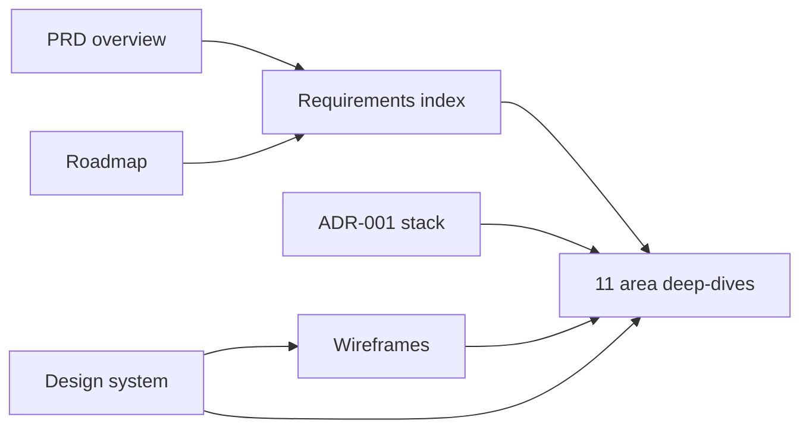

# Cuộn docs

Everything written down about Cuộn so far: what it is (PRD), how it's built (ADR), when (roadmap) and how it looks (design system, wireframes).

Back to: [Project README](../README.md)

## Map

| Doc | What it answers | Source of truth |
|---|---|---|
| [product/prd.md](product/prd.md) | What Cuộn is, who it's for, goals, metrics, release plan, open questions | [PRD artifact](https://claude.ai/artifact/9rfAShmDJUP9uFaDLikmu8) |
| [product/requirements/](product/requirements/README.md) | Every requirement ID, one deep-dive per area | PRD artifact (wording); deep-dives (analysis) |
| [architecture/adr-001-tech-stack.md](architecture/adr-001-tech-stack.md) | Stack, architecture, upload and share flows, MVP tables | **This repo** |
| [roadmap.md](roadmap.md) | Phases, dates, cut line, launch gates, decisions due | [Roadmap artifact](https://claude.ai/artifact/Lsq7MWHNCVanpBWQ2D4XTo) (mirrored) |
| [design/design-system.md](design/design-system.md) | Principles, voice, tokens, type, components, icons | [Design system artifact](https://claude.ai/artifact/HtsG9sZeNGx19PSvPjW65a) (mirrored) |
| [design/wireframes.md](design/wireframes.md) | Which screens have wireframes, and which don't yet | [Design canvas](https://claude.ai/artifact/AXpgMvXFo6HL1vrw9RS6gt) (reference only) |

Sync rules for the mirrored docs are in [CLAUDE.md](../CLAUDE.md#sync-rules).

## How the docs connect

Each deep-dive pulls its requirements from the PRD, its phase from the roadmap, its tables and flows from the ADR, and its screens from the wireframes and design system.

## Requirement areas

| Area | P0 in MVP | Phase |
|---|---|---|
| [Sign-in](product/requirements/auth.md) | AUTH-1 | 0 |
| [Rolls](product/requirements/rolls.md) | ROLL-1, ROLL-2 | 1 |
| [Bag](product/requirements/bag.md) | BAG-1 | 1 |
| [Catalogue](product/requirements/catalogue.md) | CAT-1, CAT-2 | 1 |
| [Labs](product/requirements/labs.md) | LAB-1, LAB-2, LAB-3 | 1–2 |
| [Scans & storage](product/requirements/scans.md) | SCAN-1 – SCAN-4 | 2 |
| [Notes & mistakes](product/requirements/notes.md) | NOTE-1, NOTE-2 | 2 |
| [Canister shelf](product/requirements/canister.md) | CAN-1, CAN-2 | 3 |
| [Collection & grid](product/requirements/collection.md) | COL-1 – COL-5 | 3–4 |
| [Sharing](product/requirements/sharing.md) | SHARE-1 – SHARE-4 | 4 |
| [Compare](product/requirements/compare.md) | none (v1.2) | after launch |

## Known conflicts between sources

These were found while building these docs from the artifacts on 25.09.2026. None is resolved here; each needs a decision and an edit to its source.

| # | Conflict | Where | Needed by | Suggested resolution |
|---|---|---|---|---|
| 1 | **Product name:** Cuộn (PRD, roadmap, ADR) vs Roll Call (design system, design canvas) vs repo `my-rolls` | All | Name decision 11.10.2026 | Docs use **Cuộn**. Rename the design system's title and the landing copy once the domain is chosen |
| 2 | **TIFF + server-made copies** (SCAN-1, SCAN-3) vs browser-made WebP, JPEG/PNG only (ADR) | [scans](product/requirements/scans.md#open-issues) | 01.11.2026 (before Phase 2) | Roadmap decision 2: MVP is JPEG/PNG/WebP ≤ 10 MB; edit SCAN-1 and SCAN-3 |
| 3 | **GPS:** "no file served carries GPS" (SHARE-1) vs full-size download = original bytes | [sharing](product/requirements/sharing.md#open-issues) | 01.11.2026 | Roadmap decision 3: no download toggle in MVP |
| 4 | **Mistakes:** PRD allows several of 13 mistake types per frame or roll (NOTE-2); ADR has one `frame.mark` enum and no mistake table | [notes](product/requirements/notes.md#open-issues) | Before Phase 2 schema | Add a `mistake` table to the ADR |
| 5 | **Share token:** stored hashed (PRD technical notes) vs plain `share_link.token` (ADR) | [sharing](product/requirements/sharing.md#open-issues) | Before Phase 4 | Store a SHA-256 of the token |
| 6 | **Data model depth:** the ADR MVP tables drop fields that P0 requirements mention: lenses in the bag (BAG-1), box/shot ISO and exposures on the roll (ROLL-1), lab services and address (LAB-2), scanner and process on the scan set (LAB-3), email on the user | [rolls](product/requirements/rolls.md#open-issues), [bag](product/requirements/bag.md#open-issues), [labs](product/requirements/labs.md#open-issues), [auth](product/requirements/auth.md#open-issues) | Before Phase 1 schema | Either add the columns or trim the requirements |
| 7 | **Upload drag-over state:** `cobalt-soft` + `cobalt` border (design system README) vs `pin-soft` + `pin` border (UploadDrop guideline) | [design system](design/design-system.md#states) | Before Phase 2 UI | `cobalt`: `pin` is reserved for oops and errors |
| 8 | **Canister presets:** Red, Orange and Cream (PRD) have no design-system token | [canister](product/requirements/canister.md#open-issues) | Before Phase 3 | Add tokens, or limit presets to the `stock-*` families |
