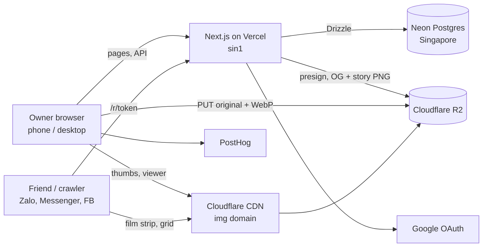
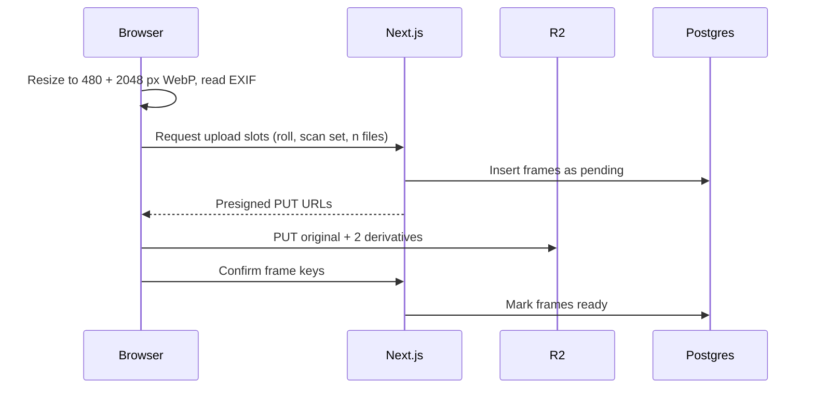

# ADR-001: Cuộn tech stack & architecture

> **Status: Accepted** · 25.09.2026 · Trúc (proposed 24.09.2026)
>
> This file is the source of truth for the stack. It started as a copy of a claude.ai doc; that doc is no longer kept in sync, so edit here.

Related: [PRD overview](../product/prd.md) · [Roadmap](../roadmap.md) · [Design system](../design/design-system.md)

## Status & context

**Accepted** on 25.09.2026, when the [Phase 0 plan](../../.planning/plans/phase-0-foundations.md) was approved. Cuộn's MVP ships as one TypeScript web app (Next.js) with Postgres for data and Cloudflare R2 for photos. This ADR records why, measured against [PRD v0.4](../product/prd.md).

What the PRD asks of the stack:

- A responsive web app for phone (390 px) and desktop (1440 px), Vietnamese first. No native apps.
- Google sign-in; rolls, bag, seeded catalogue (stocks, cameras), labs → branches, scan sets, frames with tấm ưng / oops / blank marks and notes.
- Full-size photo upload (10 MB cap today; lab TIFFs of 20–60 MB are PRD open question 2), film strip and grid views, a library grid across every roll.
- Public share links that render a friend view and a rich link preview in Zalo, Messenger and Facebook.
- Story cards (Dải phim, Phiếu cuộn) as 1080 × 1920 PNGs handed to Web Share.

Constraints:

- Side project, built and run by one engineer. Ops time is the scarcest resource.
- Free for users at soft launch, so hosting must cost close to nothing until there is traction. Photo storage and delivery are the only costs that grow with each user.
- The audience is in Vietnam, so latency to TP.HCM and Hà Nội matters most.
- Assumption: comfortable enough in TypeScript/React to own the frontend, alongside day-job Kotlin.

## Decision drivers

Photo delivery cost is the driver that decides the most: the north star is share links opened by non-users, so image traffic grows exactly when Cuộn succeeds.

1. **Near-zero egress for photos.** A roll is about 300 MB of scans (PRD: ~6 GB for 20 rolls). Every share open pulls a film strip or grid of them.
2. **Server-rendered share pages and preview images.** Zalo, Messenger and Facebook crawlers read HTML meta tags and do not run JavaScript.
3. **Uploads bypass the app server.** Full-size scans (10 MB today, TIFFs up to 60 MB later) go straight to storage.
4. **Relational data.** Catalogue, bag, Lab → LabBranch → ScanSet → Frame and library-wide queries (every tấm ưng across rolls) fit SQL.
5. **One deployable, one language, managed services.** One person runs it; free tiers must cover soft launch.
6. **Close to Vietnam.** Compute and database in Singapore; photos from a CDN with points of presence in Vietnam.

## Options considered

Option A wins on every driver except familiarity; B is the comfortable choice but doubles what one person has to run. All four put photos in Cloudflare R2, the only store with free egress ([R2 pricing](https://developers.cloudflare.com/r2/pricing/)).

| Option | Pieces to run | Share pages + OG images | Cost at soft launch | Main drawback |
|---|---|---|---|---|
| **A. Next.js full-stack on Vercel + Neon Postgres + R2** | 1 app | Built in (server rendering, `next/og`) | $0: Vercel Hobby, Neon Free, R2 10 GB free | Hobby is non-commercial only; TypeScript instead of Kotlin |
| B. Kotlin/Micronaut API + Next.js frontend + Postgres + R2 | 2 apps, 2 languages | Needs the Next.js side anyway | ~$5–10/month for an always-on JVM host | Two deploys and a JSON contract to keep in sync, for no user-visible gain |
| C. Supabase (Auth, Postgres, Storage) + Next.js | 1 app + BaaS | Via Next.js | $0, but Free pauses after 1 week idle and holds 1 GB of files; Pro is $25/month | Photos in Supabase Storage pay $0.09/GB past 250 GB egress; auth and row-level security lock-in |
| D. Cloudflare-native: Next.js via OpenNext on Workers + D1 + R2 | 1 app | Built in | $0, edge compute in Vietnam | D1 is SQLite; OpenNext adapter adds friction for a first build |

D is the natural migration target if Vercel stops fitting (see [Revisit triggers](#revisit-triggers)).

## Decision

Go with option A: one Next.js app on Vercel, Postgres on Neon in Singapore, photos in Cloudflare R2 with derivatives made at upload time.

| Layer | Choice | Why |
|---|---|---|
| App | Next.js (App Router), TypeScript, React Server Components + route handlers | Share pages render on the server; one codebase for UI and API |
| Styling | Tailwind CSS mapped to the Cuộn [design system](../design/design-system.md) tokens | Same tokens on phone and desktop layouts |
| Language | `next-intl`, Vietnamese as the only locale at launch | Keeps the app's words (cuộn, tấm ưng, túi…) in one file |
| Auth | Better Auth with the Google provider, sessions in Postgres, `oAuthProxy` plugin so sign-in works on preview URLs | Google sign-in is the only MVP method; no extra vendor. Neon's managed auth stays off |
| Database | Postgres on Neon, added through the Vercel Marketplace (Vercel-managed, billed through Vercel), region Singapore (`sin1`, AWS `ap-southeast-1`) | Relational model, free tier, branch per preview deploy |
| ORM + migrations | Drizzle ORM + drizzle-kit | SQL-first and typed, close to the Exposed + Flyway habits from work |
| Photo storage | Cloudflare R2: private bucket for originals, public bucket on a custom domain for derivatives (on `r2.dev` until the domain is chosen) | Free egress; Cloudflare CDN has Vietnam points of presence |
| Uploads | Browser → R2 with presigned PUT URLs; app only signs and records | Vercel functions cap request bodies at 4.5 MB |
| Derivatives | Browser makes two WebP sizes per JPEG (480 px grid, 2048 px viewer) and reads EXIF before upload | No server CPU and no per-transform fees; TIFF needs a server path (v1.1) |
| Share images | `next/og` renders link previews (1200 × 630) and story cards (1080 × 1920), cached in R2 per roll version | One renderer for both; crawlers get a ready PNG |
| Hosting | Vercel Hobby, functions in `sin1` (Singapore) | Next to the database; preview deploys per branch |
| Scheduled work | Vercel Cron: clean up abandoned uploads nightly | No queue needed for MVP |
| Analytics + errors | PostHog: product analytics (north star: share opens by non-users) and error tracking | Already familiar with PostHog; one vendor for both on its free tier. Sentry was dropped on 25.09.2026 to keep costs at zero |

## Architecture

Photo bytes never pass through the app: the browser talks to R2 directly, and the app only handles metadata, auth and rendering.

Owners and friends load pages from Vercel and images from the Cloudflare CDN; only Vercel touches the database.

### Upload flow

Frames left pending for 24 hours are deleted by the nightly cron, along with their R2 objects.

### Share flow

- A share link is `/r/<token>`: a random 22-character token stored on `share_link`, never the roll id, so links can be revoked.
- The page renders server-side with `og:image` pointing at a cached `next/og` PNG. Changing the roll bumps its version and the next request re-renders the PNG.
- Full-size download is off by default; when on, the app hands out a short-lived presigned GET for the private original.
- "Đăng lên story" fetches the 1080 × 1920 card and passes it to `navigator.share`; desktop falls back to download + copy link.

### Data model (MVP)

| Table | Key columns | Notes |
|---|---|---|
| `user` | id, name, email, email_verified, image, created_at | Owned by Better Auth, plus `session`, `account` and `verification`. The Google subject ID lives in `account.account_id`; `name` is the display name the user can change |
| `stock` | id, owner_id?, slug, brand, name, iso, formats[], type, canister_color, canister_photo_key, status, search_text | `owner_id` null = seeded catalogue; set = private custom. `formats[]` (Known conflict #6, D4): one stock can come in 35mm and 120 |
| `camera` | id, owner_id?, slug, brand, model, type, format, fixed_stock_id?, status, search_text | Same seeded / private split. `fixed_stock_id` (Known conflict #6, D20) is set only for single-use cameras, whose film is fixed |
| `lens` | id, owner_id, brand, model, focal_length | Known conflict #6, D3: custom entries only, no seeded lens catalogue in the MVP |
| `bag_item` | id, user_id, kind (camera \| lens \| stock), ref_id, qty?, expiry_year? | The túi. `kind` says which of `camera`/`lens`/`stock` `ref_id` points into (Known conflict #6, D3). `qty`/`expiry_year` (Round 2, migration `0003`, BAG-2) only mean anything on a `stock` row: the film pocket count and expiry year, `null` = not counted |
| `lab` / `lab_branch` | lab: id, owner_id?, slug, name, address, link_url, services[], accepts_mail, search_text · branch: id, lab_id, name, district, area_hint, city, address, link_url, services[], accepts_mail, search_text | Known conflict #6, D5: address/link/services/accepts_mail added to both; `district` holds the new phường (2025 reform), `area_hint` keeps the old quận for display |
| `roll` | id, user_id, stock_id, camera_bag_item_id, lens_id?, number?, name, canister_color, canister_style, box_iso?, shot_iso?, exposures?, format?, locations[]?, shot_from, shot_to, date_precision?, memory, version | Only stock and camera required. `canister_style` (Phase 3 D2, migration `0005`) = `stock` \| `drawn` \| `photo`, default `stock`; only `drawn` writes `canister_color`. `notes` was dropped in migration `0004` (notes live in `note`). `camera_bag_item_id` (Known conflict #6, D2) points at the owner's bag item, not the catalogue camera, so two bodies of one model stay apart. Push/pull is computed from `box_iso`/`shot_iso`, never stored (D17). `number` (Round 2, migration `0003`, R2-5) is the per-user "Cuộn #N", assigned once at creation and never reused (unique partial index on `user_id, number`, backfilled for pre-existing rows). `date_precision` (R2-4) is `day` \| `month` \| `null` ("Không nhớ"): past-mode dates can now be picked as a month + year, stored as that month's first/last instant, instead of an exact day |
| `scan_set` | id, user_id, roll_id, lab_id?, lab_branch_id?, received_at?, dropped_at?, process?, push_pull_thirds?, scanner?, resolution_px?, file_format?, price_vnd? | LAB-3, migration `0004` ([Phase 2 plan](../../.planning/plans/phase-2-scans-and-notes.md) D7, D8). One live set per roll until rescans (LAB-4). `lab_id` with a nullable `lab_branch_id`, because home development has no branch; both null until the user picks, since the upload starts first |
| `frame` | id, user_id, roll_id, scan_set_id, position, file_name, content_type, bytes, sha256?, width?, height?, exif?, original_key, grid_key, view_key, is_keeper, is_blank, alt_text?, status | Migration `0004` (Phase 2 plan D2, D3). `status` = pending \| ready. Tấm ưng and blank are two booleans; oops = the frame has a live `mistake` row (Known conflict #4, resolved 30.09.2026). `exif` has its GPS tags removed in the browser |
| `note` | id, user_id, roll_id, frame_id?, body, created_at, updated_at | NOTE-1, migration `0004` (D6). `frame_id` null = a note on the whole roll; `roll.memory` holds the longer memory |
| `mistake` | id, user_id, roll_id, frame_id?, type, note? | NOTE-2, migration `0004` (D4). One live row per type on a frame, or on the roll when `frame_id` is null (unique index on `roll_id`, `coalesce(frame_id, nil uuid)`, `type`). `type` is one of 13 English slugs |
| `share_link` | id, roll_id, token, allow_download, created_at, revoked_at | Opens tracked in PostHog, not here |

The library grid is one query over `frame` joined to `roll`, newest first. `user_id` is copied onto `frame` so an index on (`user_id`, `is_keeper`, `created_at`) serves the library-wide tấm ưng view without a join.

**Auth tables are an exception to the house database rules** (decided 25.09.2026, Trúc). Better Auth's `user`, `session`, `account` and `verification` keep the library's own shape: text ids that Better Auth generates, foreign keys to `user` with `ON DELETE CASCADE`, and hard deletes, which AUTH-2 needs to really remove an account. Their timestamps are `timestamptz`, and lookups are indexed (migration `0001`). Every Cuộn table from Phase 1 on (`stock`, `camera`, `lens`, `bag_item`, `lab`, `lab_branch`, `roll`, `frame`…) follows the house rules instead: no foreign keys, `uuid_generate_v4()` ids, soft deletes and partial indexes.

> **Open conflicts with the PRD:** share-token hashing and GPS on downloads. Mistake tagging and TIFF support were settled on 30.09.2026. See [Known conflicts](../README.md#known-conflicts-between-sources).

## Consequences

Soft launch costs $0 a month, and photo cost stays small even at 1,000 rolls (about 300 GB in R2, roughly $4.35/month at $0.015/GB after the free 10 GB).

What gets easier:

- One repo, one deploy, preview URLs per branch with a matching Neon database branch.
- Share traffic is free to serve: images come from R2 with no egress charge.
- Share pages, link previews and story cards come from the same server-rendered code.

What gets harder, and the mitigation:

| Risk | Mitigation |
|---|---|
| Vercel Hobby is non-commercial only | Fine while Cuộn is free; any paid feature means Vercel Pro ($20/month) or a move to option D |
| Neon Free scales to zero after 5 minutes, so the first request after idle is slower | Acceptable at soft launch; paid plan keeps compute warm |
| Neon Free caps storage at 0.5 GB per project | Metadata only, roughly 1 KB per frame, so about 500,000 frames before it matters |
| R2 free 10 GB fills at about 33 rolls | Budget for paid R2 from day one; the per-user cap is PRD open question 1 |
| Browsers cannot decode TIFF, so client-side derivatives cover JPEG and PNG only | MVP accepts JPEG/PNG up to the 10 MB cap; TIFF waits for the server path in v1.1 |
| Three vendors (Vercel, Neon, Cloudflare) to manage | All managed, all free tiers, no servers to patch |
| Public derivative bucket can be scraped | Keys are random UUIDs; originals stay private behind presigned URLs |
| Frontend is TypeScript, not the day-job Kotlin | Drizzle and route handlers keep backend code small and SQL-shaped |

## Revisit triggers

Reopen this ADR when one of these happens; each names the likely next step.

| Trigger | Next step |
|---|---|
| Cuộn charges for anything | Vercel Pro ($20/month), or move to option D on Cloudflare Workers |
| Neon hits 0.5 GB or 100 CU-hours a month | Neon paid plan; no code change |
| TIFF uploads (PRD open question 2) are approved | Server-side `sharp` job reading from R2; if it outgrows 300 s functions, a queue + container worker |
| v1.1 community submissions and review queue | `submission` table + admin screens in the same app |
| A native app is planned | Route handlers become a versioned public API; a separate Kotlin service is worth weighing then |
| R2 passes ~1 TB | Move originals older than a set age to R2 Infrequent Access |
| Neon cold starts show up in share-page latency | Keep compute warm on a paid plan, or cache share pages at the edge |

## Sources

- [Cloudflare R2 pricing](https://developers.cloudflare.com/r2/pricing/)
- [Cloudflare Images pricing](https://developers.cloudflare.com/images/pricing/) (5,000 free transformations/month, then $0.50 per 1,000; why derivatives are made in the browser)
- [Vercel Hobby plan](https://vercel.com/docs/plans/hobby)
- [Neon pricing](https://neon.com/pricing) and [Neon regions](https://neon.com/docs/introduction/regions)
- [Supabase pricing](https://supabase.com/pricing)
- [Cuộn PRD v0.4](../product/prd.md)
